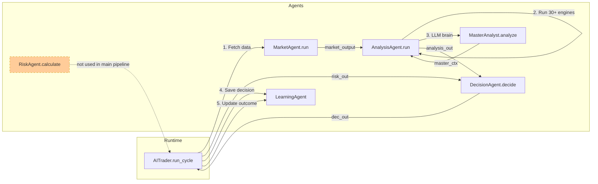
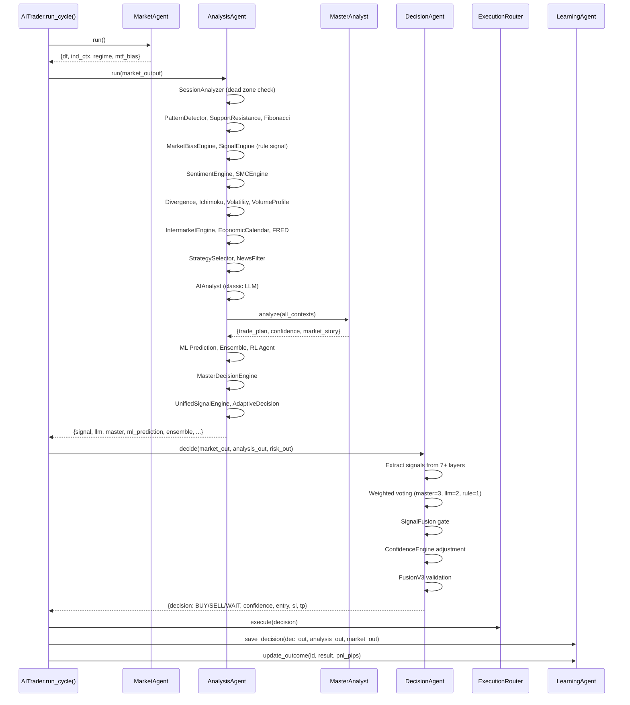
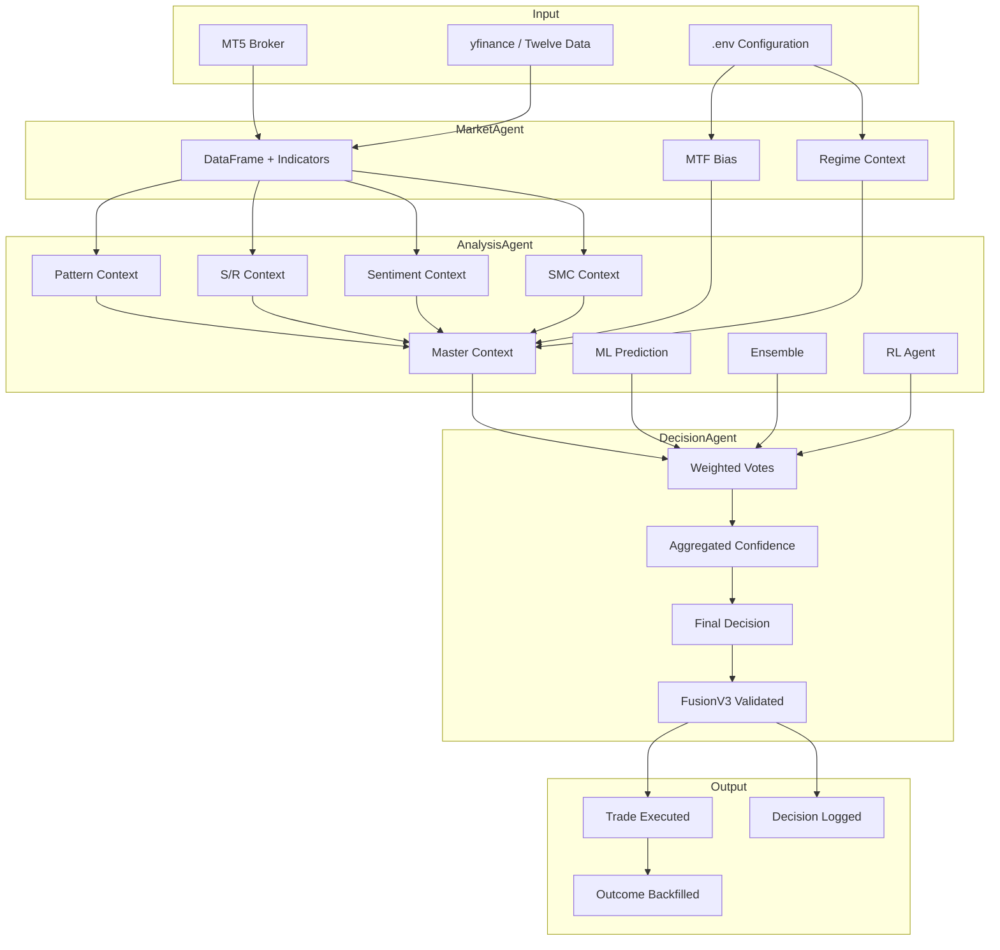

# agents/ — Architecture Documentation

> **This document is the permanent architecture reference for the `agents/` folder.**
> Every statement is based on actual code analysis. Fields marked "Not Found" mean
> the property could not be confirmed from the codebase.

---

## 1. Folder Purpose

The `agents/` folder contains the **multi-agent decision pipeline** — the sequential
chain of AI and rule-based agents that transform raw market data into a final
BUY/SELL/WAIT trading decision. Each agent has a single, well-defined responsibility
in this pipeline. The agents are orchestrated by `core/trader.py::AITrader.run_cycle()`
and run once per symbol per trading cycle.

**Responsibility:** Encapsulate each stage of the market-analysis-to-decision pipeline
as an independent, testable agent with a `run()` or `decide()` method that accepts
structured dicts and returns structured dicts.

**What should NEVER be placed inside this folder:**
- Trade execution logic (belongs in `execution/`)
- Broker connectivity (belongs in `broker/`)
- ML model training (belongs in `ml/`)
- Risk engine implementations (belongs in `risk/`)
- Data fetching infrastructure (belongs in `data/`)
- Configuration constants (belongs in `config.py`)
- Technical indicator calculations (belongs in `analysis/` or `data/`)

---

## 2. Agent Overview

| Agent Name | Purpose | Current Status | Main Responsibility | Owner Layer |
|---|---|---|---|---|
| `MarketAgent` | Fetch, validate, compute indicators, detect regime | **Active** | Data acquisition & preparation | Data Layer |
| `AnalysisAgent` | Run 30+ analysis engines, produce signal & context | **Active** | Multi-engine analysis orchestration | Analysis Layer |
| `MasterAnalyst` | LLM-powered synthesis of all analysis into trade plan | **Active** | AI judgment layer | Intelligence Layer |
| `DecisionAgent` | Weighted voting, confidence aggregation, final verdict | **Active** | Decision fusion & authority | Decision Layer |
| `RiskAgent` | ATR-based SL/TP/lot calculation, daily loss tracking | **Active** (secondary) | Lightweight risk parameters | Risk Layer |
| `LearningAgent` | Persist decisions, backfill outcomes, compute pattern stats | **Active** | Decision logging & learning | Learning Layer |
| `ChartAgent` | Browser-based TradingView S/R annotation & vision capture | **Experimental** | Chart visualization tool | Visualization Layer |

---

## 3. Individual Agent Documentation

---

### 3.1 `market_agent.py` — Market Data Agent

| Field | Value |
|---|---|
| **File Name** | `agents/market_agent.py` |
| **Purpose** | First agent in the pipeline. Collects candle data, validates it, computes technical indicators (three-tier fallback), detects market regime, and computes multi-timeframe bias. |
| **Description** | Uses `DataOrchestrator` (MT5 first, API fallback) for candles. Applies a three-tier indicator fallback: `indicator_registry` → `ExtendedIndicators` → legacy `Indicators`. Detects regime via `MarketRegimeDetector`. Computes MTF bias via `MultiTimeframeAnalyzer`. All failures degrade to structured `error` dicts — never raises out of `run()`. |
| **Responsibilities** | (1) Fetch OHLC candles, (2) Validate data quality, (3) Compute indicators, (4) Detect market regime, (5) Compute MTF bias, (6) Track data source (MT5 vs API) |
| **Main Class** | `MarketAgent` |
| **Public Methods** | `run() -> MarketAgentResult` |
| **Private Methods** | `_is_symbol_unavailable(symbol: str) -> bool` (static) |
| **Module-level Functions** | `_note_legacy_fallback(symbol: str) -> int` |
| **Input** | None (uses `self.symbol`, `self.timeframe` from constructor) |
| **Output** | `MarketAgentResult` (TypedDict): `df`, `ind_ctx`, `regime`, `regime_ctx`, `mtf_bias`, `symbol`, `timeframe`, `data_source` — OR error dict with `error` key |
| **Return Types** | `dict` (TypedDict `MarketAgentResult`) |
| **Exceptions** | Never raises from `run()`. All exceptions caught and returned as `{"error": ..., "detail": ...}` dicts. |
| **Dataclasses Used** | `MarketAgentResult` (TypedDict, defined in this file) |
| **Configurations Used** | None directly. `DataOrchestrator` internally uses `config.py`. `DAILY_LOSS_LIMIT_PCT` is not used here (that's `RiskAgent`). |
| **Logger Used** | `utils.logger.get_logger("market_agent")` — variable name `log` |

---

### 3.2 `analysis_agent.py` — Analysis Pipeline Agent

| Field | Value |
|---|---|
| **File Name** | `agents/analysis_agent.py` (2265 lines) |
| **Purpose** | Orchestrates 30+ analysis engines in sequence, producing a unified analysis output with signals, contexts, ML predictions, RL actions, and a final signal. |
| **Description** | This is the largest agent. It runs a 25+ step pipeline: Session Intelligence → Candlestick Patterns → S/R → Advanced Patterns → Fibonacci → Market Bias → Rule-based Signal → Extended Module Votes → Currency Strength → Sentiment → SMC → Zone-dependent Modules → Market Structure → FollowThrough (shadow) → Divergence → Ichimoku → Volatility → Volume Profile → SMC Advanced → NewsAPI → Session Re-run → Intermarket → MTF Structure → Economic Calendar → FRED → Retail Sentiment → Correlation → Institutional Flow → Economic Surprise → Microstructure → Network Monitor → Forecast Engine → Strategy Selector → News Filter → Classic LLM → Vision AI → MasterAnalyst → News Intelligence → Confluence Engine → Feature Engineering → ML Prediction → Ensemble → RL Agent → MasterDecision → Unified Signal Engine → Adaptive Decision → Odd Enhancers. Dead-zone early return with full safe-default dict. TEST_MODE bypass for dead zones. |
| **Responsibilities** | (1) Run all analysis engines, (2) Collect all context dicts, (3) Feed MasterAnalyst with full context, (4) Run ML/RL/Ensemble layers, (5) Apply confidence penalties, (6) Return unified analysis dict with 50+ keys |
| **Main Class** | `AnalysisAgent` |
| **Public Methods** | `run(market_output: dict, memory_ctx: dict = None) -> dict` |
| **Private Methods** | None (all pipeline logic is inline in `run()`) |
| **Module-level Functions** | `_track_confidence(master_ctx, stage, value)`, `_apply_confidence_penalty(signal_result, amount, reason, source)` |
| **Input** | `market_output` (dict from `MarketAgent.run()` — must contain `df`, `ind_ctx`, `regime`, `mtf_bias`, `symbol`, `timeframe`), `memory_ctx` (optional dict) |
| **Output** | Dict with 50+ keys including: `df`, `pat_ctx`, `sr_ctx`, `fib_ctx`, `bias_ctx`, `signal`, `signal_ctx`, `llm`, `llm_ctx`, `news`, `news_ctx`, `sentiment`, `sentiment_ctx`, `smc`, `smc_ctx`, `vision`, `vision_ctx`, `vision_fusion`, `session`, `session_ctx`, `intermarket`, `intermarket_ctx`, `currency_strength_ctx`, `macro_fusion`, `master`, `master_ctx`, `news_intelligence`, `confluence`, `feature_vector`, `ml_prediction`, `ensemble`, `rl_agent`, `master_decision`, `structure`, `structure_ctx`, `divergence`, `divergence_ctx`, `ichimoku`, `ichimoku_ctx`, `volatility`, `volatility_ctx`, `volume_profile`, `volume_profile_ctx`, `smc_advanced`, `smc_advanced_ctx`, `news_api`, `news_api_ctx`, `econ_calendar`, `econ_calendar_ctx`, `fred_macro`, `fred_ctx`, `retail_sentiment`, `retail_sentiment_ctx`, `mtf_structure`, `mtf_structure_ctx`, `correlation_ctx`, `institutional_ctx`, `surprise_ctx`, `microstructure_ctx`, `network_ctx`, `forecast_ctx`, `strategy`, `final_signal`, `execution_filters`, `unified_signal`, `dead_zone`, `dead_zone_reason` |
| **Return Types** | `dict` |
| **Exceptions** | Never raises from `run()`. Every analysis step is wrapped in try/except. Dead-zone returns a full safe-default dict with all 50+ keys pre-populated. |
| **Dataclasses Used** | None defined here. Consumes dataclasses from analysis engines (e.g., `OddEnhancerScorer.zone_score_data`). |
| **Configurations Used** | `config.TEST_MODE` (lazy import, for dead-zone bypass), `config.DEFAULT_TIMEFRAME` (not directly — via market_output) |
| **Logger Used** | `utils.logger.get_logger("analysis_agent")` — variable name `log` |

---

### 3.3 `master_analyst.py` — LLM Master Brain

| Field | Value |
|---|---|
| **File Name** | `agents/master_analyst.py` (1553 lines) |
| **Purpose** | Sends all analysis context to an LLM (Groq/Gemini/Cerebras/SambaNova/OpenRouter) and receives a structured trade plan (signal, entry, SL, TP, confidence, reasoning, risks, self-critique). |
| **Description** | Builds a comprehensive text context from 20+ analysis outputs, calls an LLM with a detailed system prompt (institutional forex trader persona), parses the JSON response, and calculates a final confidence that blends LLM confidence with technical, sentiment, session, intermarket, and SMC factors. Supports multi-key rotation via `LLMKeyManager`. Falls back to rule-engine signal when LLM is unavailable. |
| **Responsibilities** | (1) Build LLM context from all analysis outputs, (2) Call LLM with provider cascade, (3) Parse JSON response, (4) Calculate blended final confidence, (5) Return trade plan with entry/SL/TP |
| **Main Class** | `MasterAnalyst` |
| **Public Methods** | `analyze(symbol, timeframe, ind_ctx, pat_ctx, sr_ctx, regime, mtf_bias, signal, sentiment_ctx, news_ctx, memory_ctx, bias_ctx, smc_ctx, fib_ctx, advanced_pat_ctx, vision_ctx, session_ctx, intermarket_ctx, classic_llm_ctx, divergence_ctx, ichimoku_ctx, volatility_ctx, volume_profile_ctx, smc_advanced_ctx, mtf_structure_ctx, strategy_ctx, news_api_ctx, econ_calendar_ctx, fred_ctx, retail_sentiment_ctx) -> dict`, `get_ai_context(result: dict) -> dict`, `print_summary(result: dict) -> None` |
| **Private Methods** | `_build_context(...) -> str`, `_call_llm(context: str) -> str`, `_parse_response(raw: str) -> dict`, `_fallback_result(signal: dict, reason: str) -> dict`, `_calculate_final_confidence(llm_conf, technical_conf, sentiment_conf, memory_ctx, smc_ctx, session_ctx, intermarket_ctx, sentiment_ctx) -> float` |
| **Input** | 20+ context dicts (all optional, all defaulted to `{}`), plus `symbol`, `timeframe`, `ind_ctx`, `pat_ctx`, `sr_ctx`, `regime`, `mtf_bias`, `signal` |
| **Output** | Dict with: `market_story`, `key_levels`, `trade_plan` (signal, entry, sl, tp1, tp2, confidence, reasoning), `risks`, `self_critique`, `no_trade_reason`, `final_confidence`, `llm_raw`, `error`, `session_gate_penalty` |
| **Return Types** | `dict` |
| **Exceptions** | `_call_llm()` may raise `RuntimeError` on empty response. `analyze()` catches all exceptions and returns `_fallback_result()`. |
| **Dataclasses Used** | None |
| **Configurations Used** | `GROQ_MODEL`, `GEMINI_MODEL`, `CEREBRAS_MODEL`, `SAMBANOVA_MODEL`, `OPENROUTER_MODEL`, `MASTER_ANALYST_MAX_TOKENS` (env: default 800), `CEREBRAS_MAX_TOKENS` (env: default 4000), `CEREBRAS_REASONING_EFFORT` (env: default "low"), `OLLAMA_HOST`, `OLLAMA_MODEL`, `OLLAMA_MASTER_MODEL` (all OLLAMA vars are no-op stubs — Ollama removed from cascade) |
| **Logger Used** | `utils.logger.get_logger("master_analyst")` — variable name `log` |

---

### 3.4 `decision_agent.py` — Decision Fusion Agent

| Field | Value |
|---|---|
| **File Name** | `agents/decision_agent.py` (1332 lines) |
| **Purpose** | Final decision authority. Implements weighted voting across MasterAnalyst (weight 3), Classic LLM (weight 2), and Rule Engine (weight 1), with optional SignalFusion gate, MasterDecisionEngine cross-check, ConfidenceEngine dynamic adjustment, and FusionV3 validation. |
| **Description** | Takes analysis output, market output, and risk output. Extracts signals from all layers. Runs a multi-step decision pipeline: (1) Signal extraction & normalization, (2) LLM exclusion handling, (3) Weighted vote counting with Barrier-1 promotion, (4) SignalFusion authoritative gate (4-layer fusion), (5) MasterDecisionEngine cross-check, (6) Confidence aggregation across 7+ layers with participation damping, (7) Sentiment boost/penalty, (8) ConfidenceEngine pattern-aware adjustment, (9) Confidence floor check, (10) FusionV3 TTL/RRR validation, (11) Result assembly with aligned_factors and setup_quality. |
| **Responsibilities** | (1) Extract and normalize all layer signals, (2) Run weighted voting, (3) Aggregate multi-layer confidence, (4) Apply confidence adjustments, (5) Validate via FusionV3, (6) Produce final BUY/SELL/WAIT with entry/SL/TP/lot/RR |
| **Main Class** | `DecisionAgent` |
| **Public Methods** | `decide(market_out: dict, analysis_out: dict, risk_out: dict) -> dict`, `print_summary(result: dict) -> None`, `get_ai_context(result: dict) -> dict` |
| **Private Methods** | `_aggregate_confidence(analysis_out, rule_signal, rule_conf, llm_signal, llm_conf_for_vote, master_signal_for_vote, master_conf_for_vote) -> tuple[float, list[str]]`, `_extract_pattern(analysis_out: dict) -> str`, `_result(decision, confidence, risk_out, reasons, entry, sl, tp, pattern, pair, timeframe, regime, confidence_engine_result, analysis_out, excluded_layers, confidence_breakdown) -> dict` |
| **Input** | `market_out` (dict), `analysis_out` (dict — 50+ keys from AnalysisAgent), `risk_out` (dict — from RiskAgent or RiskEngine) |
| **Output** | Dict with: `decision`, `confidence`, `entry`, `sl`, `tp`, `lot`, `sl_pips`, `tp_pips`, `rr`, `reasons`, `confidence_breakdown`, `confidence_breakdown_lines`, `pattern`, `pair`, `timeframe`, `regime`, `confidence_engine`, `aligned_factors`, `setup_quality`, `unified_consensus`, `unified_buy_score`, `unified_sell_score`, `unified_confidence`, `fusion_v3`, `_fusion_conf` |
| **Return Types** | `dict` |
| **Exceptions** | All internal exceptions caught. Returns WAIT on any failure. |
| **Dataclasses Used** | None defined here. Consumes `FusionV3Result` (from `core/fusion_engine_v3.py`) and `ConfidenceBreakdown` (from `learning/confidence_engine.py`). |
| **Configurations Used** | `DECISION_CONFIDENCE_FLOOR` (env: default 60.0), `ZERO_CONSENSUS_OVERRIDE_FLOOR` (env: default 70.0) |
| **Logger Used** | `utils.logger.get_logger("decision_agent")` — variable name `log` |

---

### 3.5 `risk_agent.py` — Risk Management Agent

| Field | Value |
|---|---|
| **File Name** | `agents/risk_agent.py` (204 lines) |
| **Purpose** | Lightweight per-pair risk parameter calculator. Computes SL, TP, lot size from signal + ATR. Enforces 1% risk rule and minimum R:R ratio. Tracks daily loss limit. |
| **Description** | Simpler alternative to the full `risk/RiskEngine`. Used for lightweight or per-pair risk calculations. Computes ATR-based SL with regime-adjusted multiplier, TP at minimum R:R, and lot size via 1% account risk rule. Fails safe when ATR is missing or pip value is invalid. |
| **Responsibilities** | (1) Calculate SL from ATR, (2) Calculate TP from SL × MIN_RR, (3) Calculate lot size from 1% risk rule, (4) Enforce daily loss limit, (5) Validate R:R ratio |
| **Main Class** | `RiskAgent` |
| **Public Methods** | `calculate(signal: str, entry: float, ind_ctx: dict, regime: dict, symbol: str) -> dict`, `print_summary(result: dict) -> None`, `get_ai_context(result: dict) -> dict` |
| **Private Methods** | `_no_trade(reason: str) -> dict` |
| **Input** | `signal` (str: BUY/SELL/NO TRADE), `entry` (float), `ind_ctx` (dict — must contain `atr`), `regime` (dict — uses `volatility`), `symbol` (str) |
| **Output** | Dict with: `approved`, `signal`, `entry`, `sl_price`, `tp_price`, `sl_pips`, `tp_pips`, `lot`, `lot_size`, `risk_pc`, `risk_percent`, `risk_usd`, `risk_amount_usd`, `rr_ratio`, `balance`, `reject_reason` |
| **Return Types** | `dict` |
| **Exceptions** | Never raises. Returns `approved=False` dicts on any failure condition. |
| **Dataclasses Used** | None |
| **Configurations Used** | `config.DAILY_LOSS_LIMIT_PCT` (lazy import, default 20.0) |
| **Logger Used** | `utils.logger.get_logger("risk_agent")` — variable name `log` |

---

### 3.6 `learning_agent.py` — Self-Learning Agent

| Field | Value |
|---|---|
| **File Name** | `agents/learning_agent.py` (334 lines) |
| **Purpose** | Persists every trading decision to a JSON-backed log, backfills outcomes (WIN/LOSS/BE) when trades close, and computes aggregate pattern-level performance statistics. |
| **Description** | Thread-safe JSON file storage with atomic writes (temp file + `os.replace`). Caps history at `max_history` (default 500) entries. Validates trade results against `TradeResult` enum. Handles corrupt files by backing up and starting fresh. This is a learning log, NOT the PnL system of record (that lives in SQLite via `core/trader.py`). |
| **Responsibilities** | (1) Save decision entries, (2) Update outcomes by ID or by symbol fallback, (3) Compute aggregate performance stats (win rate, avg PnL, per-pattern stats), (4) Handle file corruption gracefully |
| **Main Class** | `LearningAgent` |
| **Public Methods** | `save_decision(decision_out: dict, analysis_out: dict, market_out: dict) -> int`, `get_performance_stats() -> dict`, `update_outcome(decision_id: int, result: str, pnl_pips: float) -> bool`, `update_outcome_by_symbol(symbol: str, result: str, pnl_pips: float) -> Optional[int]` |
| **Private Methods** | `_validate_result(result: str) -> str` (static), `_load() -> list`, `_save(data: list) -> None` |
| **Input** | `save_decision`: `decision_out` (dict), `analysis_out` (dict), `market_out` (dict). `update_outcome`: `decision_id` (int), `result` (str), `pnl_pips` (float). |
| **Output** | `save_decision` returns `int` (decision ID). `get_performance_stats` returns dict: `total_decisions`, `closed_trades`, `wins`, `losses`, `breakeven`, `win_rate`, `avg_pnl_pips`, `pattern_stats`. `update_outcome` returns `bool`. |
| **Return Types** | `int`, `dict`, `bool`, `Optional[int]` |
| **Exceptions** | `ValueError` if `result` is not a valid `TradeResult` value. `_load()` handles `JSONDecodeError` and `OSError` by backing up the corrupt file. |
| **Dataclasses Used** | `TradeResult` (Enum: WIN, LOSS, BE), `DecisionEntry` (TypedDict — defines the shape of each log entry) |
| **Configurations Used** | None directly. Uses `core.constants.MEMORY_DIR` for default file path. |
| **Logger Used** | `utils.logger.get_logger("learning_agent")` — variable name `log` |

---

### 3.7 `chart_agent.py` — Chart Annotation Agent

| Field | Value |
|---|---|
| **File Name** | `agents/chart_agent.py` (466 lines) |
| **Purpose** | Browser-automation utility that computes swing-based S/R levels from historical OHLC data (via yfinance) and draws them onto a live TradingView chart (via Playwright). Supports vision AI screenshot capture. |
| **Description** | Uses 5-bar fractal pivot detection for S/R levels. Resolves symbols via `SymbolSpec` table (maps logical symbols to Yahoo/TradingView representations with correct precision). Opens a headless or visible Chromium browser, navigates to TradingView, changes timeframe, adds indicators, and draws horizontal lines at S/R levels. Implements context manager protocol for guaranteed cleanup. |
| **Responsibilities** | (1) Compute S/R levels from yfinance data, (2) Open TradingView in browser, (3) Change chart timeframe, (4) Add indicators, (5) Draw S/R levels as horizontal lines, (6) Provide vision AI capture interface |
| **Main Class** | `ChartAgent` |
| **Public Methods** | `start(headless: bool) -> None`, `calculate_sr_levels(symbol: str, period: str, interval: str, max_retries: int) -> SRLevels`, `open_tradingview(symbol: str) -> None`, `change_timeframe(timeframe: str) -> bool`, `add_indicator(name: str) -> bool`, `draw_sr_levels() -> None`, `close(wait_for_user: bool) -> None`, `capture_and_analyze(symbol, timeframe, quant_ctx)` — **Not Found** in this file (expected on `chart_reader` object), `fuse_with_quant(vision_result, analysis_output)` — **Not Found** in this file |
| **Private Methods** | `_get_chart_price_range() -> Tuple[float, float]`, `_price_to_y(price, box, price_min, price_max) -> float` (static), `_find_pivots(highs, lows, decimals) -> Tuple[List, List]` (static), `_cluster(levels, tol) -> List[float]` (static) |
| **Input** | `calculate_sr_levels`: `symbol` (str), `period` (str), `interval` (str), `max_retries` (int) |
| **Output** | `SRLevels` dataclass: `symbol`, `current_price`, `support_levels`, `resistance_levels`. Properties: `is_valid` |
| **Return Types** | `SRLevels`, `bool`, `None` |
| **Exceptions** | `ChartDataError` (custom exception — raised when S/R calculation fails after all retries). `PlaywrightTimeoutError` (from Playwright — caught internally). |
| **Dataclasses Used** | `SymbolSpec` (yahoo_symbol, tv_symbol, decimals, cluster_tol), `SRLevels` (symbol, current_price, support_levels, resistance_levels, is_valid property) |
| **Configurations Used** | None |
| **Logger Used** | `logging.getLogger("chart_agent")` — variable name `log` (NOTE: uses stdlib `logging` directly, NOT `utils.logger.get_logger`) |

---

### 3.8 `__init__.py` — Package Init

| Field | Value |
|---|---|
| **File Name** | `agents/__init__.py` |
| **Purpose** | Empty package init file. No exports, no re-exports, no convenience imports. |
| **Description** | The file is empty (0 bytes). All consumers import agents directly (e.g., `from agents.market_agent import MarketAgent`). |

---

## 4. Dependency Analysis

### 4.1 `market_agent.py` Dependencies

| Category | Imports |
|---|---|
| **Internal (project)** | `data.data_orchestrator.get_data_orchestrator`, `data.validator.DataValidator`, `data.indicators.Indicators`, `analysis.timeframe.MultiTimeframeAnalyzer`, `analysis.market_regime.MarketRegimeDetector`, `utils.logger.get_logger`, `data.indicator_registry.add_canonical_indicators` (lazy), `data.indicator_registry.get_ai_context` (lazy), `data.indicators_ext.ExtendedIndicators` (lazy), `data.fetcher.is_symbol_unavailable` (lazy) |
| **External (third-party)** | None directly (pandas used via type hint only — `"object"`) |
| **Stdlib** | `threading`, `time`, `typing.Optional`, `typing.TypedDict` |
| **Shared utilities** | `utils.logger.get_logger` |
| **Config dependencies** | None directly |
| **Data dependencies** | `DataOrchestrator` singleton (candle data), `DataValidator`, `IndicatorRegistry`/`ExtendedIndicators`/`Indicators`, `MarketRegimeDetector`, `MultiTimeframeAnalyzer` |
| **Model dependencies** | None |

### 4.2 `analysis_agent.py` Dependencies

| Category | Imports |
|---|---|
| **Internal (project)** | `analysis.patterns.PatternDetector`, `analysis.support_resistance.SupportResistance`, `analysis.market_bias.MarketBiasEngine`, `analysis.advanced_patterns.AdvancedPatternDetector`, `analysis.fibonacci.FibonacciEngine`, `analysis.sentiment.SentimentEngine`, `analysis.smc_engine.SMCEngine`, `analysis.sentiment_data.SentimentDataProvider`, `analysis.session_analyzer.SessionAnalyzer`, `analysis.intermarket.IntermarketEngine`, `analysis.currency_strength.CurrencyStrengthEngine`, `analysis.divergence.DivergenceEngine`, `analysis.ichimoku.IchimokuEngine`, `analysis.volatility.VolatilityEngine`, `analysis.volume_profile.VolumeProfileEngine`, `analysis.smc_advanced.SMCAdvancedEngine`, `analysis.structure_mtf.MTFStructureEngine`, `analysis.structure.MarketStructureEngine`, `analysis.follow_through_engine.get_follow_through_engine`, `analysis.shadow_follow_through_logger.get_shadow_logger`, `analysis.news_api_provider.get_news_api_provider`, `fundamental.economic_calendar_api.EconomicCalendarAPI`, `fundamental.fred_data.get_fred_api`, `analysis.retail_sentiment.get_retail_sentiment_api`, `analysis.correlation_engine.CorrelationEngine`, `analysis.institutional_flow.InstitutionalFlowEngine`, `fundamental.economic_surprise.EconomicSurpriseEngine`, `analysis.microstructure.get_microstructure_engine`, `system.network_monitor.get_network_monitor`, `ml.forecast_engine.get_forecast_engine`, `strategy.selector.StrategySelector`, `fundamental.news_filter.NewsFilter`, `ai.ai_analyst.AIAnalyst`, `agents.master_analyst.MasterAnalyst`, `strategy.signal_engine.SignalEngine`, `utils.logger.get_logger` — plus ~15 lazy imports inside `run()` |
| **External (third-party)** | None directly (pandas used via `df` parameter — not imported) |
| **Stdlib** | `typing.Dict, Any, List, Optional` |
| **Shared utilities** | `utils.logger.get_logger` |
| **Config dependencies** | `config.TEST_MODE` (lazy) |
| **Data dependencies** | All 30+ analysis engines listed above |
| **Model dependencies** | `ml.forecast_engine` (EMA+RSI composite), `ml.model_predictor.ModelPredictor` (via feature/vector pipeline), `ml.ensemble.EnsembleEngine`, `ml.rl_agent.RLAgent` |

### 4.3 `master_analyst.py` Dependencies

| Category | Imports |
|---|---|
| **Internal (project)** | `utils.logger.get_logger`, `core.llm_key_manager.get_llm_key_manager` (try/except), `core.llm_key_manager.log_llm_call_failure` (lazy) |
| **External (third-party)** | `dotenv.load_dotenv`, `groq.Groq` (lazy, single-key fallback), `google.genai` (lazy, single-key fallback) |
| **Stdlib** | `json`, `math`, `os`, `re`, `datetime` |
| **Shared utilities** | `utils.logger.get_logger` |
| **Config dependencies** | `GROQ_API_KEY_1`, `GROQ_API_KEY`, `GROQ_MODEL`, `GEMINI_API_KEY_1`, `GEMINI_API_KEY`, `GEMINI_MODEL`, `CEREBRAS_MODEL`, `SAMBANOVA_MODEL`, `OPENROUTER_MODEL`, `MASTER_ANALYST_MAX_TOKENS`, `CEREBRAS_MAX_TOKENS`, `CEREBRAS_REASONING_EFFORT`, `OLLAMA_HOST`, `OLLAMA_MODEL`, `OLLAMA_MASTER_MODEL` (all OLLAMA: no-op) |
| **Data dependencies** | LLM API providers (Groq, Gemini, Cerebras, SambaNova, OpenRouter) |
| **Model dependencies** | External LLM models (llama-3.1-8b-instant, gemini-flash-lite-latest, etc.) |

### 4.4 `decision_agent.py` Dependencies

| Category | Imports |
|---|---|
| **Internal (project)** | `utils.logger.get_logger`, `learning.confidence_engine.ConfidenceEngine` (try/except), `core.master_decision.get_master_decision_engine` (try/except), `core.signal_fusion.SignalFusion` (try/except), `core.signal_fusion.LayerSignal` (try/except), `core.fusion_engine_v3.validate_fusion` (try/except) |
| **External (third-party)** | None |
| **Stdlib** | `os` (for `os.getenv`) |
| **Shared utilities** | `utils.logger.get_logger` |
| **Config dependencies** | `DECISION_CONFIDENCE_FLOOR` (env: default 60.0), `ZERO_CONSENSUS_OVERRIDE_FLOOR` (env: default 70.0) |
| **Data dependencies** | None directly (consumes dicts passed in) |
| **Model dependencies** | None |

### 4.5 `risk_agent.py` Dependencies

| Category | Imports |
|---|---|
| **Internal (project)** | `utils.logger.get_logger`, `core.constants.get_pip_size`, `core.constants.get_pip_value_usd`, `core.constants.clean_symbol`, `config.DAILY_LOSS_LIMIT_PCT` (lazy try/except) |
| **External (third-party)** | None |
| **Stdlib** | None |
| **Shared utilities** | `utils.logger.get_logger`, `core.constants` |
| **Config dependencies** | `config.DAILY_LOSS_LIMIT_PCT` (lazy, default 20.0) |
| **Data dependencies** | None directly |
| **Model dependencies** | None |

### 4.6 `learning_agent.py` Dependencies

| Category | Imports |
|---|---|
| **Internal (project)** | `utils.logger.get_logger`, `core.constants.MEMORY_DIR` |
| **External (third-party)** | None |
| **Stdlib** | `json`, `os`, `tempfile`, `threading`, `datetime`, `timezone`, `enum.Enum`, `typing.Optional`, `typing.TypedDict` |
| **Shared utilities** | `utils.logger.get_logger`, `core.constants.MEMORY_DIR` |
| **Config dependencies** | None |
| **Data dependencies** | JSON file at `MEMORY_DIR / "trade_memory.json"` |
| **Model dependencies** | None |

### 4.7 `chart_agent.py` Dependencies

| Category | Imports |
|---|---|
| **Internal (project)** | None |
| **External (third-party)** | `numpy`, `yfinance`, `playwright.sync_api` (sync_playwright, Page, Browser, TimeoutError) |
| **Stdlib** | `logging`, `time`, `dataclasses.dataclass`, `dataclasses.field`, `typing.List, Optional, Tuple` |
| **Shared utilities** | None (uses stdlib `logging` directly) |
| **Config dependencies** | None |
| **Data dependencies** | yfinance OHLC data, TradingView web pages |
| **Model dependencies** | None |

---

## 5. Call Graph

### 5.1 `MarketAgent.run()`

| Caller | File | Class | Method | Call Type |
|---|---|---|---|---|
| `AITrader.run_cycle()` | `core/trader.py` | `AITrader` | `run_cycle()` | Direct |
| `TradingOrchestrator` | `orchestrator/trading_orchestrator.py` | `TradingOrchestrator` | `run_single_cycle()` | Direct |
| `FlowController` | `hybrid/flow_controller.py` | `FlowController` | `run()` | Direct |
| `main._run_diagnostic()` | `main.py` | (module-level) | `_run_diagnostic()` | Direct |
| `run_backtest` | `run_backtest.py` | (module-level) | `run_pairs()` | Direct |
| `DataOrchestrator.get_candles()` | `data/data_orchestrator.py` | `DataOrchestrator` | N/A | Outgoing call |
| `DataValidator.validate()` | `data/validator.py` | `DataValidator` | N/A | Outgoing call |
| `Indicators.add_all()` | `data/indicators.py` | `Indicators` | N/A | Outgoing call |
| `MarketRegimeDetector.detect()` | `analysis/market_regime.py` | `MarketRegimeDetector` | N/A | Outgoing call |
| `MultiTimeframeAnalyzer.analyze()` | `analysis/timeframe.py` | `MultiTimeframeAnalyzer` | N/A | Outgoing call |

### 5.2 `AnalysisAgent.run()`

| Caller | File | Class | Method | Call Type |
|---|---|---|---|---|
| `AITrader.run_cycle()` | `core/trader.py` | `AITrader` | `run_cycle()` | Direct |
| `FlowController` | `hybrid/flow_controller.py` | `FlowController` | `run()` | Direct |
| `backtest unified engine` | `backtest/unified_engine.py` | (module-level) | N/A | Direct |
| `run_backtest` | `run_backtest.py` | (module-level) | `run_pairs()` | Direct |

### 5.3 `MasterAnalyst.analyze()`

| Caller | File | Class | Method | Call Type |
|---|---|---|---|---|
| `AnalysisAgent.run()` | `agents/analysis_agent.py` | `AnalysisAgent` | `run()` | Direct (step 12) |
| `AnalysisAgent.run()` | `agents/analysis_agent.py` | `AnalysisAgent` | `run()` | Direct (step 12) |
| `FlowController` | `hybrid/flow_controller.py` | `FlowController` | `run()` | Direct |
| `main._run_diagnostic()` | `main.py` | (module-level) | `_run_diagnostic()` | Direct |
| `test_decision_pipeline` | `tests/test_decision_pipeline.py` | (module-level) | N/A | Direct |
| `LearningAgent` references via pattern name — | — | — | — | Not Found (no direct call) |

### 5.4 `DecisionAgent.decide()`

| Caller | File | Class | Method | Call Type |
|---|---|---|---|---|
| `AITrader.run_cycle()` | `core/trader.py` | `AITrader` | `run_cycle()` | Direct |
| `FlowController` | `hybrid/flow_controller.py` | `FlowController` | `run()` | Direct |
| `webhook_server` | `server/webhook_server.py` | (module-level) | N/A | Direct |
| `signal_pipeline` | `server/signal_pipeline.py` | (module-level) | N/A | Direct |
| `orphan_consumers` | `core/orphan_consumers.py` | (module-level) | N/A | Callback based |
| `backtest unified engine` | `backtest/unified_engine.py` | (module-level) | N/A | Direct |
| `run_backtest` | `run_backtest.py` | (module-level) | `run_pairs()` | Direct |

### 5.5 `RiskAgent.calculate()`

| Caller | File | Class | Method | Call Type |
|---|---|---|---|---|
| `TradingOrchestrator` | `orchestrator/trading_orchestrator.py` | `TradingOrchestrator` | N/A | Direct |
| `FlowController` | `hybrid/flow_controller.py` | `FlowController` | `run()` | Direct |
| `core/runtime.py` (Phase 12) | `core/runtime.py` | (module-level) | `boot_risk()` | Direct (registration only) |

**Note:** In the main live pipeline (`core/trader.py`), `RiskAgent.calculate()` is NOT called. The main pipeline uses `risk/RiskEngine` instead. `RiskAgent` is a secondary/lightweight alternative used by orchestrator and flow controller.

### 5.6 `LearningAgent.save_decision()`

| Caller | File | Class | Method | Call Type |
|---|---|---|---|---|
| `AITrader.run_cycle()` | `core/trader.py` | `AITrader` | `run_cycle()` | Direct |
| `TradingOrchestrator` | `orchestrator/trading_orchestrator.py` | `TradingOrchestrator` | N/A | Direct |
| `FlowController` | `hybrid/flow_controller.py` | `FlowController` | `run()` | Direct |
| `daily_review` | `automation/daily_review.py` | (module-level) | N/A | Direct |
| `decision_journal` | `orchestrator/decision_journal.py` | (module-level) | N/A | Direct |
| `memory_integration` | `learning/memory_integration.py` | (module-level) | N/A | Direct |

### 5.7 `LearningAgent.update_outcome()`

| Caller | File | Class | Method | Call Type |
|---|---|---|---|---|
| `AITrader._process_closed_trades()` | `core/trader.py` | `AITrader` | `_process_closed_trades()` | Direct |
| `FlowController` | `hybrid/flow_controller.py` | `FlowController` | `run()` | Direct |
| `decision_journal` | `orchestrator/decision_journal.py` | (module-level) | N/A | Direct |

### 5.8 `LearningAgent.get_performance_stats()`

| Caller | File | Class | Method | Call Type |
|---|---|---|---|---|
| `ConfidenceCalibrator` | `hybrid/confidence_calibrator.py` | `ConfidenceCalibrator` | N/A | Direct |
| `DeepAnalyzer` | `learning/deep_analyzer.py` | `DeepAnalyzer` | N/A | Direct |
| `DecisionJournal` | `orchestrator/decision_journal.py` | `DecisionJournal` | N/A | Direct |

### 5.9 `ChartAgent` methods

| Caller | File | Class | Method | Call Type |
|---|---|---|---|---|
| `ChartAgent.capture_and_analyze()` | — | — | — | **UNUSED** — not defined in chart_agent.py; expected on a `chart_reader` object injected into `AnalysisAgent` |
| `ChartAgent.fuse_with_quant()` | — | — | — | **UNUSED** — not defined in chart_agent.py |
| `ChartAgent.calculate_sr_levels()` | — | — | — | **UNUSED** — no external callers found in project source |
| `ChartAgent.open_tradingview()` | — | — | — | **UNUSED** — no external callers found |
| `ChartAgent.draw_sr_levels()` | — | — | — | **UNUSED** — no external callers found |

**Note:** `ChartAgent` is imported by NO other file in the project. It is self-contained and currently has zero runtime call sites. It may be used manually or via scripts not in the repository.

---

## 6. Outgoing Calls

### 6.1 `MarketAgent.run()` Outgoing Calls

| Target | Module | Engine/Service/Utility |
|---|---|---|
| `data.fetcher.is_symbol_unavailable()` | `data/` | Utility (lazy) |
| `data.data_orchestrator.get_data_orchestrator()` | `data/` | Service singleton |
| `DataOrchestrator.get_candles()` | `data/` | Data service |
| `DataValidator().validate()` | `data/` | Validation utility |
| `indicator_registry.add_canonical_indicators()` | `data/` | Indicator service |
| `ExtendedIndicators().add_all()` | `data/` | Indicator service |
| `Indicators().add_all()` | `data/` | Indicator service (legacy) |
| `MarketRegimeDetector().detect()` | `analysis/` | Analysis engine |
| `MultiTimeframeAnalyzer().analyze()` | `analysis/` | Analysis engine |

### 6.2 `AnalysisAgent.run()` Outgoing Calls

| Target | Module | Engine/Service/Utility |
|---|---|---|
| `SessionAnalyzer.analyze()` | `analysis/` | Analysis engine |
| `PatternDetector.run_full_detection()` | `analysis/` | Analysis engine |
| `SupportResistance.analyze()` | `analysis/` | Analysis engine |
| `LiquidityEngine.analyze()` | `analysis/` | Analysis engine (lazy) |
| `AdvancedPatternDetector.detect_all()` | `analysis/` | Analysis engine |
| `FibonacciEngine.analyze()` | `analysis/` | Analysis engine |
| `MarketBiasEngine.analyze()` | `analysis/` | Analysis engine |
| `get_extended_votes()` | `analysis/` | Utility adapter |
| `SignalEngine.generate()` | `strategy/` | Strategy engine |
| `CurrencyStrengthEngine.analyze()` | `analysis/` | Analysis engine |
| `SentimentDataProvider.get_all()` | `analysis/` | Data provider |
| `SentimentEngine.final_sentiment_score()` | `analysis/` | Analysis engine |
| `SMCEngine.analyze()` | `analysis/` | Analysis engine |
| `get_zone_dependent_votes()` | `analysis/` | Utility adapter |
| `MarketStructureEngine.analyze()` | `analysis/` | Analysis engine |
| `get_follow_through_engine()` | `analysis/` | Shadow logger |
| `DivergenceEngine.detect()` | `analysis/` | Analysis engine |
| `IchimokuEngine.analyze()` | `analysis/` | Analysis engine |
| `VolatilityEngine.analyze()` | `analysis/` | Analysis engine |
| `VolumeProfileEngine.analyze()` | `analysis/` | Analysis engine |
| `SMCAdvancedEngine.analyze()` | `analysis/` | Analysis engine |
| `get_news_api_provider()` | `analysis/` | Data provider |
| `IntermarketEngine.analyze()` | `analysis/` | Analysis engine |
| `IntermarketEngine.fuse_with_smc()` | `analysis/` | Analysis engine |
| `MTFStructureEngine.analyze()` | `analysis/` | Analysis engine |
| `EconomicCalendarAPI.get_calendar()` | `fundamental/` | Data service |
| `get_fred_api().get_macro_snapshot()` | `fundamental/` | Data service |
| `get_retail_sentiment_api().get_sentiment()` | `analysis/` | Data service |
| `CorrelationEngine.analyze()` | `analysis/` | Analysis engine |
| `InstitutionalFlowEngine.analyze()` | `analysis/` | Analysis engine |
| `EconomicSurpriseEngine.analyze()` | `fundamental/` | Data service |
| `get_microstructure_engine().analyze()` | `analysis/` | Analysis engine |
| `get_network_monitor().check_now()` | `system/` | System monitor |
| `get_forecast_engine().forecast()` | `ml/` | ML engine |
| `StrategySelector.select()` | `strategy/` | Strategy engine |
| `NewsFilter.check()` | `fundamental/` | Filter engine |
| `AIAnalyst.analyze()` | `ai/` | LLM engine |
| `MasterAnalyst.analyze()` | `agents/` | LLM agent |
| `NewsAI.analyze()` | `intelligence/` | News AI |
| `get_confluence_engine()` | `intelligence/` | Confluence engine |
| `get_feature_store()` | `ml/` | Feature store |
| `get_model_predictor()` | `ml/` | ML model |
| `get_ensemble_engine()` | `ml/` | Ensemble engine |
| `get_rl_agent()` | `ml/` | RL agent |
| `get_master_decision_engine()` | `core/` | Decision engine |
| `UnifiedSignalEngine.analyze()` | `analysis/` | Signal engine |
| `make_adaptive_decision()` | `analysis/` | Decision bridge |
| `OddEnhancerScorer.score_zone()` | `analysis/` | Scoring utility |
| `EntrySafetyFilters.calibrate_confidence()` | `core/` | Safety filter |
| `TrendlineEngine.analyze()` | `analysis/` | Analysis engine (lazy) |
| `SupplyDemandZones.detect()` | `analysis/` | Analysis engine (lazy) |
| `VolumeConfirmation.check_trend_confirmation()` | `analysis/` | Analysis engine (lazy) |
| `OscillatorRegimeGate.adjust_signal()` | `analysis/` | Analysis engine (lazy) |
| `PaperTrader.get_open_positions()` | `execution/` | Execution service (lazy) |
| `DataFetcher.fetch_ohlcv()` | `data/` | Data service (H4) |

### 6.3 `MasterAnalyst.analyze()` Outgoing Calls

| Target | Module | Engine/Service/Utility |
|---|---|---|
| `LLMKeyManager.get_groq_client()` | `core/` | LLM client factory |
| `LLMKeyManager.get_gemini_client()` | `core/` | LLM client factory |
| `LLMKeyManager.log_llm_call_failure()` | `core/` | Logging utility |
| `groq.Groq` API | `groq` (third-party) | External LLM API |
| `google.genai.Client` API | `google` (third-party) | External LLM API |

### 6.4 `DecisionAgent.decide()` Outgoing Calls

| Target | Module | Engine/Service/Utility |
|---|---|---|
| `SignalFusion.fuse()` | `core/` | Fusion engine |
| `get_master_decision_engine().decide()` | `core/` | Decision engine |
| `ConfidenceEngine.adjust_decision()` | `learning/` | Confidence engine |
| `validate_fusion()` | `core/` | Fusion V3 validator |

### 6.5 `RiskAgent.calculate()` Outgoing Calls

| Target | Module | Engine/Service/Utility |
|---|---|---|
| `get_pip_size()` | `core/constants.py` | Utility |
| `get_pip_value_usd()` | `core/constants.py` | Utility |
| `clean_symbol()` | `core/constants.py` | Utility |

### 6.6 `LearningAgent` Outgoing Calls

| Target | Module | Engine/Service/Utility |
|---|---|---|
| JSON file I/O | `MEMORY_DIR/trade_memory.json` | File storage |
| `os.replace()` | stdlib | Atomic file write |
| `tempfile.NamedTemporaryFile()` | stdlib | Temp file |

### 6.7 `ChartAgent` Outgoing Calls

| Target | Module | Engine/Service/Utility |
|---|---|---|
| `yf.download()` | `yfinance` (third-party) | Market data API |
| `sync_playwright().start()` | `playwright` (third-party) | Browser automation |
| `browser.new_page()` | `playwright` (third-party) | Browser automation |
| `page.goto()` | `playwright` (third-party) | Browser navigation |
| `page.locator()` | `playwright` (third-party) | DOM interaction |

---

## 7. Runtime Flow

```
main.py
  ↓
core/runtime.py (boot_runtime → 25 phases)
  ↓
core/trader.py → AutonomousTraderSystem.run()
  ↓ (iterates over symbols)
core/trader.py → AITrader.run_cycle()
  ↓
  ├── 1. MarketAgent.run()                    [data fetch, validate, indicators, regime]
  ↓     Returns: {df, ind_ctx, regime, mtf_bias, ...}
  │
  ├── 2. AnalysisAgent.run(market_output)    [30+ analysis engines]
  ↓     Returns: {signal, llm, master, smc, sentiment, ml_prediction, ...}
  │     ├── SessionAnalyzer (Day 63)
  │     ├── PatternDetector → SupportResistance → AdvancedPatterns → Fibonacci
  │     ├── MarketBiasEngine → SignalEngine (rule-based signal)
  │     ├── SentimentEngine → SMCEngine → IntermarketEngine
  │     ├── DivergenceEngine → IchimokuEngine → VolatilityEngine
  │     ├── VolumeProfileEngine → SMCAdvancedEngine → MTFStructureEngine
  │     ├── EconomicCalendarAPI → FRED → RetailSentiment → CorrelationEngine
  │     ├── InstitutionalFlowEngine → EconomicSurpriseEngine → MicrostructureEngine
  │     ├── NewsFilter → AIAnalyst (classic LLM)
  │     ├── MasterAnalyst.analyze() (LLM brain — sends ALL contexts to LLM)
  │     ├── NewsAI → ConfluenceEngine → FeatureStore → ModelPredictor
  │     ├── EnsembleEngine → RLAgent → MasterDecisionEngine
  │     └── UnifiedSignalEngine → AdaptiveDecision → OddEnhancers
  │
  ├── 3. DecisionAgent.decide(market_out, analysis_out, risk_out)
  ↓     Returns: {decision, confidence, entry, sl, tp, lot, rr, reasons, ...}
  │     ├── Extracts: rule_signal, llm_signal, master_signal
  │     ├── Weighted voting (master=3, llm=2, rule=1)
  │     ├── SignalFusion gate (4-layer fusion)
  │     ├── MasterDecisionEngine cross-check
  │     ├── ConfidenceEngine pattern adjustment
  │     ├── FusionV3 TTL/RRR validation
  │     └── Result assembly
  │
  ├── 4. Risk checks (CircuitBreaker, TradePermission, etc.)
  ↓
  ├── 5. ExecutionRouter → PaperTrader / MT5
  ↓
  └── 6. LearningAgent.save_decision() + update_outcome() on close
```

---

## 8. Data Flow

### 8.1 Input Data

| Data | Source | Consumed By |
|---|---|---|
| OHLC candles (pandas DataFrame) | `DataOrchestrator` (MT5 or API) | `MarketAgent` → `AnalysisAgent` → all analysis engines |
| Configuration constants | `config.py` + `.env` | All agents (directly or transitively) |
| Trade memory (JSON) | `memory/trade_memory.json` | `LearningAgent` (read/write) |
| ML models (.pkl) | `memory/ml_models/` | `ModelPredictor` (called from AnalysisAgent pipeline) |
| LLM API responses | Groq / Gemini / Cerebras / SambaNova / OpenRouter | `MasterAnalyst` |

### 8.2 Intermediate Objects

| Object | Produced By | Consumed By |
|---|---|---|
| `MarketAgentResult` (df + ind_ctx + regime + mtf_bias) | `MarketAgent.run()` | `AnalysisAgent.run()` |
| 30+ analysis context dicts (pat_ctx, sr_ctx, smc_ctx, etc.) | `AnalysisAgent.run()` internal steps | `MasterAnalyst.analyze()`, `DecisionAgent.decide()` |
| LLM trade plan (signal, entry, sl, tp, confidence) | `MasterAnalyst.analyze()` | `AnalysisAgent.run()` (stored as `master_ctx`) → `DecisionAgent.decide()` |
| Vote list (weighted BUY/SELL tokens) | `DecisionAgent.decide()` internal | `DecisionAgent._result()` |
| `FusionResult` | `SignalFusion.fuse()` | `DecisionAgent.decide()` |
| `MasterDecision` (dataclass) | `MasterDecisionEngine.decide()` | `DecisionAgent.decide()` (cross-check) |

### 8.3 Output Objects

| Object | Produced By | Consumed By |
|---|---|---|
| `analysis_out` (50+ key dict) | `AnalysisAgent.run()` | `DecisionAgent.decide()`, `AITrader.run_cycle()` |
| `dec_out` (decision + confidence + entry/sl/tp) | `DecisionAgent.decide()` | `AITrader.run_cycle()` → `ExecutionRouter` |
| `risk_out` (approved + lot + sl/tp) | `RiskAgent.calculate()` or `RiskEngine` | `DecisionAgent.decide()`, `AITrader.run_cycle()` |
| `DecisionEntry` (JSON log entry) | `LearningAgent.save_decision()` | `LearningAgent._load()`, `get_performance_stats()` |

### 8.4 Shared State

| State | Location | Access Pattern |
|---|---|---|
| `DataOrchestrator.last_source` | `data/data_orchestrator.py` | Shared singleton, mutable — known race condition (see MarketAgent docstring) |
| `_legacy_fallback_counts` | `agents/market_agent.py` (module-level) | Per-symbol dict protected by `threading.Lock` |
| `_symbol_check_import_warning_logged` | `agents/market_agent.py` (module-level) | Global bool, not thread-safe (acceptable: idempotent write) |
| LLM provider state (`LLM_AVAILABLE`, `_provider`, `_groq_client`, etc.) | `agents/master_analyst.py` (module-level) | Set once at import time, read-only at runtime |
| `trade_memory.json` | `memory/trade_memory.json` | Protected by `LearningAgent._lock` (threading.Lock) — single-process safe only |

### 8.5 Memory Objects

| Object | Location | Purpose |
|---|---|---|
| `trade_memory.json` | `MEMORY_DIR/` | Decision log with outcome backfill (LearningAgent) |
| `master_decisions.db` | `MEMORY_DIR/` | MasterDecisionEngine SQLite persistence |
| Circuit breaker state | `MEMORY_DIR/circuit_breaker/` | Per-symbol JSON state files |
| RL policy versions | `MEMORY_DIR/rl_policy_versions/` | Versioned RL `.zip` policy files |

### 8.6 Context Objects

All context objects are plain `dict` instances. No formal context classes exist.
Key context dict types passed between agents:

- `market_output` / `MarketAgentResult` — produced by `MarketAgent`
- `analysis_out` — produced by `AnalysisAgent` (50+ keys)
- `master_ctx` — subset of `analysis_out["master_ctx"]`
- `signal_result` — `analysis_out["signal"]` (from `SignalEngine`)
- `llm_result` — `analysis_out["llm"]` (from `AIAnalyst`)
- `dec_out` — produced by `DecisionAgent`
- `risk_out` — produced by `RiskAgent` or `RiskEngine`

---

## 9. Dataclass Usage

| Dataclass | Defined In | Created By | Consumed By |
|---|---|---|---|
| `MarketAgentResult` (TypedDict) | `agents/market_agent.py` | `MarketAgent.run()` | `AnalysisAgent.run()` |
| `TradeResult` (Enum) | `agents/learning_agent.py` | `LearningAgent._validate_result()` | `LearningAgent.update_outcome()`, `LearningAgent.get_performance_stats()` |
| `DecisionEntry` (TypedDict) | `agents/learning_agent.py` | `LearningAgent.save_decision()` | `LearningAgent._load()` |
| `SymbolSpec` (dataclass) | `agents/chart_agent.py` | `get_symbol_spec()` | `ChartAgent.calculate_sr_levels()`, `ChartAgent.open_tradingview()` |
| `SRLevels` (dataclass) | `agents/chart_agent.py` | `ChartAgent.calculate_sr_levels()` | `ChartAgent.draw_sr_levels()` |
| `LayerSignal` (dataclass) | `core/signal_fusion.py` | `DecisionAgent.decide()` | `SignalFusion.fuse()` |
| `FusionResult` (dataclass) | `core/signal_fusion.py` | `SignalFusion.fuse()` | `DecisionAgent.decide()` |
| `MasterDecision` (dataclass) | `core/master_decision.py` | `MasterDecisionEngine.decide()` | `DecisionAgent.decide()` (cross-check) |
| `FusionV3Result` | `core/fusion_engine_v3.py` | `validate_fusion()` | `DecisionAgent._result()` |
| `ConfidenceBreakdown` | `learning/confidence_engine.py` | `ConfidenceEngine.adjust_decision()` | `DecisionAgent._result()` |

---

## 10. Configuration Usage

### Environment Variables

| Variable | Used By | Default | Purpose |
|---|---|---|---|
| `GROQ_API_KEY_1` / `GROQ_API_KEY` | `master_analyst.py` | None | Groq LLM API key |
| `GROQ_MODEL` | `master_analyst.py` | `llama-3.1-8b-instant` | Groq model name |
| `GEMINI_API_KEY_1` / `GEMINI_API_KEY` | `master_analyst.py` | None | Gemini API key |
| `GEMINI_MODEL` | `master_analyst.py` | `gemini-flash-lite-latest` | Gemini model name |
| `CEREBRAS_MODEL` | `master_analyst.py` | `llama3.1-8b-instruct` | Cerebras model |
| `SAMBANOVA_MODEL` | `master_analyst.py` | `DeepSeek-V3` | SambaNova model |
| `OPENROUTER_MODEL` | `master_analyst.py` | `google/gemma-4-26b-a4b-it:free` | OpenRouter model |
| `MASTER_ANALYST_MAX_TOKENS` | `master_analyst.py` | 800 | Max tokens for Groq/Gemini/SambaNova/OpenRouter |
| `CEREBRAS_MAX_TOKENS` | `master_analyst.py` | 4000 | Max tokens for Cerebras (reasoning model) |
| `CEREBRAS_REASONING_EFFORT` | `master_analyst.py` | `low` | Cerebras reasoning effort |
| `DECISION_CONFIDENCE_FLOOR` | `decision_agent.py` | 60.0 | Minimum confidence to trade |
| `ZERO_CONSENSUS_OVERRIDE_FLOOR` | `decision_agent.py` | 70.0 | Confidence floor when 0 layers agree |
| `TEST_MODE` | `analysis_agent.py` (lazy) | False | Bypass dead-zone block |

### Constants

| Constant | Agent | Value | Purpose |
|---|---|---|---|
| `MIN_CONSENSUS` | `decision_agent.py` | 2 | Minimum vote count to trade |
| `SENTIMENT_AGREE_BOOST` | `decision_agent.py` | 8 | Confidence boost when sentiment agrees |
| `SENTIMENT_DISAGREE_PENALTY` | `decision_agent.py` | 10 | Confidence penalty when sentiment opposes |
| `AGG_DAMPING_FLOOR` | `decision_agent.py` | 0.65 | Minimum participation damping multiplier |
| `CONFIDENCE_FLOOR` | `decision_agent.py` | 60.0 | Alias for `DECISION_CONFIDENCE_FLOOR` |
| `ZERO_CONSENSUS_OVERRIDE_FLOOR` | `decision_agent.py` | 70.0 | Single-layer override floor |
| `MAX_RISK_PERCENT` | `risk_agent.py` | 1.0 | Max 1% account risk per trade |
| `DAILY_LOSS_LIMIT` | `risk_agent.py` | 20.0 (from config) | Daily loss limit percentage |
| `MIN_RR` | `risk_agent.py` | 1.5 | Minimum risk:reward ratio |
| `ATR_SL_MULTIPLIER` | `risk_agent.py` | 1.5 | ATR multiplier for SL calculation |
| `_MIN_ROWS_FOR_INDICATORS` | `market_agent.py` | 30 | Minimum DataFrame rows for indicator computation |
| `MAX_HISTORY` | `learning_agent.py` | 500 | Maximum decision log entries |
| `DEFAULT_ACTION_TIMEOUT_MS` | `chart_agent.py` | 8000 | Playwright action timeout |

---

## 11. Error Handling

### `MarketAgent`
- **Never raises** from `run()`. Every step (fetch, validate, indicators, regime, MTF) is individually wrapped in try/except.
- All failures return `{"error": ..., "detail": ...}` dicts with specific error codes: `symbol_unavailable`, `fetch_failed`, `validation_failed`, `insufficient_data`, `indicator_calculation_failed`, `regime_detection_failed`.
- **No retry logic** for individual steps — fails fast and returns to caller.
- **No fallback logic** within `run()` — each step has its own degradation (e.g., three-tier indicator fallback).

### `AnalysisAgent`
- **Never raises** from `run()`. All 30+ analysis steps are individually wrapped in try/except.
- Dead-zone early return provides a **complete safe-default dict** with all 50+ keys pre-populated.
- Each analysis engine failure degrades gracefully — the pipeline continues with `{}` for that step's context.
- `_apply_confidence_penalty()` has its own try/except — never raises.
- `_track_confidence()` has its own try/except — never raises.

### `MasterAnalyst`
- `analyze()` catches all exceptions from `_call_llm()` and `_parse_response()` and returns `_fallback_result()`.
- `_call_llm()` implements a **provider cascade**: Groq → Gemini → Cerebras → SambaNova → OpenRouter. Each failure logs and tries the next provider.
- `_parse_response()` raises `RuntimeError` on empty response — caught by `analyze()`.
- `_call_llm()` logs failures via `log_llm_call_failure()` for rate-limit tracking.

### `DecisionAgent`
- All optional imports (`ConfidenceEngine`, `MasterDecisionEngine`, `SignalFusion`, `FusionV3`) are wrapped in try/except at module level with `_AVAILABLE` flags.
- `decide()` wraps SignalFusion, MasterDecisionEngine, ConfidenceEngine, and FusionV3 calls in individual try/except blocks.
- LLM parse failures (MasterAnalyst returns unparseable output) result in LLM exclusion from voting, not a crash.
- FusionV3 validation failure is non-fatal — proceeds without TTL/RRR checks.

### `RiskAgent`
- **Never raises** from `calculate()`. Returns `approved=False` dicts on any failure.
- **Fails safe on missing ATR** — refuses to guess a default SL distance (previously used hardcoded 0.0005 which was wrong for JPY/metal pairs).
- **Fails safe on zero pip value** — refuses to size position rather than dividing by zero.
- **No retry logic**.

### `LearningAgent`
- `update_outcome()` raises `ValueError` on invalid result strings (enforced by `TradeResult` enum).
- `_load()` handles `JSONDecodeError` and `OSError` by backing up the corrupt file and starting fresh.
- `_save()` uses atomic write (temp file + `os.replace`) to prevent partial writes.
- Thread-safety via `threading.Lock` for single-process safety.

### `ChartAgent`
- `calculate_sr_levels()` raises `ChartDataError` after all retries are exhausted.
- Implements **linear backoff retry** (1.5s × attempt number) for yfinance data fetch.
- `draw_sr_levels()` refuses to run if `self.levels.is_valid` is False.
- `close()` uses try/finally to guarantee Playwright cleanup.

---

## 12. Logging

| Agent | Logger | How Obtained | Level | Format |
|---|---|---|---|---|
| `MarketAgent` | `log` | `utils.logger.get_logger("market_agent")` | INFO (primary), DEBUG (MTF failure, cache miss), WARNING (slow fetch, legacy fallback), ERROR (fetch/validate/regime failure) | `[MarketAgent] ...` prefix |
| `AnalysisAgent` | `log` | `utils.logger.get_logger("analysis_agent")` | INFO (step completion, summary), WARNING (engine errors, dead zone), DEBUG (non-critical failures), ERROR (not used) | `[AnalysisAgent] ...` prefix |
| `MasterAnalyst` | `log` | `utils.logger.get_logger("master_analyst")` | INFO (LLM init, results), WARNING (LLM failures, key format issues, provider fallback) | `[MasterAnalyst] ...` prefix |
| `DecisionAgent` | `log` | `utils.logger.get_logger("decision_agent")` | INFO (vote details, final decision), WARNING (fusion/validator failures, disagreements) | `[DecisionAgent] ...` prefix |
| `RiskAgent` | `log` | `utils.logger.get_logger("risk_agent")` | INFO (calculation results), WARNING (not used), ERROR (not used) | `[RiskAgent] ...` prefix |
| `LearningAgent` | `log` | `utils.logger.get_logger("learning_agent")` | INFO (save/update), WARNING (not-found outcomes), ERROR (corrupt file) | `[LearningAgent] ...` prefix |
| `ChartAgent` | `log` | `logging.getLogger("chart_agent")` | INFO (steps, results), WARNING (S/R calc retries, element not found), ERROR (draw errors, stale state) | No prefix convention (uses stdlib `logging`) |

**Inconsistency:** `ChartAgent` uses `logging.getLogger()` directly instead of `utils.logger.get_logger()`. All other agents use the project's `utils.logger` module.

---

## 13. Integration Points

### Files Outside `agents/` That Communicate With This Folder

| External File | Agent(s) Accessed | Interaction Type |
|---|---|---|
| `core/trader.py` | MarketAgent, AnalysisAgent, DecisionAgent, LearningAgent | Primary orchestrator — creates instances, calls `run()`/`decide()`/`save_decision()` per symbol per cycle |
| `core/runtime.py` | MarketAgent, AnalysisAgent, DecisionAgent, RiskAgent, LearningAgent, MasterAnalyst | Registers all agents as services in Phase 9 (boot_agents) and Phase 24 (TradingEngine) |
| `core/master_decision.py` | MasterAnalyst (references its output) | Consumes `master_ctx` from analysis pipeline |
| `core/signal_fusion.py` | DecisionAgent (imported and used) | DecisionAgent imports `SignalFusion`, `LayerSignal` |
| `core/fusion_engine_v3.py` | DecisionAgent (imported and used) | DecisionAgent imports `validate_fusion` |
| `core/decision_validator.py` | AnalysisAgent, DecisionAgent (references) | Validation logic referenced by both |
| `core/entry_safety_filters.py` | AnalysisAgent, DecisionAgent (imported lazy) | `calibrate_confidence()` used by `_apply_confidence_penalty()` and `SignalFusion` |
| `core/orphan_consumers.py` | AnalysisAgent, DecisionAgent, MarketAgent, LearningAgent | Consumes outputs from all agents |
| `core/data_provider.py` | MarketAgent (references) | Data provision interface |
| `core/production_excellence.py` | MarketAgent (references) | Production hardening checks |
| `core/obsolete.py` | AnalysisAgent, DecisionAgent, MasterAnalyst (references) | Obsolescence tracking |
| `core/constants.py` | MarketAgent, RiskAgent, LearningAgent | `get_pip_size()`, `get_pip_value_usd()`, `clean_symbol()`, `MEMORY_DIR` |
| `core/trading_engine.py` | DecisionAgent (extends trader) | Trading engine layer |
| `core/confidence_manager.py` | MasterAnalyst (referenced by 85 files) | Confidence feedback loop |
| `hybrid/flow_controller.py` | All agents | Alternative pipeline runner |
| `hybrid/decision_validator.py` | AnalysisAgent, DecisionAgent, MasterAnalyst | Validation cross-reference |
| `hybrid/confidence_calibrator.py` | LearningAgent | Calls `get_performance_stats()` |
| `hybrid/execution_router.py` | DecisionAgent | Consumes decision output |
| `learning/confidence_engine.py` | DecisionAgent | `ConfidenceEngine` class |
| `learning/memory_integration.py` | LearningAgent | Memory integration |
| `learning/rule_updater.py` | DecisionAgent | Rule updating based on decisions |
| `learning/deep_analyzer.py` | LearningAgent | Calls `get_performance_stats()` |
| `learning/performance_feedback.py` | MasterAnalyst, LearningAgent | Performance feedback loop |
| `risk/trade_permission.py` | AnalysisAgent | Consumes `execution_filters` from analysis output |
| `orchestrator/trading_orchestrator.py` | MarketAgent, AnalysisAgent, DecisionAgent, RiskAgent, LearningAgent | Alternative orchestrator |
| `orchestrator/decision_journal.py` | LearningAgent | Decision journaling |
| `automation/daily_review.py` | LearningAgent | Daily review automation |
| `backtest/unified_engine.py` | AnalysisAgent, DecisionAgent | Backtest pipeline |
| `run_backtest.py` | MarketAgent, AnalysisAgent, DecisionAgent | Backtest runner |
| `main.py` | MarketAgent, AnalysisAgent, MasterAnalyst, DecisionAgent | Diagnostic mode |
| `server/webhook_server.py` | DecisionAgent | Webhook-triggered decisions |
| `server/signal_pipeline.py` | DecisionAgent | Signal pipeline processing |
| `ml/feature_engineer.py` | AnalysisAgent, MarketAgent | Feature engineering for ML |
| `ml/model_predictor.py` | AnalysisAgent, DecisionAgent | ML prediction integration |
| `ml/ensemble.py` | MasterAnalyst | Ensemble integration |
| `ml/rl_agent.py` | DecisionAgent | RL agent integration |
| `ml/seed_models.py` | LearningAgent | Model seeding |
| `analytics/strategy_tracker.py` | DecisionAgent | Strategy performance tracking |
| `analytics/ranking_engine.py` | DecisionAgent | Strategy ranking |
| `tests/test_decision_pipeline.py` | AnalysisAgent, DecisionAgent, MasterAnalyst | Integration tests |
| `tests/test_whole_decision_system.py` | DecisionAgent | System tests |
| `execution_diagnostics.py` | AnalysisAgent, DecisionAgent | Execution diagnostics |
| `scripts/diagnose_layers.py` | MarketAgent, AnalysisAgent, DecisionAgent, LearningAgent | Layer diagnostics |
| `utils/decision_logger.py` | MasterAnalyst | Decision audit logging |

---

## 14. Dead Code Detection

### Unused Agents

| Agent | Status | Evidence |
|---|---|---|
| `ChartAgent` | **Dead** | Zero imports from any other file in the project. No runtime call sites. Self-contained with no consumers. |

### Unused Methods

| Method | File | Evidence |
|---|---|---|
| `ChartAgent.capture_and_analyze()` | `chart_agent.py` | Not defined in this file. Expected on `chart_reader` object injected into `AnalysisAgent.__init__()`. If `chart_reader` is `None` (default), the entire Vision AI block in `AnalysisAgent.run()` is skipped. |
| `ChartAgent.fuse_with_quant()` | `chart_agent.py` | Not defined in this file. Same as above — expected on `chart_reader`. |
| `ChartAgent.calculate_sr_levels()` | `chart_agent.py` | No external callers found. |
| `ChartAgent.open_tradingview()` | `chart_agent.py` | No external callers found. |
| `ChartAgent.draw_sr_levels()` | `chart_agent.py` | No external callers found. |
| `ChartAgent.change_timeframe()` | `chart_agent.py` | No external callers found. |
| `ChartAgent.add_indicator()` | `chart_agent.py` | No external callers found. |

### Unused Imports

| Import | File | Evidence |
|---|---|---|
| `OLLAMA_HOST`, `OLLAMA_MODEL`, `OLLAMA_MASTER_MODEL`, `OLLAMA_ENABLED`, `_ollama_client` | `master_analyst.py` | All Ollama variables are explicitly documented as no-op stubs. `OLLAMA_ENABLED = False` is hardcoded. These exist solely to prevent `AttributeError` from external code that may read them. |

### Unused Classes

| Class | File | Evidence |
|---|---|---|
| `ChartDataError` | `chart_agent.py` | Only used within `chart_agent.py` itself. Since the entire file has zero external consumers, the class is effectively dead. |
| `SymbolSpec` | `chart_agent.py` | Same as above — only used within the dead `chart_agent.py`. |
| `SRLevels` | `chart_agent.py` | Same as above. |

### Duplicate Responsibilities

| Responsibility | Location A | Location B | Notes |
|---|---|---|---|
| Risk calculation | `agents/risk_agent.py` (`RiskAgent`) | `risk/risk_engine.py` (`RiskEngine`) | `RiskAgent` is a simpler alternative. The main pipeline uses `RiskEngine`. `RiskAgent` is used by `TradingOrchestrator` and `FlowController` only. |
| Decision validation | `agents/decision_agent.py` (FusionV3, SignalFusion gates) | `core/decision_validator.py` (`DecisionValidator`) | Both validate decisions. `DecisionAgent` imports and uses its own validation pipeline (SignalFusion + FusionV3). `DecisionValidator` in `hybrid/` is a separate implementation. |
| Confidence calculation | `agents/decision_agent.py` (`_aggregate_confidence()`) | `core/confidence_manager.py` (`ConfidenceManager`) | `DecisionAgent` has its own multi-layer aggregation. `ConfidenceManager` is used by `MasterDecisionEngine`. Both produce confidence values — potential for confusion. |
| LLM analysis | `agents/master_analyst.py` (`MasterAnalyst`) | `ai/ai_analyst.py` (`AIAnalyst`) | Both call LLMs for market analysis. `MasterAnalyst` is the "professional brain" (session+macro aware). `AIAnalyst` is the "classic" technical-only LLM. Both outputs feed into `DecisionAgent`. |

---

## 15. API Contract

### 15.1 `MarketAgent.run() -> MarketAgentResult`

| Field | Type | Required | Description |
|---|---|---|---|
| (input) | `None` | — | No parameters. Uses `self.symbol`, `self.timeframe`. |
| **Returns** | `dict` | — | `MarketAgentResult` TypedDict |
| `df` | `pd.DataFrame` | On success | OHLC candle data with indicator columns |
| `ind_ctx` | `dict` | On success | Indicator context (price, trend, rsi, macd, atr, etc.) |
| `regime` | `dict` | On success | Regime detection result (regime, direction, strength, volatility) |
| `regime_ctx` | `dict` | On success | Regime AI context |
| `mtf_bias` | `dict` | Always | MTF bias (bias, confidence) — defaults to `NEUTRAL/LOW` on failure |
| `symbol` | `str` | On success | The symbol analyzed |
| `timeframe` | `str` | On success | The timeframe used |
| `data_source` | `str` | On success | Data source (mt5/api) |
| `error` | `str` | On failure | Error code |
| `detail` | `str` | On failure | Error detail |
| `skipped` | `bool` | On skip | Whether this symbol was skipped |

**Preconditions:** `self.symbol` and `self.timeframe` must be set. DataOrchestrator singleton must be available.
**Postconditions:** On success, `result["df"]` contains indicator columns. On failure, `result.get("error")` is truthy.

### 15.2 `AnalysisAgent.run(market_output, memory_ctx) -> dict`

| Field | Type | Required | Description |
|---|---|---|---|
| (input) `market_output` | `dict` | Yes | Must contain `df`, `ind_ctx`, `regime`, `mtf_bias`, `symbol`, `timeframe` |
| (input) `memory_ctx` | `dict` | No | Optional memory context for MasterAnalyst |
| **Returns** | `dict` | — | 50+ key dict (see Section 3.2) |

**Preconditions:** `market_output["df"]` must be a valid pandas DataFrame with indicator columns. `market_output["mtf_bias"]` must be a dict (string form is normalized to dict internally).
**Postconditions:** Every return path (including dead-zone and error) contains all 50+ keys with safe defaults. Callers can `.get()` any key without KeyError.

### 15.3 `MasterAnalyst.analyze(...) -> dict`

| Field | Type | Required | Description |
|---|---|---|---|
| (input) `symbol` | `str` | Yes | Trading pair |
| (input) `timeframe` | `str` | Yes | Timeframe |
| (input) `ind_ctx` | `dict` | Yes | Indicator context |
| (input) `pat_ctx` | `dict` | Yes | Pattern context |
| (input) `sr_ctx` | `dict` | Yes | S/R context |
| (input) `regime` | `dict` | Yes | Regime dict |
| (input) `mtf_bias` | `dict` | Yes | MTF bias dict |
| (input) `signal` | `dict` | Yes | Rule-based signal result |
| (input) 20+ optional ctx dicts | `dict` | No | All default to `{}` |
| **Returns** | `dict` | — | `market_story`, `key_levels`, `trade_plan`, `risks`, `self_critique`, `final_confidence`, `error` |

**Preconditions:** At least one LLM API key must be configured for LLM analysis. Without LLM, returns fallback result based on rule-engine signal.
**Postconditions:** If LLM available, `result["trade_plan"]["signal"]` is one of BUY/SELL/WAIT. If LLM unavailable, `result["error"]` is set.

### 15.4 `DecisionAgent.decide(market_out, analysis_out, risk_out) -> dict`

| Field | Type | Required | Description |
|---|---|---|---|
| (input) `market_out` | `dict` | Yes | From MarketAgent |
| (input) `analysis_out` | `dict` | Yes | From AnalysisAgent (50+ keys) |
| (input) `risk_out` | `dict` | Yes | From RiskAgent or RiskEngine |
| **Returns** | `dict` | — | `decision`, `confidence`, `entry`, `sl`, `tp`, `lot`, `rr`, `reasons`, etc. |

**Preconditions:** `analysis_out` must contain `signal.signal`, `llm.signal`, `master_ctx.master_signal`, `final_signal`. `risk_out` should contain `entry`, `sl_price`, `tp_price`, `lot` for fallback.
**Postconditions:** `result["decision"]` is one of BUY, SELL, WAIT. `result["confidence"]` is 0-99. If decision is BUY/SELL, `result["entry"]`, `result["sl"]`, `result["tp"]` are floats.

### 15.5 `RiskAgent.calculate(signal, entry, ind_ctx, regime, symbol) -> dict`

| Field | Type | Required | Description |
|---|---|---|---|
| (input) `signal` | `str` | Yes | BUY, SELL, or NO TRADE |
| (input) `entry` | `float` | Yes | Entry price |
| (input) `ind_ctx` | `dict` | Yes | Must contain `atr` key |
| (input) `regime` | `dict` | Yes | Must contain `volatility` key |
| (input) `symbol` | `str` | Yes | Trading pair |
| **Returns** | `dict` | — | `approved`, `signal`, `entry`, `sl_price`, `tp_price`, `sl_pips`, `tp_pips`, `lot`, `rr_ratio`, etc. |

**Preconditions:** `ind_ctx["atr"]` must be a positive number. Symbol must be recognized by `get_pip_size()` and `get_pip_value_usd()`.
**Postconditions:** If `approved=True`, all price/lot fields are populated. If `approved=False`, `reject_reason` explains why. Both paths have identical key sets (no KeyError on either path).

### 15.6 `LearningAgent.save_decision(decision_out, analysis_out, market_out) -> int`

| Field | Type | Required | Description |
|---|---|---|---|
| (input) `decision_out` | `dict` | Yes | Must contain `decision`, `confidence`, `entry`, `sl`, `tp`, `lot`, `rr`, `reasons` |
| (input) `analysis_out` | `dict` | Yes | Must contain `pat_ctx.recent_patterns`, `signal.signal`, `llm.signal` |
| (input) `market_out` | `dict` | Yes | Must contain `symbol`, `timeframe`, `regime.regime`, `ind_ctx.trend`, `ind_ctx.rsi` |
| **Returns** | `int` | — | Stable, monotonic decision ID |

**Preconditions:** `MEMORY_DIR` must be writable. JSON file must be valid (or will be backed up and reset).
**Postconditions:** Entry is appended to `trade_memory.json`. ID is `max(existing_ids) + 1`. File is atomically written.

---

## 16. Future Responsibility

### `MarketAgent`
| Should Own | Should NOT Own |
|---|---|
| Candle data fetching & validation | Trade execution |
| Technical indicator computation | Risk management |
| Market regime detection | LLM analysis |
| MTF bias computation | Signal generation |
| Data source tracking (MT5 vs API) | Position management |

### `AnalysisAgent`
| Should Own | Should NOT Own |
|---|---|
| Orchestrating analysis engine sequence | Making the final trade decision (that's DecisionAgent) |
| Collecting and passing through all context dicts | Risk parameter calculation |
| Running ML/RL/Ensemble pipelines | Order placement |
| Dead-zone enforcement | Broker communication |
| Confidence penalty application (soft) | Hard confidence floor enforcement |

### `MasterAnalyst`
| Should Own | Should NOT Own |
|---|---|
| LLM context building | Technical indicator computation |
| LLM provider cascade & key rotation | Signal voting logic |
| JSON response parsing | Risk management |
| Confidence blending (LLM + technical + sentiment) | Trade execution |
| System prompt engineering | Data fetching |

### `DecisionAgent`
| Should Own | Should NOT Own |
|---|---|
| Final BUY/SELL/WAIT authority | Running analysis engines |
| Weighted vote counting | Computing indicators |
| Multi-layer confidence aggregation | LLM API calls |
| FusionV3 TTL/RRR validation | Position sizing (beyond what's passed in) |
| Barrier-1 rule promotion | Data fetching |

### `RiskAgent`
| Should Own | Should NOT Own |
|---|---|
| Lightweight per-pair SL/TP/lot calculation | Full portfolio risk management |
| Daily loss limit tracking | Circuit breaker logic |
| ATR-based stop distance | LLM analysis |
| R:R ratio validation | Signal generation |

### `LearningAgent`
| Should Own | Should NOT Own |
|---|---|
| Decision logging (JSON) | PnL system of record (that's SQLite) |
| Outcome backfilling | Pattern disabling/enabling logic |
| Aggregate performance stats | Model retraining |
| Thread-safe file I/O | Trade execution |

### `ChartAgent`
| Should Own | Should NOT Own |
|---|---|
| S/R level computation from yfinance | Broker data fetching |
| TradingView chart annotation | Trade execution |
| Browser lifecycle management | Signal generation |

---

## 17. Mermaid Diagrams

### 17.1 Dependency Diagram

```mermaid
graph TD
    subgraph agents[agents/ folder]
        MA[MarketAgent]
        AA[AnalysisAgent]
        ML[MasterAnalyst]
        DA[DecisionAgent]
        RA[RiskAgent]
        LA[LearningAgent]
        CA[ChartAgent]
    end

    subgraph data[data/]
        DO[DataOrchestrator]
        DV[DataValidator]
        IR[IndicatorRegistry]
        IE[ExtendedIndicators]
        IN[Indicators]
        DF[DataFetcher]
    end

    subgraph analysis[analysis/]
        PD[PatternDetector]
        SR[SupportResistance]
        APD[AdvancedPatternDetector]
        FE[FibonacciEngine]
        MBE[MarketBiasEngine]
        SE[SentimentEngine]
        SMCE[SMCEngine]
        SA[SessionAnalyzer]
        IME[IntermarketEngine]
        CSE[CurrencyStrengthEngine]
        MRD[MarketRegimeDetector]
        MTA[MultiTimeframeAnalyzer]
        DE[DivergenceEngine]
        IE2[IchimokuEngine]
        VE[VolatilityEngine]
        VPE[VolumeProfileEngine]
        SAE[SMCAdvancedEngine]
        MSE[MarketStructureEngine]
        MTFSE[MTFStructureEngine]
        NF[NewsFilter]
        USE[UnifiedSignalEngine]
    end

    subgraph core[core/]
        SF[SignalFusion]
        MDE[MasterDecisionEngine]
        FE3[FusionEngineV3]
        LKM[LLMKeyManager]
        ESF[EntrySafetyFilters]
        CONST[constants]
    end

    subgraph ai[ai/]
        AIA[AIAnalyst]
    end

    subgraph strategy[strategy/]
        STE[SignalEngine]
        STS[StrategySelector]
    end

    subgraph risk[risk/]
        RE[RiskEngine]
    end

    subgraph learning[learning/]
        CE[ConfidenceEngine]
    end

    subgraph fundamental[fundamental/]
        ECA[EconomicCalendarAPI]
        FRED[FredAPI]
        NF2[NewsFilter]
    end

    subgraph ml[ml/]
        FE2[ForecastEngine]
        MP[ModelPredictor]
        EE[EnsembleEngine]
        RLA[RLAgent]
    end

    subgraph system[system/]
        NM[NetworkMonitor]
    end

    subgraph utils[utils/]
        LOG[logger]
    end

    MA --> DO
    MA --> DV
    MA --> IR
    MA --> IE
    MA --> IN
    MA --> MRD
    MA --> MTA
    MA --> DF
    MA --> LOG

    AA --> PD
    AA --> SR
    AA --> APD
    AA --> FE
    AA --> MBE
    AA --> SE
    AA --> SMCE
    AA --> SA
    AA --> IME
    AA --> CSE
    AA --> DE
    AA --> IE2
    AA --> VE
    AA --> VPE
    AA --> SAE
    AA --> MSE
    AA --> MTFSE
    AA --> NF
    AA --> AIA
    AA --> ML
    AA --> STE
    AA --> STS
    AA --> USE
    AA --> FE2
    AA --> MP
    AA --> EE
    AA --> RLA
    AA --> MDE
    AA --> ECA
    AA --> FRED
    AA --> NM
    AA --> ESF
    AA --> LOG

    ML --> LKM
    ML --> LOG

    DA --> SF
    DA --> MDE
    DA --> CE
    DA --> FE3
    DA --> LOG

    RA --> CONST
    RA --> LOG

    LA --> CONST
    LA --> LOG

    CA -.->|no project imports| CA

    style CA fill:#ff9999,stroke:#cc0000,stroke-dasharray: 5 5
```



### 17.2 Call Graph



### 17.3 Runtime Flow



### 17.4 Data Flow



---

## 18. Summary

### Strengths

1. **Fail-safe design**: `MarketAgent`, `AnalysisAgent`, and `RiskAgent` never raise exceptions from their main methods. All failures degrade gracefully to structured error dicts, preventing single-point failures from crashing the entire trading loop.

2. **Defensive imports**: `DecisionAgent` wraps all optional imports (`ConfidenceEngine`, `MasterDecisionEngine`, `SignalFusion`, `FusionV3`) in try/except with `_AVAILABLE` flags, ensuring the system degrades gracefully when dependencies are missing.

3. **Consistent API pattern**: Every agent follows the same pattern: constructor → `run()`/`decide()`/`calculate()` → result dict → `print_summary()` → `get_ai_context()`. This makes the pipeline compositional and predictable.

4. **Thread safety in LearningAgent**: Uses `threading.Lock` for all read-modify-write operations and atomic file writes (temp + `os.replace`), preventing data corruption under concurrent access.

5. **Comprehensive dead-zone handling**: `AnalysisAgent` returns a complete 50+ key dict even in dead-zone early return, preventing downstream `KeyError` crashes.

6. **Extensive audit trail**: Every confidence modification is tracked via `_track_confidence()` and `confidence_penalties`, providing a full chain of custody for how final confidence was derived.

### Weaknesses

1. **`AnalysisAgent.run()` is 2265 lines** with 25+ sequential steps all in one method. This is extremely difficult to test, debug, or modify. Individual steps cannot be unit-tested in isolation. The method is a god-function that violates Single Responsibility Principle.

2. **`DecisionAgent.decide()` is 1332 lines** with deeply nested conditional logic, multiple Barrier fixes, and confidence pipeline stages. The voting logic is interleaved with confidence aggregation and validation, making it hard to reason about correctness.

3. **No formal dataclass for the analysis output**: The `AnalysisAgent.run()` return dict has 50+ keys with no type safety. Any caller must know the exact key names. A dataclass or TypedDict would prevent silent key errors.

4. **`ChartAgent` is completely dead code**: Zero imports, zero callers, zero runtime usage. It occupies 466 lines and introduces dependencies on `playwright` and `yfinance` that may not be needed in production deployments.

5. **Duplicate risk implementations**: `RiskAgent` (agents/) and `RiskEngine` (risk/) have overlapping responsibilities. The main pipeline uses `RiskEngine`; `RiskAgent` is only used by `TradingOrchestrator` and `FlowController`. This creates confusion about which is authoritative.

6. **Duplicate confidence calculations**: `DecisionAgent._aggregate_confidence()` and `core/confidence_manager.ConfidenceManager` both compute confidence from multiple layers. They use different methodologies and can produce conflicting numbers.

### Architecture Issues

1. **Sequential monolith pipeline**: `AnalysisAgent.run()` runs 30+ engines sequentially. If one slow engine (e.g., LLM call) blocks, the entire pipeline stalls. There is no parallelism, timeout management, or circuit-breaking at the analysis level.

2. **Tight coupling between agents via dict keys**: Agents communicate through untyped dicts with string keys. There is no formal interface or contract. A typo in a key name silently produces `None` instead of raising an error.

3. **`AnalysisAgent` directly imports 30+ modules** at the top level, meaning a broken import in any one of them (e.g., a missing dependency in `analysis.divergence`) can prevent the entire `AnalysisAgent` from being instantiated, even if that particular engine is wrapped in try/except at runtime. Top-level imports should be minimized; lazy imports should be used for optional engines.

4. **`MasterAnalyst` builds context as a giant string** and sends it to an LLM. The context building logic (`_build_context`) is 400+ lines of string concatenation. Any structural change to the analysis output dict requires a corresponding change in `_build_context`, but there is no compile-time check enforcing consistency.

5. **`DecisionAgent` has evolved through 90+ days of patches** (Day 42, Day 53, Day 81, Day 99, Day 100, Day 137 fixes documented in comments). The accumulated complexity makes it the most fragile component — a small change in vote counting logic can have cascading effects on trade frequency and confidence levels.

### Dependency Issues

1. **`analysis_agent.py` has 30+ top-level imports** from the `analysis/` package. A failure in any single analysis module's import chain will prevent `AnalysisAgent` from loading at all. These should be lazy imports inside `run()` or `__init__()`.

2. **`master_analyst.py` imports from `core/llm_key_manager.py`** at module level. If the LLM key manager fails to initialize, the entire `MasterAnalyst` module fails to load, even though it has a fallback path for when LLM is unavailable.

3. **`DecisionAgent` imports from `learning/confidence_engine.py`** at module level. If `ConfidenceEngine` has an import error, `DecisionAgent` degrades to `ConfidenceEngine = None` — this is handled correctly but the import should be documented as optional.

### Possible Circular Imports

1. **`agents/analysis_agent.py` → `agents/master_analyst.py`**: `AnalysisAgent` imports `MasterAnalyst` at the top level. `MasterAnalyst` does not import from `agents/` — **no circular dependency**.

2. **`agents/analysis_agent.py` → `strategy/signal_engine.py`**: `AnalysisAgent` imports `SignalEngine`. `SignalEngine` does not import from `agents/` — **no circular dependency**.

3. **`agents/decision_agent.py` → `core/master_decision.py`**: `DecisionAgent` imports `get_master_decision_engine`. `MasterDecisionEngine` does not import from `agents/` — **no circular dependency**.

4. **`agents/decision_agent.py` → `core/signal_fusion.py`**: `DecisionAgent` imports `SignalFusion`. `SignalFusion` does not import from `agents/` — **no circular dependency**.

**Conclusion: No circular imports exist within the `agents/` folder.** All dependencies flow outward (agents → core → utils, agents → analysis, agents → data, agents → strategy).

### Missing Integrations

1. **`ChartAgent` is not integrated**: Despite being in the `agents/` folder, `ChartAgent` has zero runtime call sites. The `AnalysisAgent` expects a `chart_reader` object with `capture_and_analyze()` and `fuse_with_quant()` methods, but these methods are not defined on `ChartAgent` — they appear to be defined on a different class (possibly in `visualization/` or a separate vision module). The `chart_reader` is passed as `None` by default, so the entire Vision AI block is always skipped in production.

2. **`RiskAgent` is not integrated into the main pipeline**: The main pipeline (`core/trader.py::AITrader`) uses `risk/RiskEngine` directly, bypassing `RiskAgent` entirely. `RiskAgent` is only used by `TradingOrchestrator` and `FlowController` (alternative runners).

3. **`LearningAgent` stats are not fed back into the pipeline**: `get_performance_stats()` computes per-pattern win rates, but this data is not consumed by `AnalysisAgent` or `DecisionAgent` during signal generation. Only `ConfidenceEngine` (in `learning/`) uses it for the `should_skip` check. The rich pattern statistics could improve decision quality if integrated into the signal pipeline.

### Future Improvements

1. **Break `AnalysisAgent.run()` into composable steps**: Extract each analysis step into its own method with a common interface (input dict → output dict). This enables unit testing, parallel execution, and conditional skipping.

2. **Add a formal `AnalysisOutput` TypedDict**: Define all 50+ keys as a TypedDict to catch key errors at development time instead of runtime.

3. **Make all analysis module imports lazy**: Move the 30+ top-level imports in `analysis_agent.py` into `run()` or a `_get_engine()` factory. This prevents a single broken module from blocking the entire agent.

4. **Integrate or remove `ChartAgent`**: Either wire it into the `AnalysisAgent` pipeline (implementing the `capture_and_analyze`/`fuse_with_quant` interface) or move it to `scripts/` or `visualization/` where it belongs.

5. **Unify risk calculation**: Decide whether `RiskAgent` or `RiskEngine` is authoritative. If `RiskEngine` is the primary, consider deprecating `RiskAgent` or clearly documenting when each should be used.

6. **Integrate `LearningAgent` pattern stats into the decision pipeline**: Feed per-pattern win rates back into `DecisionAgent` or `ConfidenceEngine` to enable data-driven pattern filtering.

7. **Standardize logger usage**: Replace `ChartAgent`'s `logging.getLogger()` with `utils.logger.get_logger()` for consistency.
