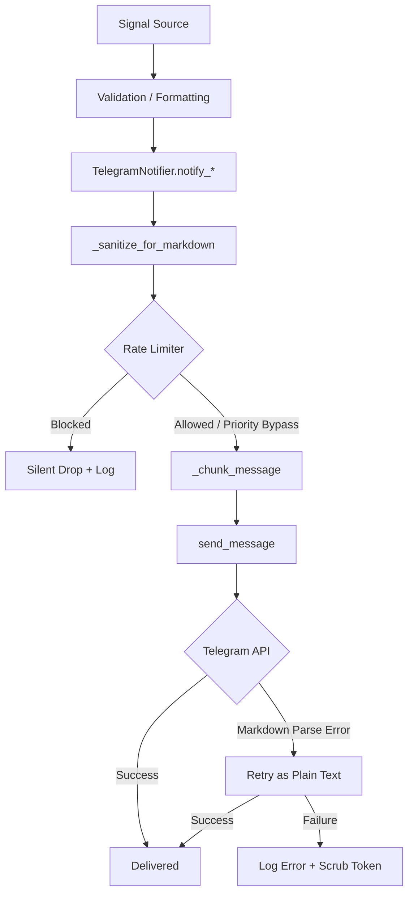
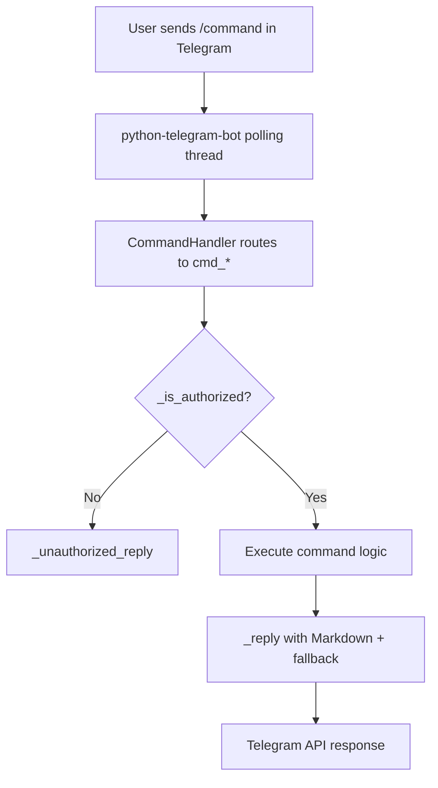
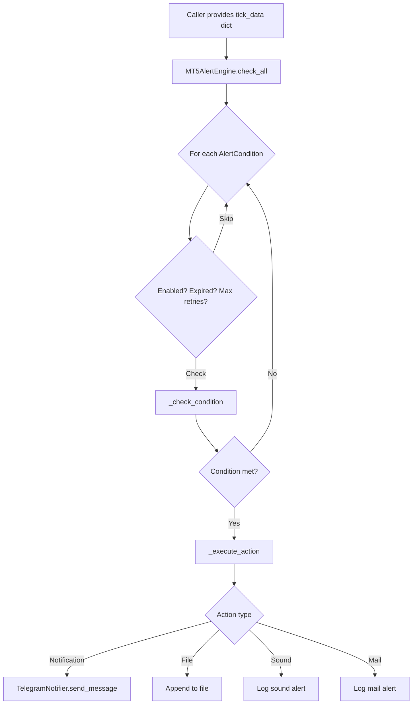
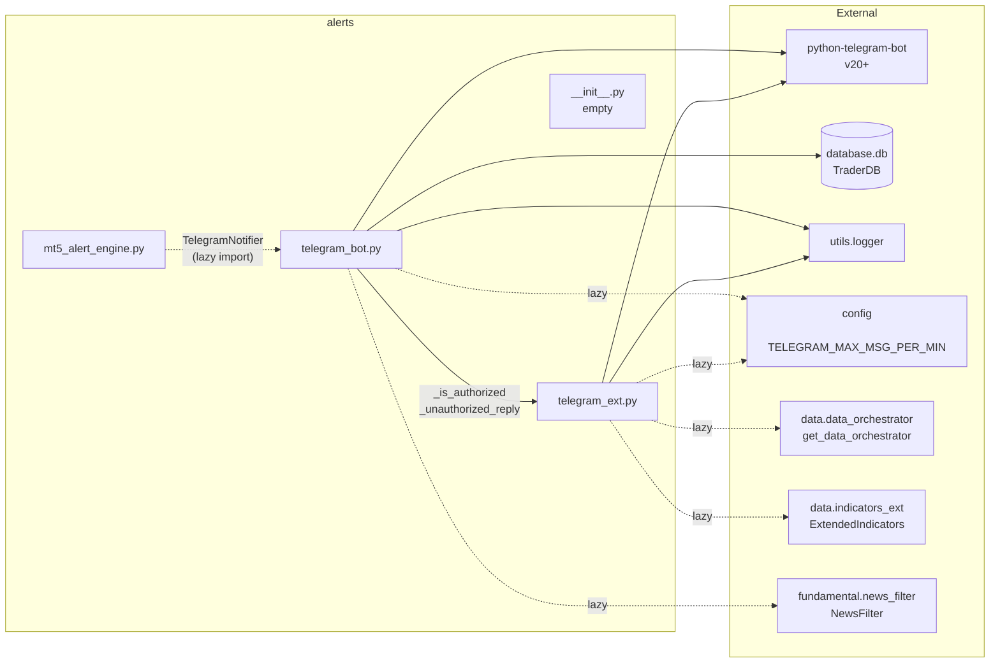
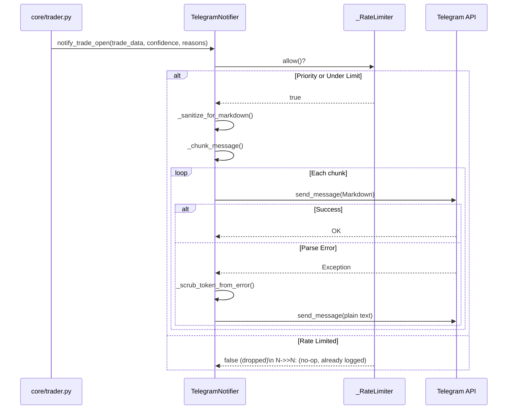
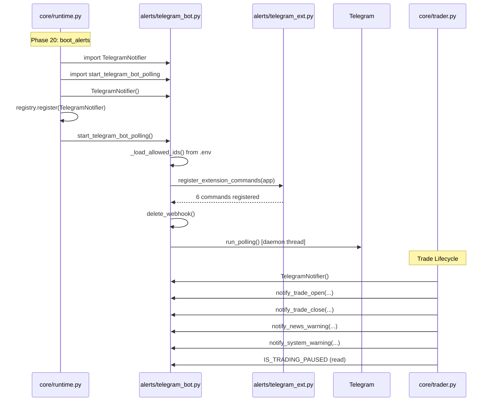

# alerts/ — Alert & Notification Layer

---

## 1 Folder Purpose

The `alerts/` folder is the **sole outbound notification and remote-control interface** for the forex trading system. It provides two distinct capabilities:

1. **Telegram Notifications** — All operator-facing alerts (trade opens/closes, risk warnings, daily reports, news warnings, morning briefings, economic calendars) are formatted and delivered to the operator's Telegram account via the `TelegramNotifier` class.
2. **Telegram Bot Commands** — A bidirectional command interface (/pause, /resume, /status, /daily, /calendar, /positions, /close, /symbols, /indicators, /source, /account) lets the operator monitor and control the running trading system remotely from a phone.
3. **MT5-Style Price Alerts** — A rule-based alert condition engine (`MT5AlertEngine`) that evaluates price/volume/time thresholds and fires configurable actions (sound, file, mail, notification).

### Responsibilities

- Format all outbound alerts into Telegram Markdown messages
- Handle Telegram API failures with Markdown → plain-text fallback
- Enforce per-channel rate limiting to prevent Telegram floods
- Provide authorization-gated remote control commands
- Implement MT5-style alert conditions (price/volume/time thresholds)
- Manage trading pause/resume state with async-safe locking
- Auto-chunk messages exceeding Telegram's 4096-character limit
- Scrub Telegram bot tokens from error log output

### Scope

- Telegram is the **only** notification transport implemented.
- All alert templates live inside `TelegramNotifier`.
- Command handlers are registered during `start_telegram_bot_polling()`.
- Extension commands (Day 93) are registered via `register_extension_commands()`.
- The `MT5AlertEngine` is a standalone rule engine with no integration into the main trading loop.

### What Should Never Be Inside This Folder

- Trade decision logic or signal generation
- Data fetching, indicator computation, or market analysis
- Database writes for trade records
- Risk management calculations (threshold checking happens externally; this folder only formats and sends the alert)
- Broker/MT5 connection management
- Strategy or backtesting logic

---

## 2 Folder Structure

```
alerts/
├── __init__.py            # Empty — no public API exported at package level
├── telegram_bot.py        # Core: TelegramNotifier class + bot command handlers + polling
├── telegram_ext.py        # Extension: Day 93 commands (/positions, /close, etc.) + rich signal
└── mt5_alert_engine.py    # Standalone: MT5-style price/volume/time alert rule engine
```

| File | Lines | Purpose | Status | Role |
|------|-------|---------|--------|------|
| `__init__.py` | 0 | Package marker | Empty | No exports; all imports are done via fully-qualified module paths |
| `telegram_bot.py` | 996 | Core notification hub and bot command system | Active, heavily used | `TelegramNotifier` class, command handlers, rate limiter, pause state, polling bootstrap |
| `telegram_ext.py` | 396 | Day 93 extension commands and rich signal formatter | Active | Extends `telegram_bot.py` at startup; adds /positions, /close, /symbols, /indicators, /source, /account, `notify_rich_signal` |
| `mt5_alert_engine.py` | 415 | MT5-style alert condition rule engine | Active, **unused externally** | `MT5AlertEngine`, `AlertCondition`, `AlertResult`, enums, `create_price_alert` helper |

---

## 3 Alert Pipeline

### Outbound Alert Flow (Telegram Notifications)



### Inbound Command Flow



### MT5 Alert Engine Flow



---

## 4 Module Documentation

### 4.1 `telegram_bot.py`

**Purpose:** Core notification and command hub. Contains the `TelegramNotifier` class (all outbound alert templates), command handlers for the Telegram bot, rate limiting, pause-state management, and the polling bootstrap function.

#### Classes

| Class | Description |
|-------|-------------|
| `TelegramNotifier` | Formats and sends all outbound Telegram notifications. Reads `TELEGRAM_TOKEN` and `TELEGRAM_CHAT_ID` from environment. If either is missing, `self.bot` is set to `None` and all sends are silently no-ops. |
| `_RateLimiter` | Internal sliding-window rate limiter (per-channel, default 10 msgs/min). Tracks send timestamps in a `deque`, drops excess messages, logs every 10th drop. |

#### Functions

| Function | Signature | Description |
|----------|-----------|-------------|
| `register_pause_callback` | `(callback: Callable[[bool], None]) -> None` | Registers a callback invoked when `IS_TRADING_PAUSED` changes. |
| `get_notifier` | `() -> TelegramNotifier` | Returns a module-level lazy singleton `TelegramNotifier`. Used by command handlers to avoid re-instantiation. |
| `start_telegram_bot_polling` | `() -> None` | Spawns a daemon thread that runs the Telegram bot long-polling loop. Registers all command handlers including extension commands. Implements retry with exponential backoff (up to 5 attempts). Deletes existing webhook before polling. |
| `_is_authorized` | `(update) -> bool` | Fail-closed auth check against `ALLOWED_USER_IDS` / `ALLOWED_CHAT_IDS` from `.env`. Rejects all users if no IDs are configured. |
| `_unauthorized_reply` | `(update) -> None` | Sends a rejection message to unauthorized users. |
| `_set_trading_paused` | `(value: bool) -> None` | Async helper that updates `IS_TRADING_PAUSED` under `asyncio.Lock` and invokes the registered callback. |
| `_escape_markdown` | `(text) -> str` | Strips `*`, `_`, `` ` ``, `[` from dynamic text to prevent Markdown parse failures. |
| `_scrub_token_from_error` | `(error_str: str) -> str` | Removes Telegram bot tokens from exception strings before logging (security audit fix). |
| `_sanitize_for_markdown` | `(text: str) -> str` | Pre-send defensive check: removes unbalanced `*`, `_`, `` ` `` and stray `[` / `]` that would cause Telegram's Markdown parser to reject the entire message. |
| `_chunk_message` | `(text: str, limit: int = 4096) -> list[str]` | Splits long messages on newline boundaries to fit within Telegram's 4096-char limit. |
| `_reply` | `(update, text: str) -> None` | Shared reply helper for command handlers. Tries Markdown, falls back to plain text. Auto-chunks long messages. |
| `cmd_start` | `(update, context) -> None` | `/start` — Welcome message with command list. |
| `cmd_help` | `(update, context) -> None` | `/help` — Alias for `/start`. |
| `cmd_status` | `(update, context) -> None` | `/status` — System status with portfolio snapshot from `TraderDB`. |
| `cmd_pause` | `(update, context) -> None` | `/pause` — Pauses trading (auth required). |
| `cmd_resume` | `(update, context) -> None` | `/resume` — Resumes trading (auth required). |
| `cmd_calendar` | `(update, context) -> None` | `/calendar` — Weekly high-impact economic events from `NewsFilter`. |
| `cmd_daily` | `(update, context) -> None` | `/daily` — On-demand daily trading report from `TraderDB`. |

#### `TelegramNotifier` Methods

| Method | Inputs | Output | Description |
|--------|--------|--------|-------------|
| `send_message` | `text: str, priority: bool = False` | `None` | Core sender. Markdown → plain-text fallback. Rate-limited (priority bypasses). Auto-chunks. |
| `notify_trade_open` | `trade_data: dict, confidence: int, reasons: list, confidence_breakdown_lines: list` | `None` | Trade opened alert with confidence score, breakdown, and AI reasoning. |
| `notify_trade_close` | `trade_data: dict` | `None` | Trade closed alert with P/L, pips, and R:R ratio. |
| `notify_daily_loss_limit` | `used: float, limit: float` | `None` | Daily loss warning or limit-reached alert. **Priority=True** — never rate-limited. |
| `notify_drawdown_alert` | `drawdown_pct: float, max_allowed: float` | `None` | Drawdown warning or circuit-breaker alert. **Priority=True**. |
| `notify_daily_report` | `report: dict` | `None` | Daily trading summary (trades, wins, losses, P/L, best/worst trade). |
| `notify_news_warning` | `event_name: str, time_remaining: str` | `None` | High-impact news event pause notification. |
| `notify_system_warning` | `reason: str, pause_duration: str` | `None` | System-initiated pause notification (recovery, errors). |
| `notify_weekly_calendar` | `weekly_calendar: dict` | `None` | Weekly economic calendar with per-event volatility tagging. Auto-chunked. |
| `notify_morning_briefing` | `date_str, high_impact_today, fundamental_scores, session_schedule` | `None` | Morning briefing with session schedule, news events, trading pause windows, and fundamental bias. |

### 4.2 `telegram_ext.py`

**Purpose:** Day 93 extension commands and rich signal notification. Extends the Telegram bot with operational commands that expose MT5 data and allow remote position management. Imported and registered by `telegram_bot.py` during startup.

#### Functions

| Function | Signature | Description |
|----------|-----------|-------------|
| `register_extension_commands` | `(application) -> None` | Registers 6 extension command handlers with the bot `Application`. |
| `cmd_positions` | `(update, context) -> None` | `/positions` — Lists open MT5 positions (ticket, symbol, direction, PnL, SL/TP). Auth required. |
| `cmd_close` | `(update, context) -> None` | `/close <ticket>` — Closes an MT5 position by ticket number. Auth required. Runs close in thread executor. |
| `cmd_symbols` | `(update, context) -> None` | `/symbols` — Lists configured trading pairs with spread/digits/source. Auth required. |
| `cmd_indicators` | `(update, context) -> None` | `/indicators <symbol>` — Shows latest indicator snapshot for a symbol. Auth required. |
| `cmd_source` | `(update, context) -> None` | `/source` — Shows active data source status (MT5 vs API fallback). Auth required. |
| `cmd_account` | `(update, context) -> None` | `/account` — Shows MT5 account balance/equity/margin/floating PnL. Auth required. |
| `notify_rich_signal` | `(bot, chat_id: str, signal_data: Dict[str, Any]) -> None` | Sends a richly-formatted trade signal alert with pair, direction, confidence, entry/SL/TP, strategy, regime, reasons, source. |
| `_escape_md` | `(text: str) -> str` | Escapes Markdown V2 special characters for Telegram. |
| `_fmt_pnl` | `(pnl: float) -> str` | Formats PnL with color icon. |
| `_fmt_position` | `(p: Dict[str, Any]) -> str` | Formats a single position dict as a Telegram message line. |
| `_reply_md` | `(update, text: str) -> None` | Replies with MarkdownV2 formatting, falls back to plain text. |

### 4.3 `mt5_alert_engine.py`

**Purpose:** Standalone MT5-style alert condition engine. Implements the 9 condition types from MT5 User Guide Page 29: `{Bid, Ask, Last, Volume} x {>, <}` + `{Time} x {=}`. Supports configurable actions (sound, file, mail, notification), timeout/snooze, max retries, and expiration.

#### Enums

| Enum | Values | Description |
|------|--------|-------------|
| `AlertField` | `BID`, `ASK`, `LAST`, `VOLUME`, `TIME` | The market data field to evaluate. |
| `AlertOperator` | `GREATER (>)`, `LESS (<)`, `EQUAL (=)` | Comparison operator. |
| `AlertAction` | `Sound`, `File`, `Mail`, `Notification` | Action to execute when alert fires. |

#### Dataclasses

| Dataclass | Fields | Description |
|-----------|--------|-------------|
| `AlertCondition` | `name, symbol, field, operator, value, action, source, timeout_sec, max_retries, expiration, enabled, _last_fired, _fire_count` | A single alert rule with internal firing state. |
| `AlertResult` | `alert_name, fired, reason, current_value, timestamp` | Result of a single alert check. |

#### Classes

| Class | Methods | Description |
|-------|---------|-------------|
| `MT5AlertEngine` | `add_alert`, `remove_alert`, `list_alerts`, `set_action_handler`, `check_all`, `_check_condition`, `_execute_action`, `reset_all`, `get_status`, plus 4 default action handlers | Rule engine that manages a list of `AlertCondition` objects and evaluates them against tick data. |

#### Functions

| Function | Signature | Description |
|----------|-----------|-------------|
| `create_price_alert` | `(name, symbol, field, operator, value, action, source) -> AlertCondition` | Convenience factory for creating `AlertCondition` objects from string parameters. |

---

## 5 Alert Types

All confirmed alert types that exist in the codebase:

| # | Alert Type | Method | Priority? | Description |
|---|-----------|--------|-----------|-------------|
| 1 | **Trade Opened** | `notify_trade_open` | No | Fired when a new trade is executed. Includes pair, signal, entry/SL/TP, lot size, confidence score, confidence breakdown, and AI reasoning. |
| 2 | **Trade Closed** | `notify_trade_close` | No | Fired when a trade is closed. Includes pair, result (WIN/LOSS), P/L in dollars, pips, and R:R ratio. |
| 3 | **Daily Loss Warning** | `notify_daily_loss_limit` | **Yes** | Fired when daily loss approaches the limit (pct < 100%). Shows used vs. limit with percentage. |
| 4 | **Daily Loss Limit Reached** | `notify_daily_loss_limit` | **Yes** | Fired when daily loss >= 100% of limit. Indicates trading has been auto-paused. |
| 5 | **Drawdown Warning** | `notify_drawdown_alert` | **Yes** | Fired when drawdown is approaching but below max allowed. |
| 6 | **Drawdown Circuit Breaker** | `notify_drawdown_alert` | **Yes** | Fired when drawdown >= max allowed. Indicates circuit breaker triggered, trading paused. |
| 7 | **Daily Trading Report** | `notify_daily_report` | No | End-of-day or on-demand summary with total trades, wins, losses, win rate, P/L, best/worst trade. |
| 8 | **News Warning** | `notify_news_warning` | No | Fired before high-impact economic news events. Includes event name and time remaining. Indicates auto-pause. |
| 9 | **System Warning** | `notify_system_warning` | No | Fired for system-initiated pauses (recovery after errors, cycle failures). Includes reason and pause duration. |
| 10 | **Weekly Calendar** | `notify_weekly_calendar` | No | Weekly economic calendar with per-day events, volatility levels, and currency tags. |
| 11 | **Morning Briefing** | `notify_morning_briefing` | No | Daily morning briefing with session schedule, high-impact events, pause windows, and fundamental bias scores. |
| 12 | **Rich Signal** | `notify_rich_signal` | No | Richly-formatted trade signal notification from `telegram_ext.py`. Includes pair, direction, confidence, entry/SL/TP, lot, strategy, regime, reasons, source. |
| 13 | **MT5 Price/Volume/Time Alert** | `MT5AlertEngine._execute_action` | No | Fired by the rule engine when a price/volume/time condition is met. Action types: Sound, File, Mail, Notification. |

**NOT VERIFIED:** The following alert types were **not** found as dedicated methods: Margin, Confidence, ML, Execution, Broker, Connection, Session.

---

## 6 Trigger Conditions

| Alert | Trigger | Required Inputs | Required State | Thresholds |
|-------|---------|----------------|---------------|------------|
| Trade Opened | A new trade is executed by the trading engine | `trade_data` dict (pair, signal, entry, sl, tp, lot), `confidence` (int 0-100), `reasons` (list), `confidence_breakdown_lines` (list, optional) | `self.bot` must not be `None` (TELEGRAM_TOKEN + TELEGRAM_CHAT_ID set) | None — fires on every trade open |
| Trade Closed | A trade is closed by the trading engine | `trade_data` dict (pair, result, pnl, pips, rr_ratio) | `self.bot` not `None` | None — fires on every trade close |
| Daily Loss Warning | Daily loss is approaching limit | `used: float` (current daily loss $), `limit: float` (max daily loss $) | N/A | `used / limit * 100 < 100` — warning stage |
| Daily Loss Limit Reached | Daily loss has exceeded or met the limit | Same as above | N/A | `used / limit * 100 >= 100` — triggers auto-pause message |
| Drawdown Warning | Account drawdown is approaching safety limit | `drawdown_pct: float`, `max_allowed: float` | N/A | `drawdown_pct < max_allowed` |
| Drawdown Circuit Breaker | Account drawdown exceeded safety limit | Same as above | N/A | `drawdown_pct >= max_allowed` — circuit breaker message |
| Daily Report | End-of-day cycle or `/daily` command | `report` dict (total_trades, wins, losses, pnl_pct, pnl_abs, best_trade, worst_trade, win_rate) | N/A | None — fires on schedule or command |
| News Warning | High-impact news event approaching | `event_name: str`, `time_remaining: str` | N/A | Determined by external `NewsFilter` — this module only formats and sends |
| System Warning | System-initiated recovery pause | `reason: str`, `pause_duration: str` | N/A | Determined by external logic — this module only formats and sends |
| Weekly Calendar | Weekly schedule or `/calendar` command | `weekly_calendar: dict` ({date: [event_dict, ...]}) | N/A | None — fires on schedule or command |
| Morning Briefing | Daily morning schedule | `date_str`, `high_impact_today` (list), `fundamental_scores` (dict, optional), `session_schedule` (dict, optional) | N/A | None — fires on schedule |
| Rich Signal | Trade signal from external caller | `signal_data` dict (pair, direction, confidence, entry, sl, tp, lot, strategy, regime, reasons, source) | `bot` instance + `chat_id` must be valid | None — fires on every call |
| MT5 Price Alert | Price/volume/time crosses threshold | `tick_data` dict ({symbol: {bid, ask, last, volume}}), `server_time` (optional) | Alert must be `enabled`, not expired, under max retries, past timeout/snooze | Configured per `AlertCondition` — `field > < = value` |

---

## 7 Consumers

### External Callers (confirmed from code)

| File | Class / Function | Method Called | Purpose |
|------|-----------------|---------------|---------|
| `core/runtime.py` | `boot_alerts()` | `TelegramNotifier()`, `start_telegram_bot_polling` | Phase 20 bootstrap: instantiates notifier, registers as service, starts bot polling in daemon thread |
| `core/trader.py` | `ForexTrader.__init__()` | `TelegramNotifier()` | Creates notifier instance stored as `self.notifier` for trade lifecycle alerts |
| `core/trader.py` | `ForexTrader._notify_trade_open()` | `notifier.notify_trade_open()` | Sends trade-open notification after execution |
| `core/trader.py` | `ForexTrader._notify_trade_close()` | `notifier.notify_trade_close()` | Sends trade-close notification after close |
| `core/trader.py` | `ForexTrader._notify_system_warning()` | `notifier.notify_system_warning()` | Sends system recovery pause notification |
| `core/trader.py` | `ForexTrader` (news handler) | `notifier.notify_news_warning()` | Sends news event pause notification |
| `core/trader.py` | `ForexTrader.is_trading_paused()` | reads `telegram_module.IS_TRADING_PAUSED` | Checks if trading is paused via Telegram /pause |
| `scripts/test_day93_integration.py` | Test function | `notify_rich_signal()` | Integration test for Day 93 extension commands |

### Internal Consumers (within alerts/)

| File | Consumer | Consumes From |
|------|----------|---------------|
| `telegram_bot.py` | `start_telegram_bot_polling()` | `telegram_ext.register_extension_commands()` |
| `telegram_ext.py` | `cmd_positions`, `cmd_close`, etc. | `telegram_bot._is_authorized()`, `telegram_bot._unauthorized_reply()` |
| `mt5_alert_engine.py` | `_default_notification_handler()` | `telegram_bot.TelegramNotifier` (lazy import inside handler) |

### Unconsumed Alert Methods

The following `TelegramNotifier` methods are **defined but not called from outside `alerts/`** based on one-level import tracing:

- `notify_daily_loss_limit` — NOT VERIFIED as called externally (no project-wide call found outside `alerts/`)
- `notify_drawdown_alert` — NOT VERIFIED as called externally
- `notify_daily_report` — Only called internally by `cmd_daily` handler (same module)
- `notify_weekly_calendar` — NOT VERIFIED as called externally
- `notify_morning_briefing` — NOT VERIFIED as called externally

These methods may be called via the `ServiceRegistry` pattern (registered in `boot_alerts` and retrieved by other phases). This could not be confirmed within the one-level import depth constraint.

---

## 8 Dependencies

### Imports Within alerts/

| Source File | Imports From | What |
|-------------|-------------|------|
| `telegram_bot.py` | — | No intra-alerts imports |
| `telegram_ext.py` | `alerts.telegram_bot` | `_is_authorized`, `_unauthorized_reply` (for auth checks in extension commands) |
| `mt5_alert_engine.py` | `alerts.telegram_bot` | `TelegramNotifier` (lazy import inside `_default_notification_handler`) |

### Imports from Outside alerts/ (direct, depth = 1)

| Source File | Imported Module | What |
|-------------|----------------|------|
| `telegram_bot.py` | `telegram` (python-telegram-bot) | `Bot`, `Application`, `CommandHandler`, `ContextTypes`, `ParseMode` |
| `telegram_bot.py` | `database.db` | `TraderDB` (for `/status` and `/daily` portfolio stats) |
| `telegram_bot.py` | `utils.logger` | `get_logger` (logger named `"telegram_bot"`) |
| `telegram_bot.py` | `config` | `TELEGRAM_MAX_MSG_PER_MIN` (lazy import in `_get_rate_limiter`) |
| `telegram_ext.py` | `utils.logger` | `get_logger` (logger named `"telegram_ext"`) |
| `telegram_ext.py` | `data.data_orchestrator` | `get_data_orchestrator` (lazy imports in command handlers) |
| `telegram_ext.py` | `config` | `SYMBOLS` (in `/symbols` command) |
| `telegram_ext.py` | `data.indicators_ext` | `ExtendedIndicators` (in `/indicators` command) |
| `telegram_ext.py` | `telegram.ext` | `CommandHandler` (in `register_extension_commands`) |

### Standard Library

| Module | Used In |
|--------|---------|
| `os` | `telegram_bot.py` (env vars), `mt5_alert_engine.py` (NOT USED — no `os` import) |
| `asyncio` | `telegram_bot.py` (lock, event loop), `telegram_ext.py` (run_in_executor) |
| `time` | `telegram_bot.py` (rate limiter monotonic timestamps, backoff sleep) |
| `collections.deque` | `telegram_bot.py` (rate limiter timestamp window) |
| `datetime` | `telegram_bot.py` (timestamps), `telegram_ext.py` (NOT USED directly), `mt5_alert_engine.py` (expiration, server time) |
| `typing` | `telegram_bot.py` (Callable, Optional), `telegram_ext.py` (Any, Dict, List, Optional), `mt5_alert_engine.py` (Optional, List, Callable, Any) |
| `dataclasses` | `mt5_alert_engine.py` (AlertCondition, AlertResult) |
| `enum` | `mt5_alert_engine.py` (AlertField, AlertOperator, AlertAction) |
| `logging` | `mt5_alert_engine.py` (uses `logging.getLogger(__name__)` instead of `utils.logger`) |
| `threading` | `telegram_bot.py` (daemon thread for polling) |
| `re` | `telegram_bot.py` (token scrubbing, markdown sanitization — imported inline) |

### External Libraries

| Library | Used In | Purpose |
|---------|---------|---------|
| `python-telegram-bot` (v20+) | `telegram_bot.py`, `telegram_ext.py` | Telegram Bot API: `Bot`, `Application`, `CommandHandler`, `ContextTypes`, `ParseMode` |

---

## 9 Alert Objects

### `AlertCondition` (dataclass, `mt5_alert_engine.py`)

```python
@dataclass
class AlertCondition:
    name: str
    symbol: str
    field: AlertField           # BID, ASK, LAST, VOLUME, TIME
    operator: AlertOperator     # >, <, =
    value: float                # threshold
    action: AlertAction = AlertAction.NOTIFICATION
    source: str = ""            # sound file / file path / email
    timeout_sec: int = 0        # snooze interval (0 = no snooze)
    max_retries: int = 1        # repeat count
    expiration: Optional[datetime] = None
    enabled: bool = True
    # Internal (not in to_dict output):
    _last_fired: Optional[datetime]
    _fire_count: int
```

### `AlertResult` (dataclass, `mt5_alert_engine.py`)

```python
@dataclass
class AlertResult:
    alert_name: str
    fired: bool
    reason: str
    current_value: Optional[float] = None
    timestamp: str = ""
```

### Trade Alert Payloads (dict-based, `telegram_bot.py`)

All `TelegramNotifier.notify_*` methods accept **dict payloads** — no formal dataclasses or Pydantic schemas. Key contracts:

**`notify_trade_open` trade_data:**
- `pair` (str), `signal` (str — "BUY"/"SELL"), `entry` (float), `sl` (float), `tp` (float), `lot` (float)

**`notify_trade_close` trade_data:**
- `pair` (str), `result` (str — "WIN"/"LOSS"), `pnl` (float), `pips` (float), `rr_ratio` (float)

**`notify_daily_report` report:**
- `total_trades` (int), `wins` (int), `losses` (int), `pnl_pct` (float), `pnl_abs` (float), `win_rate` (float), `best_trade` (dict, optional), `worst_trade` (dict, optional)

**`notify_rich_signal` signal_data:**
- `pair` (str), `direction` (str), `confidence` (int), `entry` (float), `sl` (float), `tp` (float), `lot` (float), `strategy` (str), `regime` (str), `reasons` (list), `source` (str)

---

## 10 Configuration

### Environment Variables

| Variable | Used In | Description | Default |
|----------|---------|-------------|---------|
| `TELEGRAM_TOKEN` | `telegram_bot.py` (TelegramNotifier init + polling bootstrap) | Telegram Bot API token from @BotFather | `""` (empty — notifications disabled if missing) |
| `TELEGRAM_CHAT_ID` | `telegram_bot.py` (TelegramNotifier init) | Target Telegram chat ID for alerts | `""` (empty — notifications disabled if missing) |
| `ALLOWED_USER_IDS` | `telegram_bot.py` (`_load_allowed_ids`) | Comma-separated Telegram user IDs allowed to run commands | `""` (fail-closed: all rejected if empty) |
| `ALLOWED_CHAT_IDS` | `telegram_bot.py` (`_load_allowed_ids`) | Comma-separated Telegram chat IDs allowed to run commands | `""` (fail-closed: all rejected if empty) |

### Config Module Reference

| Variable | Source | Description |
|----------|--------|-------------|
| `TELEGRAM_MAX_MSG_PER_MIN` | `config.py` (line 353) — reads from `os.getenv("TELEGRAM_MAX_MSG_PER_MIN", "10")` | Maximum outbound messages per minute before rate limiter drops messages | `10` |

### Constants

| Constant | File | Value | Description |
|----------|------|-------|-------------|
| `TELEGRAM_MSG_LIMIT` | `telegram_bot.py` | `4096` | Telegram's hard per-message character limit |
| `IS_TRADING_PAUSED` | `telegram_bot.py` | `False` | Global trading pause flag. Protected by `asyncio.Lock`. |
| `MAX_POLLING_RESTARTS` | `telegram_bot.py` (inside `start_telegram_bot_polling`) | `5` | Max polling restart attempts with exponential backoff |
| `MIN_RELIABLE_TRADES` | `mt5_alert_engine.py` — NOT PRESENT | N/A | This constant exists in `ranking_engine.py`, not in `alerts/` |

---

## 11 Error Handling

### Markdown Parse Failure (telegram_bot.py)
- **Strategy:** Try Markdown first, fall back to plain text.
- **Implementation:** `send_message()` wraps the attempt in try/except. On failure, `_scrub_token_from_error()` sanitizes the exception string before logging. A second attempt sends without `parse_mode`.
- **Coverage:** Both `send_message()` (outbound) and `_reply()` (command responses) implement this pattern.

### Rate Limiter Overflow
- **Strategy:** Messages exceeding `TELEGRAM_MAX_MSG_PER_MIN` are silently dropped.
- **Logging:** Every 10th dropped message is logged at WARNING level with running drop count and current window utilization.
- **Priority Bypass:** Risk-critical alerts (`notify_daily_loss_limit`, `notify_drawdown_alert`) pass `priority=True` to bypass the rate limiter entirely.

### Telegram Network Errors (Polling)
- **Strategy:** Errors matching network keywords (`getaddrinfo`, `connection`, `timeout`, `dns`, `unreachable`, `refused`, `reset`, etc.) are logged as compact one-line warnings to prevent traceback spam.
- **Retry:** Up to 5 polling restart attempts with exponential backoff (10s, 20s, 40s, 80s, 160s). After 5 failures, a CRITICAL log is emitted.
- **Recovery:** The `Application` object is rebuilt fresh after each crash to avoid inconsistent state.

### Webhook Conflict (Pre-polling)
- **Strategy:** `delete_webhook(drop_pending_updates=False)` is called before starting polling to prevent 409 Conflict errors from stale webhook state.
- **Non-fatal:** Failure to delete webhook is logged at DEBUG level and does not block polling startup.

### MT5 Alert Engine
- **Strategy:** Action handler errors are caught and logged per-alert; one failing alert does not block others.
- **Telegram Notification Handler:** The default notification handler wraps `TelegramNotifier` import and send in a bare `except Exception: pass` — if Telegram is not configured, the alert is silently reduced to a log line only.

### Token Security
- **Strategy:** `_scrub_token_from_error()` uses regex to remove bot tokens from exception messages before they reach log output. Pattern matches both URL-embedded tokens (`bot<digits>:<token>`) and bare tokens.

---

## 12 Logging

### Logger Instances

| File | Logger Name | Method | Log Level Usage |
|------|-------------|--------|----------------|
| `telegram_bot.py` | `"telegram_bot"` | `utils.logger.get_logger()` | `info` — startup, command registrations, pause/resume events; `warning` — Markdown failures, unauthorized commands, rate limit drops, extension load failures, network errors; `error` — send failures, callback errors, polling crashes; `critical` — missing TELEGRAM_TOKEN/CHAT_ID, polling giving up after max restarts |
| `telegram_ext.py` | `"telegram_ext"` | `utils.logger.get_logger()` | `info` — command registrations; `warning` — notify_rich_signal failures; `error` — reply failures |
| `mt5_alert_engine.py` | `__name__` (="alerts.mt5_alert_engine") | `logging.getLogger()` (standard library, **not** `utils.logger`) | `info` — alert added/removed/reset, action handler fires; `warning` — no handler for action type; `error` — action handler errors, file write failures |

### Inconsistency

`mt5_alert_engine.py` uses `logging.getLogger(__name__)` (standard library) while the other two files use `utils.logger.get_logger()`. This means `mt5_alert_engine.py` may not respect the project's unified log formatting and level configuration.

---

## 13 Dead Code

### `MT5AlertEngine` — Zero External Usage

`MT5AlertEngine`, `AlertCondition`, `AlertResult`, `AlertField`, `AlertOperator`, `AlertAction`, and `create_price_alert` are **not imported or used by any file outside `alerts/`**. The engine is fully implemented with a CLI demo (`if __name__ == "__main__"`) but has no integration into the trading system's runtime, risk management, or main loop. This module appears to be a standalone utility built for future use or demonstration purposes.

### `register_pause_callback` — No External Registrant

The function `register_pause_callback()` is defined and documented in `telegram_bot.py`, but **no file outside `alerts/` calls it**. The docstring shows an example usage (`register_pause_callback(my_engine.on_pause_changed)`) but this pattern is NOT VERIFIED as implemented. The pause state IS read by `core/trader.py` via `IS_TRADING_PAUSED`, but the callback mechanism itself has no confirmed external subscriber.

### `_unauthorized_reply` — Only Used Internally

`_unauthorized_reply()` is exported and used by `telegram_ext.py` (imported explicitly), but has no external consumers. This is expected design — it's an internal API shared between the two telegram modules.

### Duplicate Markdown Escaping

Two separate Markdown escaping functions exist with different behavior:
- `_escape_markdown()` in `telegram_bot.py` — Strips `*`, `_`, `` ` ``, `[` unconditionally.
- `_escape_md()` in `telegram_ext.py` — Escapes 19 Markdown V2 special characters with backslash prefix.

These serve different Telegram Markdown versions (V1 vs V2) but the inconsistency is a maintenance risk.

---

## 14 Integration Points

### Confirmed Integrations

| Target Module | Integration Type | File | Details |
|---------------|-----------------|------|---------|
| **Runtime** | Bootstrap | `core/runtime.py` → `alerts/telegram_bot.py` | `boot_alerts()` (Phase 20) imports `TelegramNotifier` and `start_telegram_bot_polling`. Creates notifier, registers as service, starts polling thread. |
| **Trader** | Outbound alerts | `core/trader.py` → `alerts/telegram_bot.py` | `ForexTrader.__init__()` creates `TelegramNotifier` instance. Calls `notify_trade_open`, `notify_trade_close`, `notify_news_warning`, `notify_system_warning`. Reads `IS_TRADING_PAUSED` via `telegram_module.IS_TRADING_PAUSED`. |
| **Database** | Read-only | `alerts/telegram_bot.py` → `database/db.py` | `cmd_status` and `cmd_daily` read portfolio stats from `TraderDB.get_overall_stats()`. |
| **Data Orchestrator** | Read-only | `alerts/telegram_ext.py` → `data/data_orchestrator.py` | Extension commands read positions, symbol info, account info, and candles via `get_data_orchestrator()`. |
| **Config** | Read-only | `alerts/telegram_bot.py` → `config.py` | Reads `TELEGRAM_MAX_MSG_PER_MIN` (lazy import). |
| **News Filter** | Read-only | `alerts/telegram_bot.py` → `fundamental/news_filter.py` | `cmd_calendar` imports `NewsFilter` and calls `get_weekly_calendar()`. |
| **Indicators** | Read-only | `alerts/telegram_ext.py` → `data/indicators_ext.py` | `/indicators` command imports `ExtendedIndicators` for snapshot display. |

### NOT VERIFIED Integrations

The following were **not** confirmed with one-level import tracing:
- **Risk** — `notify_daily_loss_limit` and `notify_drawdown_alert` are defined but no external caller was found. They may be called via the `ServiceRegistry` (registered in `boot_alerts`).
- **Analytics** — No imports from `analytics/` found in any alerts file.
- **Memory** — No imports from `memory/` found in any alerts file.
- **ML** — No imports from `ml/` found in any alerts file.
- **Execution** — No imports from `execution/` found in any alerts file (except `telegram_ext.py` uses `run_in_executor` for MT5 close, which is stdlib).
- **Broker** — No direct broker imports; MT5 interaction goes through `data_orchestrator`.

---

## 15 Extension Guide

### How to Add a New Alert Type

1. **Add a new `notify_*` method** to `TelegramNotifier` in `telegram_bot.py`:
   ```python
   async def notify_my_alert(self, key_data: str, value: float):
       msg = f"\U0001f6a8 *MY ALERT*\n\nData: {_escape_markdown(key_data)}\nValue: {value}"
       await self.send_message(msg)
   ```

2. **Call it from the appropriate external module** (e.g., `core/trader.py`):
   ```python
   self.notifier.notify_my_alert(some_key, some_value)
   ```

3. **If the alert is risk-critical**, pass `priority=True` to `send_message()` to bypass the rate limiter.

### How to Add a New Bot Command

1. **For core commands** — Add the handler in `telegram_bot.py`:
   - Define `async def cmd_mycommand(update, context):` with auth check if needed.
   - Register in `start_telegram_bot_polling()`: `app.add_handler(CommandHandler("mycommand", cmd_mycommand))`

2. **For extension commands** — Add the handler in `telegram_ext.py`:
   - Define the async handler function.
   - Add it to the `commands` list in `register_extension_commands()`.
   - Use `_is_authorized` / `_unauthorized_reply` for auth checks.

### How to Add a New MT5 Alert Condition Type

1. Add a new value to the `AlertField` enum if needed.
2. Handle the new field in `MT5AlertEngine._check_condition()`.
3. No other changes needed — the engine evaluates any field/operator combination generically.

### Backward Compatibility Rules

- New `notify_*` methods must follow the existing pattern: accept a dict or keyword args, use `_escape_markdown()` for dynamic text, and call `self.send_message()`.
- New command handlers must use `_reply()` (not raw `reply_text`) for Markdown safety.
- New environment variables must have sensible defaults and not break existing behavior when unset.
- The `__init__.py` is empty — do not add exports there. All external consumers use fully-qualified imports (`from alerts.telegram_bot import ...`).

---

## 16 Mermaid Diagrams

### Dependency Diagram



### Alert Flow



### Runtime Flow



---

## 17 Folder Health Report

### Architecture

The folder follows a reasonable separation: `telegram_bot.py` as the core hub, `telegram_ext.py` as an extension layer, and `mt5_alert_engine.py` as a standalone rule engine. However, the architecture has several weaknesses:

- **Single transport coupling:** All alerts are Telegram-only. There is no abstraction layer (e.g., `AlertTransport` interface) that would allow adding email, SMS, or webhook channels without modifying `TelegramNotifier`.
- **God class:** `TelegramNotifier` in `telegram_bot.py` (996 lines) handles both notification templates AND bot command definitions AND polling bootstrap AND rate limiting AND pause state management. This file has too many responsibilities.
- **`__init__.py` is empty:** Despite having well-defined public APIs (`TelegramNotifier`, `start_telegram_bot_polling`, `register_pause_callback`, `IS_TRADING_PAUSED`, `get_notifier`), none are re-exported. All consumers use fully-qualified imports.

### Maintainability

- **Markdown handling complexity:** Three overlapping Markdown utilities (`_escape_markdown`, `_sanitize_for_markdown`, `_escape_md`) with different behaviors for V1 vs V2 Markdown create confusion and potential bugs.
- **Mixed sync/async patterns:** The system mixes sync (`start_telegram_bot_polling` spawns its own thread/loop) and async (all `notify_*` methods are async). Callers in `core/trader.py` use `_run_async` / `_run_async_safe` wrappers, which is fragile.
- **Inconsistent logging:** `mt5_alert_engine.py` uses `logging.getLogger(__name__)` while other files use `utils.logger.get_logger()`. This breaks unified log configuration.
- **Comments in Bengali:** `telegram_bot.py` contains Bengali comments (e.g., line 834: "নতুন event loop এ চালাও"). This reduces accessibility for international contributors.

### Reliability

- **Strong:** Markdown → plain-text fallback, rate limiting with priority bypass, polling retry with exponential backoff, token scrubbing, webhook cleanup before polling, authorization-gated commands.
- **Moderate risk:** `asyncio.run()` inside `_default_notification_handler` in `mt5_alert_engine.py` will fail if called from within an already-running event loop (RuntimeError). This handler is never called in practice (engine is unused), but it would break if integrated.
- **Silent failure mode:** If `TELEGRAM_TOKEN` or `TELEGRAM_CHAT_ID` is not set, `TelegramNotifier` silently sets `self.bot = None` and ALL alerts become no-ops with only a CRITICAL log at startup. There is no runtime check or re-attempt.

### Extensibility

- **Adding new alert types** is straightforward — add a method to `TelegramNotifier`.
- **Adding new bot commands** is well-supported via both core registration and the extension mechanism.
- **Adding new transport channels** requires modifying `TelegramNotifier` directly (no plugin architecture).
- **The `MT5AlertEngine`** is well-designed for extension (custom action handlers via `set_action_handler`), but has zero integration into the system.

### Technical Debt

1. **`mt5_alert_engine.py` is dead code** — 415 lines of fully implemented, tested code with no external consumer. Either integrate it or remove it.
2. **`register_pause_callback` has no caller** — The callback mechanism is built but unused. The pause state IS consumed via direct flag read, making the callback redundant.
3. **Several `notify_*` methods may be unused** — `notify_daily_loss_limit`, `notify_drawdown_alert`, `notify_weekly_calendar`, `notify_morning_briefing` have no confirmed external caller within one-level import depth. They may be invoked via `ServiceRegistry` (NOT VERIFIED).
4. **Duplicate Markdown escaping** — Three functions with subtly different behaviors for V1 vs V2 Markdown.
5. **Mixed Markdown modes** — `telegram_bot.py` uses `ParseMode.MARKDOWN` (V1) while `telegram_ext.py`'s `_reply_md` uses `parse_mode="MarkdownV2"`. This inconsistency can cause formatting issues.
6. **996-line file** — `telegram_bot.py` combines notification templates, command handlers, rate limiting, pause state, and polling bootstrap. Should be split into at least 3 modules.

### Major Risks

| Risk | Severity | Description |
|------|----------|-------------|
| Token leakage | HIGH (mitigated) | Telegram bot tokens could appear in log output from urllib3/httpx errors. Mitigated by `_scrub_token_from_error()` but relies on regex coverage. |
| Silent alert loss | MEDIUM | If env vars are misconfigured after startup, all alerts silently become no-ops. No health-check mechanism. |
| Command auth bypass | LOW (mitigated) | Fail-closed auth design rejects all users when no IDs are configured. However, if a user is accidentally added to `ALLOWED_USER_IDS`, they gain full control including `/close` on live positions. |
| `asyncio.run()` crash | LOW | `mt5_alert_engine.py`'s notification handler would crash if called from an async context. Currently mitigated by the module being unused. |
| Rate limiter data loss | LOW | The `_RateLimiter` uses an in-memory `deque` with no persistence. On process restart, all rate-limit state is lost (benign — resets to zero). |