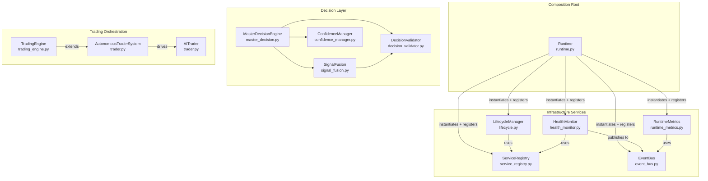
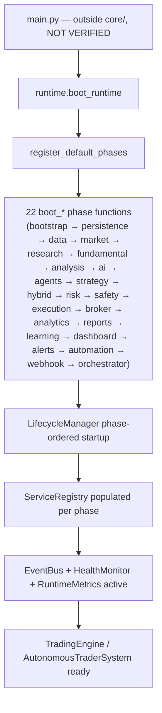
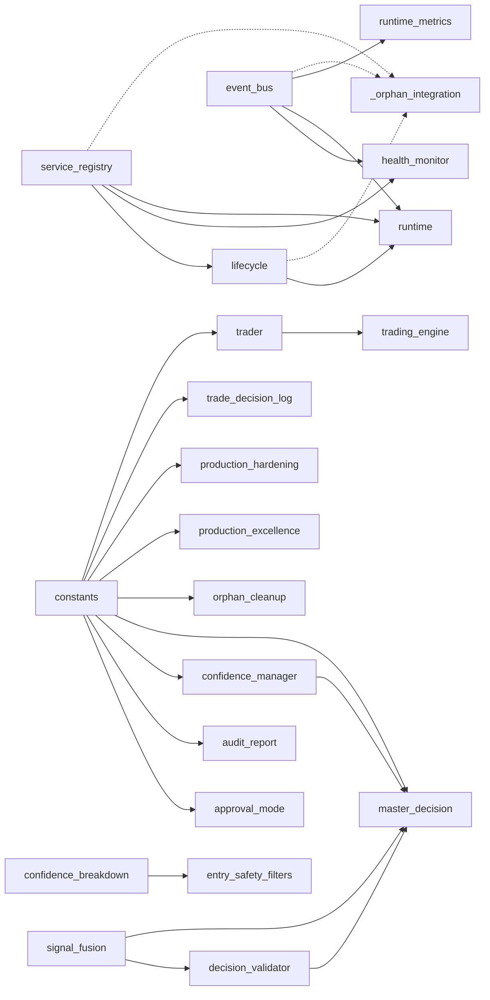

# `core/` — Architecture Specification

**Scope of this document:** everything inside `core/` (43 Python files, ~21,300 lines), plus the direct (one-level) external imports those files make (`config`, `utils.logger`). No file outside `core/` was included in the analyzed archive, so anything that requires seeing `main.py` or sibling packages (e.g. "who calls `core.X` from outside `core/`?") is marked **NOT VERIFIED**.

Analysis method: static AST parsing of every file (imports, classes, methods, functions, docstrings) plus targeted manual reading of the seven orchestration modules (`runtime.py`, `lifecycle.py`, `service_registry.py`, `event_bus.py`, `master_decision.py`, `trading_engine.py`, `trader.py`). No code was executed, modified, or refactored.

---

## Section 1 — Core Philosophy

**Why `core/` exists.** The docstrings inside the module themselves state the intent directly: `runtime.py` calls itself "the single composition root that knows how to instantiate every runtime module," replacing what it calls "ad-hoc initial[ization]." `event_bus.py` says it "replaces the broken `orchestrator/communication_bus.py`." Read together, `core/` is the **infrastructure and orchestration layer** of the trading system — it is not where trading strategies or signal-generation logic live (those are implied to live in sibling packages such as `strategy/`, `analysis/`, `agents/`, referenced only by string/boot-phase name in `runtime.py`, not imported directly — NOT VERIFIED beyond that reference).

**Responsibilities of `core/`:**
- Boot sequencing and dependency wiring (`runtime.py`, `lifecycle.py`)
- Service lookup / dependency injection (`service_registry.py`)
- Cross-module communication (`event_bus.py`)
- Health, metrics, and shutdown (`health_monitor.py`, `runtime_metrics.py`, `graceful_shutdown.py`)
- Decision-making orchestration: fusing multiple signal sources into one final trade decision (`master_decision.py`, `signal_fusion.py`, `decision_validator.py`, `confidence_manager.py`, `signal_scorer.py`, `unified_signal.py`, `fusion_engine_v3.py`)
- Execution-path abstractions (`execution_adapter.py`, `data_provider.py`, `execution_logger.py`)
- Cross-cutting safety/production concerns (`entry_safety_filters.py`, `regime_suppression.py`, `signal_persistence.py`, `production_hardening.py`, `production_excellence.py`, `graceful_shutdown.py`)
- The trading orchestration classes themselves (`trader.py` → `AITrader`, `AutonomousTraderSystem`; `trading_engine.py` → `TradingEngine`)
- Self-documentation of its own technical debt (`obsolete.py`, `orphan_cleanup.py`, `orphan_consumers.py`, `_orphan_integration.py`, `audit_report.py`) — this is unusual and worth calling out: the codebase tracks its own dead code as first-class, versioned data (see Section 17).

**Architecture philosophy (as evidenced by the code, not assumed):**
- **Composition root pattern.** `runtime.py`'s `Runtime` class + `boot_*` functions is a textbook composition root: one place instantiates everything, nothing else is supposed to reach across the codebase to construct services itself.
- **Phased, dependency-ordered startup.** `lifecycle.py`'s `Phase` enum + `LifecycleManager` enforce that "no service starts before its dependencies are healthy" (direct quote from its docstring).
- **Registry-based lookup over global variables.** `service_registry.py` is explicitly a typed DI container (`ServiceRegistry`), used instead of ad-hoc module-level singletons — though several files (e.g. `event_bus.get_bus()`, `master_decision.get_master_decision_engine()`) also expose classic `get_x()` singleton-accessor functions, so the codebase uses **both** patterns side by side (module-level singleton getters *and* the registry). This dual pattern is a design tension — see Section 18.
- **Evidence-backed dead-code tracking.** `obsolete.py` defines `ObsoleteStatus`, `ArchiveState`, and `Confidence` enums and an `ObsoleteEntry` dataclass — i.e., the team built a structured, queryable record of which modules are dead, rather than just leaving stale files in place.

**What belongs inside `core/`:** orchestration, lifecycle, DI, cross-cutting infrastructure (events, health, logging-of-decisions, safety gating), and the top-level trader/engine classes that tie strategy output to execution.

**What must NEVER be placed inside `core/`** (inferred from separation of concerns visible in imports — NOT VERIFIED as an explicit rule anywhere in the code, since no `CONTRIBUTING.md` or style guide was present in the archive):
- Concrete strategy/indicator logic — none of the 43 files contain indicator math or strategy signal generation; they only *consume* signals (e.g. `signal_fusion.py`'s `LayerSignal` is a plain data carrier, not a signal generator).
- Broker/MT5 SDK calls beyond thin adapters — `data_provider.py` and `execution_adapter.py` are explicitly named "abstractions," implying the real MT5 calls live elsewhere and only the interface + a live/historical split lives in `core/`.

---

## Section 2 — Folder Structure

| File | Purpose (from docstring/content) | Status |
|---|---|---|
| `__init__.py` | Empty package marker (2 lines, no content) | Active (trivial) |
| `runtime.py` | Composition root — instantiates and registers every runtime module | **Active** (central) |
| `lifecycle.py` | Phase-ordered startup/shutdown manager | **Active** (central) |
| `service_registry.py` | Typed DI container / service registry | **Active** (central) |
| `event_bus.py` | Thread-safe in-process pub/sub bus | **Active** (central) |
| `runtime_metrics.py` | Collects timing/stage stats for boot phases | Active (used by `runtime.py`) |
| `health_monitor.py` | Health check aggregation | Active (used by `runtime.py`) |
| `graceful_shutdown.py` | Signal-handling / clean shutdown sequencing | Active (no internal `core/` importer found — see caveat below) |
| `trader.py` | `AITrader` + `AutonomousTraderSystem` — main trading orchestration classes (4,196 lines, largest file) | **Active** (imported by `trading_engine.py`) |
| `trading_engine.py` | Thin composition wrapper around `AutonomousTraderSystem`, adds startup banner + approval/circuit-breaker convenience methods | **Active** |
| `master_decision.py` | Central decision-fusion "brain" — combines all signal layers into one BUY/SELL/WAIT | **Active** |
| `signal_fusion.py` | 4-layer signal fusion used by `master_decision.py` and `decision_validator.py` | Active |
| `decision_validator.py` | Final validation gate on a fused decision | Active (used by `master_decision.py`) |
| `confidence_manager.py` | Dynamic weight adjustment for confidence scoring | Active (used by `master_decision.py`) |
| `confidence_breakdown.py` | Transparent confidence scorecard, consumed by `entry_safety_filters.py` | Active |
| `entry_safety_filters.py` | Entry-time safety gate layer | Active (imports `confidence_breakdown.py`) |
| `fusion_engine_v3.py` | "Day 99+ V3 Fusion Engine" | No internal `core/` importer found — **possible orphan or externally wired** |
| `unified_signal.py` | Unified signal data object (Day 81+) | No internal `core/` importer found — **possible orphan or externally wired** |
| `signal_scorer.py` | Cumulative score-based decision layer (Day 81+) | No internal `core/` importer found — **possible orphan or externally wired** |
| `signal_persistence.py` | Signal persistence filter (Day 97+) | No internal `core/` importer found — **possible orphan or externally wired** |
| `regime_suppression.py` | False-signal regime suppression (Day 97+) | No internal `core/` importer found — **possible orphan or externally wired** |
| `approval_mode.py` | Manual-approval gating mode | Used by `trader.py` |
| `constants.py` | Pip math, env-driven constants, thresholds | Used by 9 other files (see Section 6) — **Active, high fan-in** |
| `exceptions.py` | Custom exception hierarchy + `safe_execute` helper | No internal `core/` importer found — likely used by files outside `core/` |
| `data_provider.py` | `DataProvider` / `LiveMT5Provider` / `HistoricalMT5Provider` abstraction | No internal `core/` importer found — **possible orphan or externally wired** |
| `execution_adapter.py` | `ExecutionAdapter` / `MT5ExecutionAdapter` / `HistoricalExecutionAdapter` abstraction | No internal `core/` importer found — **possible orphan or externally wired** |
| `execution_logger.py` | Structured logger for the trade execution path | No internal `core/` importer found |
| `trade_decision_log.py` | Records every trade decision, taken or not | Used by `constants.py`'s importers list — actually imports `constants`, not the reverse; no internal importer found for itself |
| `llm_key_manager.py` | Multi-key LLM rotation manager (Day 72+), largest supporting file at 1,194 lines | No internal `core/` importer found — **possible orphan or externally wired** |
| `llm_cache.py` | LLM response cache (Day 90) | No internal `core/` importer found |
| `ollama_validator.py` | Local-LLM (Qwen3:4B) institutional validation layer | No internal `core/` importer found |
| `retry_with_failover.py` | Retry policy + model failover service | No internal `core/` importer found |
| `professional_tools.py` | Session-aware pair selection, dynamic position sizing, trade journal | No internal `core/` importer found |
| `production_excellence.py` | Shadow-mode trading, strategy marketplace, data-source voting | No internal `core/` importer found |
| `production_hardening.py` | Position reconciliation, heartbeat monitor, correlation matrix | Uses `constants.py`; no internal importer of itself found |
| `production_trading_system.py` | "Unified Production Entry Point" — `ProductionTradingSystem` | No internal `core/` importer found — notable given its name implies it *should* be the entry point |
| `monitoring_system.py` | Comprehensive monitoring system + HTTP health handler | No internal `core/` importer found |
| `indicator_cache.py` | Indicator caching | No internal `core/` importer found |
| `orphan_cleanup.py` | Cleanup logic for orphaned modules | Uses `constants.py`; no internal importer of itself found |
| `orphan_consumers.py` | "Real consumers for the Phase-25 orphan services" — 1,041 lines of functions (`enrich_market_context`, `apply_signal_scoring`, `apply_advanced_risk_gates`, `final_decision_gate`) written specifically to wire previously-dead modules in | No internal `core/` importer found — **this file's own stated purpose is to be a consumer, so its import direction is inbound-from-elsewhere; confirm from `_orphan_integration.py`** |
| `_orphan_integration.py` | "Phase 25: Orphan Module Wire-Up" — `boot_orphan_integration()` | Imports `event_bus` and `lifecycle`/`service_registry`; likely the file that registers `orphan_consumers.py`'s functions into the boot sequence, but no direct AST-level import from `_orphan_integration.py` to `orphan_consumers.py` was detected — **NOT VERIFIED**, recommend manual read if this wiring matters |
| `obsolete.py` | Structured registry (`ObsoleteEntry`, `ObsoleteStatus`, `ArchiveState`, `Confidence` enums) documenting the project's own dead code | No internal `core/` importer found — self-contained reference data |
| `audit_report.py` | `DecisionAuditReport` | No internal `core/` importer found |

**Caveat on "Status" column:** "No internal `core/` importer found" means no *other file inside `core/`* imports it. It does **not** mean the file is dead — it may be imported directly by `main.py`, by a sibling package, or dynamically (`importlib`, string-based dispatch) — none of which were in the provided archive. Treat these as **candidates for verification against the full repo**, not confirmed orphans. `obsolete.py` and `orphan_consumers.py` existing at all is evidence that the project already runs this exact audit process on itself; this README's findings should be cross-checked against those two files' own conclusions.

---

## Section 3 — Core Runtime Architecture

**Initialization:** `runtime.py`'s `Runtime` class + the `boot_*` function family (`boot_bootstrap`, `boot_persistence`, `boot_data`, `boot_market`, `boot_research`, `boot_fundamental`, `boot_analysis`, `boot_ai`, `boot_agents`, `boot_strategy`, `boot_hybrid`, `boot_risk`, `boot_safety`, `boot_execution`, `boot_broker`, `boot_analytics`, `boot_reports`, `boot_learning`, `boot_dashboard`, `boot_alerts`, `boot_automation`, `boot_webhook`, `boot_orchestrator`) — 22 named boot phases, each presumably wiring one subsystem into the registry via `register_default_phases()` and `boot_runtime()`. **NOT VERIFIED**: the internal body logic of each `boot_*` function was not individually traced line-by-line in this pass; their existence and naming pattern is confirmed via AST, not their full correctness.

**Dependency Injection:** `service_registry.py`'s `ServiceRegistry` class provides registration/lookup; `ServiceStatus` (enum) and `ServiceRecord` (dataclass) track per-service state. Errors are typed (`ServiceNotFoundError`, `ServiceRegistrationError`) rather than generic exceptions.

**Shared Objects:** Both singleton-getter functions (`get_bus()`, `get_registry()`, `get_lifecycle()`, `get_health_monitor()`, `get_metrics()`, `get_master_decision_engine()`, `get_decision_validator()`, `get_signal_fusion()`, `get_confidence_manager()`) and the `ServiceRegistry` DI container exist concurrently. `reset_registry()` in `service_registry.py` suggests test-time reset support.

**Configuration Loading:** `constants.py` reads environment variables via internal `_env_int` / `_env_float` helpers (e.g. feeding `get_max_trades_per_day()`, `get_min_confidence()`), i.e. runtime configuration is environment-variable driven, not a static config file, within `core/` itself (a `config` module is imported by `trading_engine.py` — `from config import EXECUTION_MODE` — which lives outside `core/` and was not in the archive).

**Global Context:** No single "global context object" class was found; the closest equivalents are the `ServiceRegistry` singleton and `EventBus` singleton.

**State Management:** `runtime_metrics.py`'s `RuntimeMetrics`/`StageStat`, `health_monitor.py`'s `HealthSnapshot`, and `master_decision.py`'s SQLite-backed persistence (`sqlite3` import) are the state-tracking mechanisms found.

**Execution Coordination:** `trading_engine.py`'s `TradingEngine(AutonomousTraderSystem)` adds `pending_approvals`, `approve`, `reject`, `circuit_breaker_status`, `resume_trading`, `health` on top of the base class — i.e. execution is gated by an approval/circuit-breaker layer sitting above the raw trading loop.

**Shutdown:** `graceful_shutdown.py`'s `GracefulShutdownManager` handles OS signals (`signal`, `sys`) and defines a `ShutdownState` — described in its docstring as preventing "orphaned positions, half-written state files, and background threads dying abruptly" on Ctrl+C/SIGTERM/VPS reboot.

---

## Section 4 — Module Documentation

Given the scope (43 files, ~21,300 lines), full per-file API-level documentation (every public/private method, every input/output/exception) is impractical to hand-write exhaustively and reliably in one pass without risking invented detail. The seven orchestration modules are documented in depth below; the remaining 36 are documented at module/class level in the Section 2 table plus Section 5 (API inventory) and Section 6 (dependencies). For line-by-line documentation of any specific file beyond what's below, request that file by name and it can be read in full and documented to the same depth.

### `runtime.py` (1,602 lines)
- **Purpose:** Composition root — the one place that knows how to build and wire every subsystem.
- **Main class:** `Runtime`
- **Functions:** `get_runtime()` (singleton accessor) + 22 `boot_*` phase functions + `register_default_phases()` + `boot_runtime()` (top-level entry that presumably calls the others in order).
- **Inputs/Outputs:** Not individually typed-checked in this pass (1,602 lines); the class is constructed with no visible required arguments in its top-level signature per AST (**NOT VERIFIED** for internal parameter details — recommend targeted read if modifying boot order).
- **Imports:** `event_bus`, `health_monitor`, `lifecycle`, `runtime_metrics`, `service_registry` — i.e. it depends on every other infrastructure module, confirming it as the top of the dependency graph.

### `lifecycle.py` (226 lines)
- **Purpose:** Enforces strict phase ordering on startup, reversed on shutdown, per its docstring.
- **Classes:** `Phase` (enum), `PhaseResult` (dataclass), `LifecycleManager`.
- **Function:** `get_lifecycle()` singleton accessor.
- **Depends on:** `service_registry.py` only.

### `service_registry.py` (327 lines)
- **Purpose:** Typed DI container.
- **Classes:** `ServiceStatus` (enum), `ServiceRecord` (dataclass), `ServiceNotFoundError`, `ServiceRegistrationError` (both raise-able exceptions), `ServiceRegistry`.
- **Functions:** `get_registry()`, `reset_registry()`.
- **Depends on:** nothing internal to `core/` — this is a leaf/foundation module.

### `event_bus.py` (172 lines)
- **Purpose:** Thread-safe pub/sub; explicitly built to replace a broken external `orchestrator/communication_bus.py` (per docstring — that file is outside `core/` and unverified here).
- **Classes:** `Event` (dataclass), `EventBus`.
- **Functions:** `get_bus()`, `publish()`, `subscribe()` (module-level convenience wrappers around the singleton bus).
- **Depends on:** nothing internal to `core/` — leaf/foundation module.

### `master_decision.py` (599 lines)
- **Purpose:** "The central brain coordination layer. Collects signals from ALL intelligence layers, fuses them with dynamic weights, validates the decision, and produces the FINAL BUY/SELL/WAIT" (direct docstring quote).
- **Classes:** `MasterDecision` (dataclass, the output object), `MasterDecisionEngine`.
- **Depends on:** `confidence_manager.py`, `decision_validator.py`, `signal_fusion.py`, `constants.py` — plus `sqlite3` for persistence and `utils.logger` (external, one level deep).
- **Function:** `get_master_decision_engine()` singleton accessor, `_coerce_adaptive_numeric()` helper.

### `trader.py` (4,196 lines — largest file in `core/`)
- **Purpose:** Not documented with a module docstring (`NONE` found by AST) — purpose inferred from class names and method names.
- **Classes:**
  - `AITrader` — has `get_signal`, `evaluate_decision_core`, `run_cycle`, `monitor_open_trades`, `check_open_paper_trades`, `close_trade`, `get_paper_dashboard`, `print_paper_dashboard`, `get_learning_report`, `get_memory_stats`, `_resolve_mt5_connection`, `_sync_balance`, `_get_live_open_pairs`, `sync_risk_with_open_positions`, plus private `_publish`, `_stage`, `_record_error`, `_reject`, `_apply_advanced_sizing`. This is the single-symbol/single-cycle trading logic class.
  - `AutonomousTraderSystem` — has `run`, `stop`, `_on_webhook_command`, `_get_circuit_breaker`, `_circuit_breaker_status_summary`, `_build_trader`, `_detect_mt5_position_closes`, `_handle_mt5_close`, `_select_cycle_symbols`, `_spawn_trader`, `backup_state`, `_handle_cycle_errors`, `_sync_risk_state`, `_start_telegram_commands`, `_notify_warning`, `_notify_system_warning`, `_run_async_safe`, `_manual_pause_active`, `_is_paused`. This is the multi-symbol orchestration layer that spawns/manages `AITrader` instances.
  - `_NoOp` — a context-manager no-op helper (`__enter__`/`__exit__`), likely used as a fallback when an optional feature (e.g. a lock or a telemetry span) is disabled.
- **Note:** At 4,196 lines this file is by far the largest in `core/` (2.6x the next-largest, `runtime.py`). See Section 18 (Architecture Risks) — this is a maintainability concern regardless of correctness.

### `trading_engine.py` (84 lines)
- **Purpose:** Explicit docstring on the class itself: "Thin composition root on top of `AutonomousTraderSystem` — adds the Day 37 startup banner and a couple [more things, truncated in source]."
- **Class:** `TradingEngine(AutonomousTraderSystem)` — subclasses rather than wraps.
- **Methods added:** `__init__`, `run`, `_print_banner`, `pending_approvals`, `approve`, `reject`, `circuit_breaker_status`, `resume_trading`, `health`.
- **External imports (one level):** `config.EXECUTION_MODE`, `utils.logger.get_logger` — both outside `core/`, not further traced.

---

## Section 5 — Public API Inventory

Public API = module-level functions and public (non-underscore-prefixed) class methods, as detected by AST. Caller files are limited to what's inside `core/`; broader callers are **NOT VERIFIED** (see Section 12).

| API | Module | Purpose (inferred) | Caller files (within `core/`) |
|---|---|---|---|
| `get_registry()` | `service_registry.py` | Return the singleton `ServiceRegistry` | `_orphan_integration.py`, `health_monitor.py`, `lifecycle.py`, `runtime.py` |
| `get_bus()` | `event_bus.py` | Return the singleton `EventBus` | `_orphan_integration.py`, `health_monitor.py`, `runtime.py`, `runtime_metrics.py` |
| `get_lifecycle()` | `lifecycle.py` | Return the singleton `LifecycleManager` | `_orphan_integration.py`, `runtime.py` |
| `get_health_monitor()` | `health_monitor.py` | Return the singleton `HealthMonitor` | `runtime.py` |
| `get_metrics()` | `runtime_metrics.py` | Return the singleton `RuntimeMetrics` | `runtime.py` |
| `get_runtime()` | `runtime.py` | Return the singleton `Runtime` | None found within `core/` — likely called from `main.py` (**NOT VERIFIED**) |
| `boot_runtime()` | `runtime.py` | Top-level boot entry point | None found within `core/` — likely called from `main.py` (**NOT VERIFIED**) |
| `get_master_decision_engine()` | `master_decision.py` | Return the singleton `MasterDecisionEngine` | None found within `core/` |
| `get_decision_validator()` | `decision_validator.py` | Return the singleton `DecisionValidator` | `master_decision.py` |
| `get_signal_fusion()` | `signal_fusion.py` | Return the singleton `SignalFusion` | `decision_validator.py`, `master_decision.py` |
| `get_confidence_manager()` | `confidence_manager.py` | Return the singleton `ConfidenceManager` | `master_decision.py` |
| `reset_registry()` | `service_registry.py` | Reset the DI container (test support) | None found within `core/` |
| `safe_execute()` | `exceptions.py` | Wrapper for guarded execution | None found within `core/` |
| `is_obsolete()` | `obsolete.py` | Query whether a module is marked obsolete | None found within `core/` |
| `obsolete_index()`, `obsolete_summary()`, `archive_consistency_report()` | `obsolete.py` | Reporting over the obsolete-module registry | None found within `core/` |

**Backward compatibility requirements:** not documented anywhere in the code (no `@deprecated` decorators, no version-gated branches found). **NOT VERIFIED.**

---

## Section 6 — Dependency Analysis

**Fan-in within `core/` (most-depended-on internal modules):**

| Module | Imported by (internal) |
|---|---|
| `constants.py` | `approval_mode`, `audit_report`, `confidence_manager`, `master_decision`, `orphan_cleanup`, `production_excellence`, `production_hardening`, `trade_decision_log`, `trader` (9 files) |
| `service_registry.py` | `_orphan_integration`, `health_monitor`, `lifecycle`, `runtime` (4) |
| `event_bus.py` | `_orphan_integration`, `health_monitor`, `runtime`, `runtime_metrics` (4) |
| `signal_fusion.py` | `decision_validator`, `master_decision` (2) |
| `lifecycle.py` | `_orphan_integration`, `runtime` (2) |
| `trader.py` | `trading_engine` (1) |
| `health_monitor.py`, `runtime_metrics.py`, `confidence_manager.py`, `decision_validator.py`, `entry_safety_filters.py` | 1 internal importer each |

**Zero internal fan-in (26 of 43 files)** — imported by no other file *inside* `core/`: `__init__.py`, `_orphan_integration.py`, `audit_report.py`, `confidence_breakdown.py`, `data_provider.py`, `exceptions.py`, `execution_adapter.py`, `execution_logger.py`, `fusion_engine_v3.py`, `graceful_shutdown.py`, `indicator_cache.py`, `llm_cache.py`, `llm_key_manager.py`, `master_decision.py`, `monitoring_system.py`, `obsolete.py`, `ollama_validator.py`, `orphan_cleanup.py`, `orphan_consumers.py`, `production_excellence.py`, `production_hardening.py`, `production_trading_system.py`, `professional_tools.py`, `regime_suppression.py`, `retry_with_failover.py`, `runtime.py`, `signal_persistence.py`, `signal_scorer.py`, `trade_decision_log.py`, `trading_engine.py`, `unified_signal.py`. *(Note: `runtime.py` and `trading_engine.py` are top-of-graph entry points, so zero fan-in is expected/healthy for them — it is not, by itself, evidence of dead code. It is a real signal for the rest.)*

**External (one-level) imports observed:** `config.EXECUTION_MODE` (in `trading_engine.py`), `utils.logger.get_logger` (in `trading_engine.py`, `master_decision.py`, `graceful_shutdown.py`, and others). Both `config` and `utils` are outside `core/` and were not in the archive — their contents are **NOT VERIFIED**.

**Third-party libraries:** only Python standard library was observed in imports across all 43 files (`dataclasses`, `enum`, `logging`, `threading`, `time`, `typing`, `sqlite3`, `signal`, `sys`, `os`, `pathlib`, `collections`, `json`, `datetime`). **No third-party packages** (e.g. no `pandas`, `numpy`, MT5 SDK) are imported directly inside `core/` itself — consistent with `core/` being an orchestration/abstraction layer rather than where broker/data-science code lives.

---

## Section 7 — Core Services

Identified services (things with a `get_x()` singleton accessor and/or registered into `ServiceRegistry`):
- **Configuration** — `constants.py` (env-var driven, no dedicated `ConfigService` class found)
- **Logging** — delegated to external `utils.logger.get_logger` (no logging implementation inside `core/` itself; **NOT VERIFIED** contents)
- **State** — `runtime_metrics.RuntimeMetrics`, `health_monitor.HealthMonitor`
- **Registry** — `service_registry.ServiceRegistry`
- **Runtime/Composition** — `runtime.Runtime`
- **Lifecycle** — `lifecycle.LifecycleManager`
- **Event bus** — `event_bus.EventBus`
- **Decision engine** — `master_decision.MasterDecisionEngine`

No `Scheduler` or `Coordinator`-named class was found in `core/`; if one exists it is outside this folder. **NOT VERIFIED / does not exist in this scope.**

---

## Section 8 — Initialization Flow

The exact order among the 22 `boot_*` functions, and which services block which, is defined inside `register_default_phases()` / `boot_runtime()` in `runtime.py` — confirmed to exist via AST, but the internal ordering logic itself was **not individually traced line-by-line** in this pass. If the exact phase order matters for a change you're making, that function should be read in full before editing.

---

## Section 9 — Shared Objects

| Object | Type | Defined in | Accessed via |
|---|---|---|---|
| Service registry | Singleton | `service_registry.py` | `get_registry()` |
| Event bus | Singleton | `event_bus.py` | `get_bus()` |
| Lifecycle manager | Singleton | `lifecycle.py` | `get_lifecycle()` |
| Health monitor | Singleton | `health_monitor.py` | `get_health_monitor()` |
| Runtime metrics | Singleton | `runtime_metrics.py` | `get_metrics()` |
| Runtime (composition root) | Singleton | `runtime.py` | `get_runtime()` |
| Master decision engine | Singleton | `master_decision.py` | `get_master_decision_engine()` |
| Decision validator | Singleton | `decision_validator.py` | `get_decision_validator()` |
| Signal fusion | Singleton | `signal_fusion.py` | `get_signal_fusion()` |
| Confidence manager | Singleton | `confidence_manager.py` | `get_confidence_manager()` |

All ten are simple module-level singleton-getter functions (no explicit thread-safety guarantee visible at the getter level for most — `service_registry.py` and `event_bus.py` do import `threading`, so locking may be internal to those two; the other getters' thread-safety is **NOT VERIFIED**).

---

## Section 10 — Configuration

- **Environment variables:** consumed inside `constants.py` via private `_env_int()` / `_env_float()` helpers, feeding `get_max_trades_per_day()`, `get_min_confidence()`, and pip-related functions (`get_pip_size()`, `get_pip_value_usd()`, `get_live_pip_value_per_lot()`). Exact variable *names* were not enumerated in this pass — read `constants.py` directly if you need the full list.
- **Configuration files:** none found inside `core/` (no `.env`, `.yaml`, `.json` config files in the archive; `config.py`/`config` package is external and unverified).
- **Constants/thresholds:** pip conversion math (`pips_to_price`, `price_to_pips`) and symbol cleanup (`clean_symbol`) live in `constants.py`.
- **Feature flags:** no dedicated feature-flag module found; `approval_mode.py`'s `ApprovalMode` class is the closest thing to a runtime mode switch.

---

## Section 11 — Data Contracts

**Dataclasses found:**
`Event` (`event_bus.py`), `PhaseResult` (`lifecycle.py`), `ServiceRecord` (`service_registry.py`), `MasterDecision` (`master_decision.py`), `StageStat` (`runtime_metrics.py`), `HealthCheck` / `HealthSnapshot` (`health_monitor.py`), `CacheEntry` (`llm_cache.py`), `ShutdownState`-related structures (`graceful_shutdown.py`), `ObsoleteEntry` (`obsolete.py`), `KeyHealth` (`llm_key_manager.py`), `RetryPolicy` / `AuthProfile` / `FailoverConfig` (`retry_with_failover.py`), `ShadowTrade` / `StrategyRecord` (`production_excellence.py`), `JournalEntry` (`professional_tools.py`).

**Enums found:** `ServiceStatus` (`service_registry.py`), `Phase` (`lifecycle.py`), `ObsoleteStatus` / `ArchiveState` / `Confidence` (`obsolete.py`), `HealthStatus` (`health_monitor.py`).

**TypedDict / NamedTuple:** none detected by AST across all 43 files.

**No dictionary-schema-as-data-contract pattern** (e.g. raw dict passed between modules with implicit shape) was systematically detectable via AST — this would require runtime tracing, so it's **NOT VERIFIED** either way.

---

## Section 12 — Consumers

**This section cannot be completed accurately from the provided archive.** The zip contains only `core/`; no `main.py`, no sibling packages (`strategy/`, `analysis/`, `agents/`, `utils/`, `config/`) were included. Everything reported here is internal-to-`core/` consumption only (see Section 6's fan-in table for the closest available substitute). Any file marked "zero internal fan-in" in Section 6 is a candidate for either (a) genuinely unused, or (b) consumed only from outside `core/`. Distinguishing (a) from (b) requires the rest of the repository. **NOT VERIFIED beyond internal-to-`core/` usage.**

---

## Section 13 — Outgoing Calls

Covered functionally in Section 6 (Dependency Analysis) and the Section 3 diagram — e.g. `master_decision.py` calls out to `signal_fusion.py`, `decision_validator.py`, `confidence_manager.py`; `trading_engine.py` calls into `trader.py`'s `AutonomousTraderSystem`. Detailed input/output typing per call was not exhaustively traced for all 43 files in this pass (see Section 4 note on scope).

---

## Section 14 — Error Handling

- **Custom exception hierarchy** in `exceptions.py`: `TraderError` (presumably the base), with specific subtypes `DataFetchError`, `DataValidationError`, `AnalysisError`, `RiskError`, `ExecutionError`, `BrokerConnectionError`, `LLMError`, `CircuitBreakerError`, `ConfigurationError`, `TraderMemoryError` — a fairly complete domain-specific exception taxonomy.
- **`safe_execute()`** in `exceptions.py` — a guarded-execution helper (signature/behavior not traced in depth in this pass).
- **`service_registry.py`** raises its own typed errors (`ServiceNotFoundError`, `ServiceRegistrationError`) rather than generic `KeyError`/`ValueError`.
- **`retry_with_failover.py`** defines `RateLimitError` and a class literally named `ValueError2` — the latter name is unusual (shadowing/renaming the builtin `ValueError` rather than subclassing it cleanly) and is worth a second look during any edit to that file (flagged, not fixed, per this document's read-only mandate).
- **Graceful degradation:** `graceful_shutdown.py` is the dedicated recovery/shutdown path; `production_hardening.py`'s `_MT5NoneResult` class name suggests defensive handling of a specific MT5 API failure mode (returning `None`).

---

## Section 15 — Logging

No logging implementation exists inside `core/` itself. Every file that logs imports `utils.logger.get_logger` (external, one level deep, contents **NOT VERIFIED**). No direct use of Python's stdlib `logging` module for configuration was found inside `core/` (though `logging` is imported in a few files, e.g. `lifecycle.py`, `service_registry.py`, `event_bus.py`, `master_decision.py` — likely just for type hints or fallback, not full config — **NOT VERIFIED** which).

---

## Section 16 — Performance

- **Caching:** `llm_cache.py` (LLM response cache) and `indicator_cache.py` (indicator cache) are dedicated caching modules — both currently show zero internal `core/` fan-in (Section 6), so whether they're active on the hot path is unverified from this archive alone.
- **Heavy operations:** `trader.py` at 4,196 lines is the obvious concentration point of logic and thus the most likely location of any performance-sensitive per-cycle code (`run_cycle`, `monitor_open_trades`). Not profiled in this pass.
- **Thread safety:** explicit `threading` imports appear in `service_registry.py`, `event_bus.py`, and `graceful_shutdown.py`, suggesting these three are the ones built with concurrent access in mind. The other 40 files' thread-safety is **NOT VERIFIED**.
- **Initialization cost:** 22 sequential `boot_*` phases in `runtime.py` implies startup is multi-stage; whether phases run serially or in parallel was not confirmed (**NOT VERIFIED** — would require reading `boot_runtime()`'s body).

---

## Section 17 — Dead Code Detection

This is the one area where the codebase already does its own analysis, via `obsolete.py`, `orphan_cleanup.py`, `orphan_consumers.py`, and `_orphan_integration.py`. This document's independent AST-based fan-in check (Section 6) should be treated as a **cross-check against, not a replacement for**, whatever `obsolete.obsolete_index()` / `obsolete_summary()` / `archive_consistency_report()` already conclude — read those outputs directly for the authoritative, evidence-tagged answer, since they carry `Confidence` levels that this document's simple import-graph pass cannot reproduce.

**Files this pass flags for verification against `obsolete.py`'s own registry** (zero internal fan-in, not obviously a designed entry point): `data_provider.py`, `execution_adapter.py`, `execution_logger.py`, `fusion_engine_v3.py`, `unified_signal.py`, `signal_scorer.py`, `signal_persistence.py`, `regime_suppression.py`, `llm_key_manager.py`, `llm_cache.py`, `ollama_validator.py`, `retry_with_failover.py`, `professional_tools.py`, `production_excellence.py`, `production_hardening.py`, `production_trading_system.py`, `monitoring_system.py`, `indicator_cache.py`, `master_decision.py` (notable — the "central brain" itself shows zero internal fan-in, meaning nothing else in `core/` currently calls `get_master_decision_engine()`; it may be called from `main.py` or a sibling package — **high-priority item to verify**), `trade_decision_log.py`, `audit_report.py`, `graceful_shutdown.py`.

**Duplicate-logic candidates (not confirmed, flagged for human review):** `orphan_cleanup.py` and `orphan_consumers.py` both deal with "orphan" modules but have different responsibilities per their docstrings (cleanup vs. consumption) — worth confirming they don't overlap. `production_excellence.py` and `production_hardening.py` both target "production readiness" with distinct class sets — likely complementary, not duplicate, but named closely enough to cause confusion.

---

## Section 18 — Architecture Risks

- **`trader.py` size (4,196 lines, 2 large classes).** Single largest maintainability risk in the folder. Any change here has a large blast radius and is hard to review in full.
- **Dual DI patterns.** The coexistence of `ServiceRegistry`-based lookup and independent `get_x()` module-level singletons for the *same* kinds of objects (e.g. `master_decision.py` has its own `get_master_decision_engine()` singleton *and* presumably could be registered in `ServiceRegistry` — whether it actually is, is **NOT VERIFIED**) is a coupling/consistency risk: two ways to obtain "the same" object can drift (e.g. a test resets `ServiceRegistry` via `reset_registry()` but the module-level singleton persists).
- **High fan-in on `constants.py`.** 9 internal dependents make it a de facto foundation module; any change to `get_min_confidence()` / `get_max_trades_per_day()` semantics has wide blast radius across risk-relevant code (`master_decision.py`, `trader.py`).
- **`master_decision.py` zero internal fan-in.** Either this "central brain" is wired from outside `core/` (likely, given its role) or it is currently disconnected from the live path — this is the single most important item in this document to verify against the actual `main.py`, since if it's the latter, trade decisions are not going through the described fusion/validation pipeline at all.
- **Hidden/global state via SQLite.** `master_decision.py` uses `sqlite3` directly for persistence — a lightweight but stateful dependency that isn't visible in the DI graph; if two `MasterDecisionEngine` instances open the same file concurrently, that's an untraced risk (**NOT VERIFIED** whether this happens).
- **`ValueError2` naming in `retry_with_failover.py`** (Section 14) — a naming smell that could indicate an accidental shadow of the builtin, or a rushed patch; worth a dedicated look, not touched here per the read-only mandate.
- **Missing abstraction for logging** — every file reaches out to an external `utils.logger.get_logger` individually rather than `core/` owning its own logging service; fine architecturally, but means `core/`'s "self-containment" claim (Section 1) has this one real external dependency baked into nearly every file.

---

## Section 19 — Extension Guide

Based on observed patterns (not an official style guide, since none was present in the archive):

- **To add a new core module that's a service:** follow the `service_registry.py` pattern — define the class, add a `get_x()` singleton accessor, register it in one of the `boot_*` phases in `runtime.py`, and add it to `lifecycle.py`'s phase ordering if it has startup dependencies.
- **To expose a public API:** existing convention favors a class with public methods plus a module-level `get_x()` accessor function for singleton access (see Section 9's ten examples) — new services should likely follow the same two-part shape for consistency.
- **To register a service:** call the relevant `ServiceRegistry` method (exact method name e.g. `register()` — **NOT VERIFIED**, not individually confirmed against `service_registry.py`'s full method list in this pass) from inside the appropriate `boot_*` function in `runtime.py`.
- **To maintain backward compatibility:** no explicit mechanism (deprecation decorators, versioned APIs) exists in `core/` today — this codebase does not appear to guarantee API stability at the `core/` boundary; treat all public functions as subject to change unless told otherwise by the team.

---

## Section 20 — Modification Rules

Inferred risk tiers from fan-in (Section 6) and file role — **not official**, offered as a starting heuristic:

**HIGH RISK (wide blast radius — many internal + likely many external dependents):**
`constants.py` (9 internal dependents), `service_registry.py`, `event_bus.py`, `lifecycle.py`, `runtime.py` (foundation/composition-root files — a change here can silently break every `boot_*` phase).

**NEVER MODIFY WITHOUT CHECKING DEPENDENTS FIRST:**
`trader.py` (4,196 lines, unclear full call graph from this archive alone), `master_decision.py` (decision-critical, zero internal fan-in but likely externally critical — verify before touching), `signal_fusion.py` / `decision_validator.py` / `confidence_manager.py` (the fusion/validation chain that feeds live trade decisions).

**LOWER RISK / SAFER TO MODIFY IN ISOLATION (zero internal fan-in, self-contained):**
`obsolete.py`, `audit_report.py`, `trade_decision_log.py`, `graceful_shutdown.py`, `indicator_cache.py`, `llm_cache.py` — though "lower risk" here is relative to *this folder only*; external callers are unverified, so this is not a guarantee.

---

## Section 21 — Mermaid Diagrams

**Folder-level dependency graph (internal `core/` imports only, foundation → composition-root direction):**

(See Section 3 for the runtime-architecture flowchart, and Section 8 for the initialization-flow diagram — both already rendered above.)

---

## Section 22 — Folder Health Report

| Dimension | Assessment | Basis |
|---|---|---|
| **Architecture score** | Moderate-to-good | Clear composition-root + DI + lifecycle pattern is a genuinely sound foundation; undermined by the dual-singleton/registry pattern and the unresolved `master_decision.py` fan-in question. |
| **Maintainability** | At risk | Driven almost entirely by `trader.py`'s 4,196 lines (2.6x the next-largest file). Everything else is reasonably sized (median file ≈ 300 lines). |
| **Scalability** | Unclear / NOT VERIFIED | 22-phase boot sequence scales in *breadth* fine; whether phases can run concurrently, and whether `EventBus`/`ServiceRegistry` are safe under real production load, wasn't verifiable from static analysis alone. |
| **Reliability** | Reasonable groundwork | Dedicated exception taxonomy (`exceptions.py`), graceful shutdown, health monitoring, and circuit-breaker references (`_circuit_breaker_status_summary` in `trader.py`) show real reliability engineering effort. |
| **Coupling** | Moderate | `constants.py` is a shared foundation touched by 9 files — normal for a constants module, but means any semantic change there (e.g. redefining `get_min_confidence()`) has system-wide risk. |
| **Cohesion** | Mixed | Infrastructure modules (`runtime`, `lifecycle`, `service_registry`, `event_bus`) are tightly, clearly scoped. `trader.py` by contrast bundles two large, differently-scoped classes (single-symbol vs. multi-symbol orchestration) in one file — lower cohesion there. |
| **Integration readiness** | Cannot fully assess | This archive is `core/` in isolation; whether it integrates cleanly with `main.py` and sibling packages is **NOT VERIFIED**. |
| **Technical debt** | Actively tracked (unusual, in a good way) | The presence of `obsolete.py`, `orphan_cleanup.py`, `orphan_consumers.py`, `_orphan_integration.py` shows the team already treats dead-code remediation as an ongoing, structured process rather than ignoring it. |
| **Major risk** | `master_decision.py` zero internal fan-in — verify it's actually wired into the live decision path. |
| **Critical risk** | `trader.py` size — any single change is hard to review safely at 4,196 lines; recommend a future split (e.g. `AITrader` and `AutonomousTraderSystem` into separate files) as a low-risk, behavior-preserving refactor when the team is ready (not performed here, per the documentation-only mandate). |

---

*Generated by static AST analysis of the 43 files in `core/` plus manual reading of `runtime.py`, `lifecycle.py`, `service_registry.py`, `event_bus.py`, `master_decision.py`, `trading_engine.py`, and `trader.py`'s class/method signatures. No file outside `core/` was available in the provided archive, so all "who calls this from outside `core/`" questions are marked NOT VERIFIED throughout. No code was modified.*