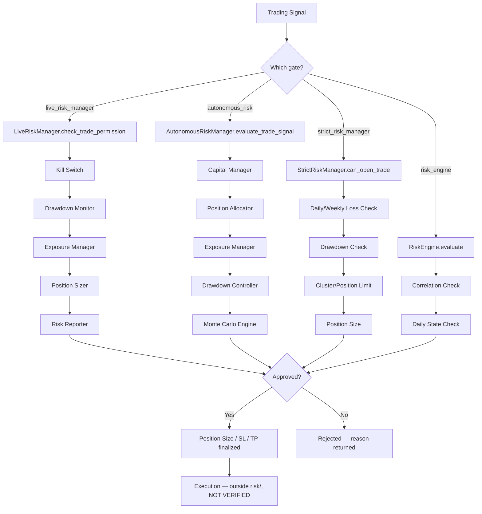
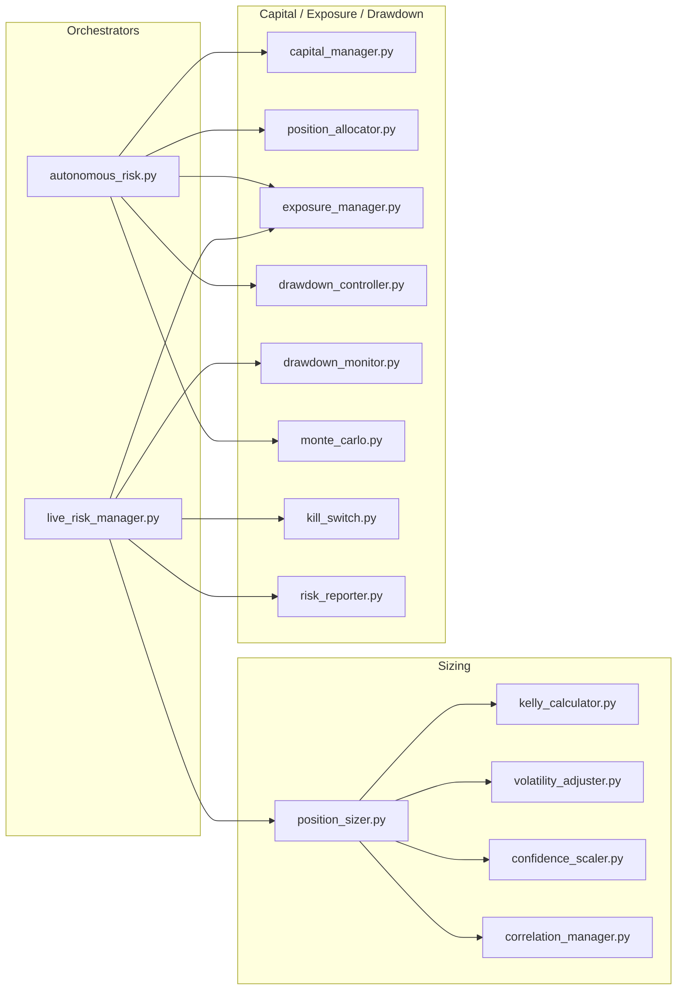
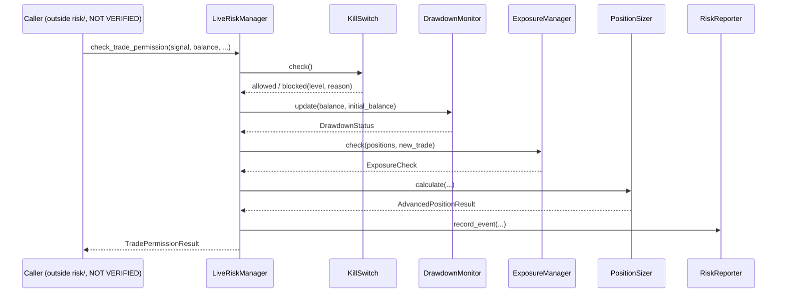

# Risk Management Specification — `risk/` Folder

**Scope of this document:** `risk/` folder only, plus its direct (one-level) external
imports: `utils.logger`, `core.constants`, `config`. Those three modules were **not**
included in the provided archive, so their internal implementations are **NOT VERIFIED**
— only their imported names/usage as seen from `risk/` are documented. No file outside
`risk/` was opened, and no recursive traversal beyond one import level was performed.
Anything about how `risk/` is invoked by the rest of the trading system (bot loop,
strategy layer, execution layer) is therefore also **NOT VERIFIED** — this archive did
not include those callers.

The folder contains **44 active `.py` modules** (17,499 lines) plus **14 files with a
`.dead_code_archived` suffix** that duplicate an active file of the same name (see
Section 18). `risk/__init__.py` is empty (0 lines, no re-exports).

---

## Section 1 — Risk Philosophy

**Purpose of the folder:** `risk/` is the capital-protection layer of the trading system.
Docstrings across the folder consistently describe a permission-gate architecture: a
trading signal must pass through this layer — sizing, exposure, drawdown, kill-switch,
and entry-quality checks — before it is allowed to reach execution. `live_risk_manager.py`
states this explicitly: *"Every trade MUST pass through this before execution."*

**Primary responsibilities**, as evidenced by the module set:
- Deciding **whether** a trade is allowed (`trade_permission.py`, `strict_risk_manager.py`, `risk_engine.py`, `live_risk_manager.py`, `trading_controls.py`)
- Deciding **how big** a trade should be (`position_sizer.py`, `position_allocator.py`, `kelly_calculator.py`, `atr_risk_manager.py`, `compounding.py`)
- Deciding **where** stop-loss/take-profit sit (`atr_risk_manager.py`, `structure_stop.py`, `channel_breakout_stops.py`, `usd_tp_sl_calculator.py`)
- Protecting the account against **cumulative** damage (`drawdown_controller.py`, `drawdown_monitor.py`, `kill_switch.py`, `circuit_breaker.py`)
- Protecting against **correlated/overloaded** exposure (`exposure_manager.py`, `correlation_manager.py`, `book_guardrails.py`)
- Guarding against **behavioral/psychological** failure modes (`cognitive_bias_defenses.py`, `confirmation_bias_defense.py`, `revenge_trading_detector.py`)
- Guarding against **operational/adversarial** failure modes (`adversarial_defenses.py`) — broker rejection handling, news blackouts, crash recovery, strategy degradation
- Post-trade **analysis and simulation** (`monte_carlo.py`, `risk_simulator.py`, `expectancy.py`, `probability_distribution.py`)
- **Reporting and observability** (`risk_reporter.py`)

**Capital-protection philosophy** (as expressed in constants and comments, see Section 6):
layered, redundant stops — a per-trade risk cap (`MAX_RISK_PCT`/`MAX_KELLY_RISK` = 2%),
a daily loss halt (1.0%–1.5% depending on module), a weekly loss halt (5.0%), and an
account-level drawdown halt (10%–15% depending on module — see Section 19 for the
inconsistency this creates) stacked on top of each other, plus a hard kill-switch with
three escalating severity levels.

**Risk-first design principles observed:**
- Fail-closed defaults: several modules default to rejecting a trade unless every check explicitly passes (`trade_permission.py`, `strict_risk_manager._can_open_trade_unlocked`).
- State persistence to disk (JSON files under a `memory/` directory via `MEMORY_DIR`, plus a SQLite DB in `risk_reporter.py`) so risk state (daily loss, streaks, kill-switch level) survives restarts.
- Test-mode branching: several modules (`trade_permission.py`, `rr_policy.py`) lower thresholds when `config.TEST_MODE` is true, guarded by lazy imports specifically to avoid crashing unit tests without a `.env` file.

**What belongs here (as evidenced by content):** trade approval logic, position sizing math, stop/target calculation, exposure/correlation/drawdown bookkeeping, behavioral guardrails, simulation/backtesting of risk scenarios, and risk event logging.

**What must never belong here:** signal generation, indicator computation, or ML/LLM inference logic are not present anywhere in this folder — the folder only *consumes* signals/context (`direction`, `entry`, `sl`, `tp`, `confidence`, `ind_ctx`, `regime`, etc.) as function arguments. NOT VERIFIED beyond this folder whether that boundary is respected elsewhere in the project.

---

## Section 2 — Folder Structure

| File | Lines | Role | Status |
|---|---|---|---|
| `__init__.py` | 0 | Package marker | Active (empty) |
| `advanced_risk_orchestrator.py` | 322 | Orchestrator combining daily/weekly loss caps, correlation, sizing | Active |
| `adversarial_defenses.py` | 1,157 | Broker/execution/news/crash/degradation defenses | Active |
| `atr_risk_manager.py` | 298 | ATR-based SL/TP + lot sizing | Active — duplicate `.dead_code_archived` twin exists, byte-identical |
| `autonomous_risk.py` | 1,268 | Master orchestrator ("Fund Manager Brain") tying capital/exposure/drawdown/MC together | Active |
| `basket_exit.py` | 342 | Average-price basket exit for grid/scaled positions | Active — identical archived twin |
| `book_guardrails.py` | 539 | Correlation, anti-revenge, cost-aware EV guardrails ("Book Pages 136-151") | Active — identical archived twin |
| `capital_manager.py` | 430 | Portfolio-level capital allocation across symbols/strategies | Active |
| `channel_breakout_stops.py` | 307 | Breakout/rejection-based stop logic | Active |
| `circuit_breaker.py` | 629 | Daily/weekly loss + win-rate circuit breaker with pause/learning modes | Active |
| `cognitive_bias_defenses.py` | 503 | Pre-registration, strategy graveyard, calibration tracking, selection audit | Active |
| `compounding.py` | 207 | Reinvestment-based lot multiplier | Active — near-identical archived twin (one import path difference) |
| `confidence_scaler.py` | 108 | Scales risk/size by model confidence | Active |
| `confirmation_bias_defense.py` | 37 | Disconfirming-evidence check | Active — identical archived twin |
| `controlled_grid_scaler.py` | 343 | Non-martingale grid scaling | Active — identical archived twin |
| `correlation_manager.py` | 160 | Portfolio correlation heat / position-size adjustment | Active |
| `drawdown_controller.py` | 481 | Account drawdown protection levels + emergency actions | Active |
| `drawdown_monitor.py` | 164 | Lightweight drawdown status computation | Active |
| `entry_quality_guardrails.py` | 1,981 | 12 anti-chasing / structure-validation entry filters | Active (largest file in folder) |
| `entry_score.py` | 90 | 100-point entry scoring system | Active — identical archived twin |
| `expectancy.py` | 565 | Trade expectancy / system-quality statistics | Active |
| `exposure_manager.py` | 178 | Correlation-group + total-exposure limits | Active |
| `institutional_entry_framework.py` | 84 | 200-point institutional entry scoring | Active — identical archived twin |
| `kelly_calculator.py` | 136 | Kelly-criterion risk sizing | Active |
| `kill_switch.py` | 313 | 3-level emergency trading halt | Active |
| `live_risk_manager.py` | 577 | Central live risk controller tying sizer/kill-switch/exposure/drawdown/reporter together | Active |
| `monte_carlo.py` | 349 | Monte Carlo simulation of trade sequences / risk of ruin | Active |
| `order_split_manager.py` | 400 | Splits one signal into multiple TP-staged positions | Active — identical archived twin |
| `portfolio_manager.py` | 496 | Portfolio-level sizing, Sharpe/Sortino/VaR/CVaR, rebalancing | Active — identical archived twin |
| `position_allocator.py` | 322 | Kelly-based lot sizing + confidence adjustment | Active |
| `position_sizer.py` | 412 | Composed sizer: Kelly × volatility × confidence × correlation | Active |
| `probability_distribution.py` | 256 | Probability distribution of trade outcomes vs. fixed TP | Active — identical archived twin |
| `revenge_trading_detector.py` | 49 | Detects revenge-trading patterns | Active — near-identical archived twin (bare `except` narrowed) |
| `risk_engine.py` | 494 | Older/parallel risk evaluation engine (correlation, daily state) | Active |
| `risk_reporter.py` | 166 | SQLite-backed risk event log + Telegram alert hook | Active |
| `risk_simulator.py` | 448 | "What-if" scenario simulator (loss streaks, black swan, etc.) | Active — identical archived twin |
| `rr_policy.py` | 58 | Minimum risk:reward policy resolver | Active |
| `streak_tracker.py` | 160 | Consecutive win/loss streak tracking (singleton) | Active |
| `strict_risk_manager.py` | 525 | Thread-safe, stricter alternative risk manager | Active |
| `structure_stop.py` | 37 | Swing/fractal structure-based stop calc | Active — identical archived twin |
| `symbol_lock.py` | 251 | Per-symbol direction lock to prevent conflicting positions | Active |
| `trade_frequency.py` | 186 | Daily trade-count throttling | Active |
| `trade_permission.py` | 957 | Final trade-permission gate (confidence/RR/factor checks) | Active |
| `trading_controls.py` | 288 | Abstract `TradingControl` framework (max order/position size, long-only) | Active |
| `usd_tp_sl_calculator.py` | 288 | USD-denominated TP/SL price calculation | Active |
| `volatility_adjuster.py` | 138 | ATR-percentile based risk-size adjustment | Active |

**Files present but out of the analysis boundary:** `__pycache__/*.pyc` (compiled bytecode, not analyzed) and the 14 `.dead_code_archived` files (content compared byte-for-byte against their active twins — see Section 18, not documented separately since 12 of 14 are exact duplicates).

---

## Section 3 — Risk Pipeline

The folder contains **more than one candidate pipeline** rather than a single canonical
one — this is a real architectural characteristic, not a simplification (see Section 19).
Based on docstrings and call structure, three overlapping entry-gate stacks exist:

1. `live_risk_manager.LiveRiskManager.check_trade_permission()` → composes `PositionSizer`, `KillSwitch`, `ExposureManager`, `DrawdownMonitor`, `RiskReporter`.
2. `autonomous_risk.AutonomousRiskManager.evaluate_trade_signal()` → composes `CapitalManager`, `PositionAllocator`, `ExposureManager`, `DrawdownController`, `MonteCarloEngine`.
3. `strict_risk_manager.StrictRiskManager.can_open_trade()` → self-contained, does not import the other risk modules.

`risk_engine.RiskEngine.evaluate()` is a fourth, older-looking standalone evaluator
(uses `core.constants` directly rather than the newer composed classes).

NOT VERIFIED: which of these four is actually wired into the live trading loop — that
code lives outside `risk/` and was not part of this archive.

Supplementary, pre-entry filters that can feed into any of the above (called with raw
market context rather than being part of a fixed chain): `entry_quality_guardrails.py`
(12 checks), `entry_score.py` / `institutional_entry_framework.py` (scoring systems),
`book_guardrails.py`, `confirmation_bias_defense.py`, `revenge_trading_detector.py`.

---

## Section 4 — Module Documentation

Given the folder's size (17,499 lines across 44 files), full per-function signatures for
every file are impractical to reproduce faithfully here without reproducing large spans
of source; the table below gives verified purpose/class/function-level documentation for
every active module. Section headers group modules by role for readability.

### 4.1 Core Trade-Permission Gates

**`live_risk_manager.py`** (577 lines)
- Purpose (from docstring): central live risk controller — "Every trade MUST pass through this before execution."
- Classes: `CapitalTier`, `_LazyTiers`, `TradePermissionResult` (`to_dict`), `LiveRiskManager`
- Public API: `LiveRiskManager.__init__`, `set_tier`, `maybe_promote_tier`, `record_trade_result`, `attach_learning_agent`, `reset_daily`, `check_trade_permission`, `status`; module-level singleton getter `get_live_risk_manager()`
- Private: `_get_consecutive_losses`, `_get_lifetime_stats`
- Input: signal metadata, account balance, tier; Output: `TradePermissionResult` dict (approved/rejected + reason + sizing)
- Internal deps: `risk.position_sizer`, `risk.kill_switch`, `risk.exposure_manager`, `risk.drawdown_monitor`, `risk.risk_reporter`

**`strict_risk_manager.py`** (525 lines)
- Classes: `OpenPosition`, `TradeRecord`, `RiskCheckResult`, `StrictRiskManager`
- Public API: `can_open_trade`, `position_size`, `register_trade`, `close_trade`
- Private: `_can_open_trade_unlocked`, `_position_size_unlocked`, `_clusters_for_pair`, `_drawdown_pct`, `_in_drawdown`, `_snapshot_state`, `_reset_day`, `_reset_week`
- Thread safety: uses `threading` — explicit lock-guarded ("unlocked" helper methods called under a lock)
- No internal `risk.*` imports — self-contained module (verified via grep, see Section 9)

**`trade_permission.py`** (957 lines)
- Purpose: "Final Trade Permission Gate" (per header comment)
- Function: `_test_mode()` (lazy `config.TEST_MODE` check, catches all exceptions so unit tests don't crash without `.env`)
- Class: `TradePermission` with properties `MIN_CONFIDENCE`, `MIN_ALIGNED_FACTORS`, `MIN_RR`, method `check(...)`, `print_summary`
- Constants: `MIN_CONFIDENCE_PROD=60`, `MIN_CONFIDENCE_TEST=10`, `MIN_ALIGNED_FACTORS_PROD=2`, `MIN_ALIGNED_FACTORS_TEST=1`; `MIN_RR_PROD`/`MIN_RR_TEST` resolved lazily via `rr_policy.get_min_rr()`

**`risk_engine.py`** (494 lines)
- Header comment labels it "Day 13 | Risk Engine" and states it uses `core.constants` for `PIP_SIZE`/`CORRELATION_GROUPS` "— no local duplicates"
- Class `RiskEngine`: constants `MAX_RISK_PC=1.0`, `MIN_RR=2.0`, `MAX_RR=5.0` ("don't take trades with RR > 1:5"), `MAX_OPEN_TRADES=3` (overridden by `config.MAX_OPEN_TRADES`)
- Public API: `evaluate`, `sync_open_positions`, `record_trade_open`, `record_trade_close`, `get_daily_summary`, `get_sync_health`, `print_summary`, `get_ai_context`
- Private: `_correlation_check`, `_load_daily`, `_fresh_day`, `_save_daily`, `_reject`, `_clean`
- Persists daily state to `MEMORY_DIR / "daily_risk.json"`

**`trading_controls.py`** (288 lines)
- Abstract framework: `TradingControlViolation(Exception)`, `PortfolioState`, `TradingControl(ABC)` with abstract `validate`, concrete controls `MaxOrderCount`, `MaxOrderSize`, `MaxPositionSize`, `LongOnly`, and an aggregator `TradingControls` (`add`, `validate`, `list_controls`)
- This is the only module in the folder implementing a formal plugin-style validator interface (`ABC`/`abstractmethod`) rather than a monolithic manager class.

### 4.2 Master Orchestrators

**`autonomous_risk.py`** (1,268 lines) — "AI Trader's Fund Manager Brain"
- Function: `_safe_get_exposure_pct`
- Class `AutonomousRiskManager`: `evaluate_trade_signal` (largest method, ~265 lines), `_update_risk_mode`, `set_mode`, `_calculate_adaptive_sl`, `record_trade_result`, `_update_performance_metrics`, `_get_strategy_capital_ranking`, `allocate_portfolio`, `run_risk_simulation`, `simulate_scenario`, `generate_capital_report`, `get_stats`, `get_ai_context`, `print_status`, `_blend_risk`, `_build_rejection`, `_get_open_positions`, `_load_state`/`_save_state`, `reset_daily`
- Modes referenced in header comment: AGGRESSIVE / (others implied by `_update_risk_mode`, not enumerated in the comment header — NOT VERIFIED beyond what the docstring states)
- Internal deps: `risk.capital_manager.CapitalManager`, `risk.position_allocator.PositionAllocator`, `risk.exposure_manager.ExposureManager`, `risk.drawdown_controller.DrawdownController`, `risk.monte_carlo.MonteCarloEngine`
- External: `core.constants.MEMORY_DIR`

**`advanced_risk_orchestrator.py`** (322 lines)
- Class `AdvancedRiskOrchestrator`: `can_trade`, `position_size`, `is_correlation_safe`, `set_open_positions`, `record_trade_result`, `status`
- Private: `_correlation` (static), `_today`/`_this_week` (static), `_maybe_reset_periods`
- No internal `risk.*` imports — appears to duplicate responsibility already covered by `autonomous_risk.py` and `live_risk_manager.py` (see Section 19)

### 4.3 Position Sizing

**`position_sizer.py`** (412 lines)
- Constants: `MAX_RISK_PCT=0.02`, `MIN_LOT=0.01`
- Classes: `AdvancedPositionResult` (`to_dict`, `reason`), `PositionSizer` (`calculate`, `_drawdown_mult`, `_streak_mult`)
- Composes `KellyCalculator`, `VolatilityAdjuster`, `ConfidenceScaler`, `CorrelationManager` (all four imported from sibling modules)

**`position_allocator.py`** (322 lines)
- Class `PositionAllocator`: `calculate_kelly_risk`, `calculate_lot_size`, `get_minimum_rr`, `adjust_for_confidence`, `analyze_kelly`, `print_kelly_analysis`

**`kelly_calculator.py`** (136 lines)
- Constants: `MAX_KELLY_RISK=0.02`, `MIN_SAMPLES=20`, `DEFAULT_WIN_RATE=0.50`, `DEFAULT_RR_RATIO=1.5`
- Class `KellyResult` (`to_dict`), `KellyCalculator.calculate`; getter `get_kelly_calculator()`

**`confidence_scaler.py`** (108 lines) — `MAX_CONFIDENCE_MULT=2.0`; `ConfidenceResult`, `ConfidenceScaler.scale`

**`volatility_adjuster.py`** (138 lines) — `VolatilityResult`, `VolatilityAdjuster.adjust`, `_compute_atr` equivalent logic (ATR-percentile based, per docstring)

**`correlation_manager.py`** (160 lines) — `MAX_PORTFOLIO_HEAT=0.05`; `CorrelationResult`, `CorrelationManager.adjust`, `_find_group`, `_calc_heat`

**`compounding.py`** (207 lines) — `MAX_MULTIPLIER=2.0`, `MIN_MULTIPLIER=0.5`; `CompoundingEngine.record_profit`, `get_lot_multiplier`, `get_stats`, `reset`; persists to `MEMORY_DIR / "compounding_state.json"` (differs from its archived twin only in this path resolution — twin used a hardcoded `"memory/..."` string)

**`atr_risk_manager.py`** (298 lines) — `TradeRiskParams` dataclass; functions `get_stop_loss`, `get_take_profit`, `calculate_position_size`, `calculate_risk_reward`, `compute_trade_params`; module docstring in its archived twin credits this as ported from an external educational repo (`github.com/bruh7463/forex_bot`)

**`usd_tp_sl_calculator.py`** (288 lines) — `_parse_currency`, `_default_usd_quote_fn`, `tp_long`, `tp_short`, `sl_long`, `sl_short`, `tp_sl_for_trade`

### 4.4 Stop/Target Construction

**`structure_stop.py`** (37 lines) — `find_swing_low`/`find_swing_high`, `find_fractal_swing_low`/`_high`, `compute_structure_stop`, `compute_structure_stop_pips`

**`channel_breakout_stops.py`** (307 lines) — `_validate_direction`, `_is_valid`, `five_day_condition`, `RejectionCheck` dataclass (frozen), `evaluate_rejection`, `last_bar_stop`, `select_active_stop`

**`rr_policy.py`** (58 lines) — single function `get_min_rr(*, strategy=None, test_mode=False)`, resolves minimum risk:reward policy

### 4.5 Exposure / Correlation / Drawdown

**`exposure_manager.py`** (178 lines) — `MAX_SAME_GROUP=2`, `MAX_TOTAL_OPEN=5`, `MAX_CURRENCY_PCT=0.30`; `ExposureCheck` (`to_dict`), `ExposureManager.update_positions`/`check`/`_find_group`/`status`

**`drawdown_controller.py`** (481 lines) — `MAX_DRAWDOWN_LIMIT_PCT=15.0`; `DrawdownController`: `current_drawdown_pct`, `update_peak`, `get_protection_level`, `get_risk_scale`, `get_action`, `check_emergency`, `record_trade`, daily/weekly PnL getters, `reset_daily`, `get_status`/`print_status`, `_load_state`/`_save_state` (JSON persistence)

**`drawdown_monitor.py`** (164 lines) — lighter-weight companion to the controller; `DrawdownStatus` (`to_dict`), `DrawdownMonitor.update`/`reset`/`status`; getter `get_drawdown_monitor()`

**`kill_switch.py`** (313 lines) — `MAX_DRAWDOWN_LIMIT=0.15`; `KillSwitch`: `_load`/`_save`, `check`, three severity triggers `_trigger_level1/2/3`, `_block`, `manual_reset`, `status`; reads `config.DAILY_LOSS_LIMIT_PCT`

**`circuit_breaker.py`** (629 lines) — `MAX_CONSECUTIVE_LOSSES=50`, `MAX_DAILY_LOSS_PCT` (from `config.DAILY_LOSS_LIMIT_PCT`), `MAX_WEEKLY_LOSS_PCT=5.0`, `MIN_WIN_RATE_THRESHOLD=30.0`; `CircuitBreaker`: `allow_trade`, `record_result`, `manual_resume`, `force_learning_mode`, `reset_daily`, `_reset_week_if_needed`, `get_status`/`print_status`, pause/learning-mode transition helpers

**`symbol_lock.py`** (251 lines) — per-symbol directional lock; `_PositionRecord`, `SymbolLock`: `can_open`, `on_open`/`on_close`, `try_open`, position/state getters, `is_locked`, `clear`

**`trade_frequency.py`** (186 lines) — `DEFAULT_MIN_DAILY_TRADES=3`, `DEFAULT_MAX_DAILY_TRADES=20`; `TradeRecord`, `TradeFrequencyController`: `record_trade`, `trades_today`, `trade_count_today`, `can_trade_now`, `status`, `daily_summary`, `threshold_adjustment_hint`; getter `get_trade_frequency_controller()`

**`capital_manager.py`** (430 lines) — `CapitalManager`: `allocate`/`deallocate`, `compute_optimal_allocation`, `_get_best_strategy_for_pair`, allocation getters, `update_balance`, `rebalance`, `update_strategy_weights`, `get_summary`/`print_status`, `_load_state`/`_save_state`

**`portfolio_manager.py`** (496 lines) — `max_portfolio_risk=0.02`, `max_position_risk=0.01`, `max_correlation=0.7` (instance attrs); `PortfolioManager`: `calculate_position_size`, `_apply_volatility_filter`, `_apply_correlation_filter`, `update_portfolio`, `calculate_portfolio_risk`, Sharpe/Sortino/max-drawdown/VaR/CVaR calculators, `rebalance_portfolio`, `check_risk_limits`, `_check_concentration`, `_generate_risk_reduction_actions`

**`book_guardrails.py`** (539 lines) — `DEFAULT_CORRELATION_THRESHOLD=0.70`, `DEFAULT_LOSS_STREAK_THRESHOLD=3`, `DEFAULT_POSITION_ESCALATION_MULT=1.25`, `DEFAULT_MIN_NET_EV_PIPS=1.0`, `DEFAULT_COMMISSION_PIPS=0.7`, `DEFAULT_SLIPPAGE_PIPS=0.5`; `GuardrailResult` (`to_dict`), `check_correlation_exposure`, `_default_fx_correlation_matrix`, `_lookup_correlation`, `check_anti_revenge_trading`, `check_cost_aware_ev`, `run_all_guardrails`

### 4.6 Entry-Quality / Scoring Filters

**`entry_quality_guardrails.py`** (1,981 lines — largest module) — 12 hard-coded filters per its own header comment (built from a post-mortem of a real GBPUSD M5 trade dated 2026-07-02): `check_chasing_filter`, `check_sl_swing_anchor`, `check_tp_structure_validation`, `check_indecision_candles`, `check_indicator_confluence`, `check_round_number_tp`, `check_rejection_wick_at_entry`, `check_averaging_into_losers`, `check_fresh_high_rejection`, `check_tp_above_unconfirmed_spike`, `check_opposite_direction_stacking`, `check_exhaustion_filter`, `check_rejection_psychology`, aggregated by `run_all_entry_quality_checks`. Uses `numpy`/`pandas`.

**`entry_score.py`** (90 lines) — `MIN_SCORE_TO_TRADE=70`, `MIN_RR=2.0`, `MAX_SPREAD_PIPS=10`, `MIN_ATR_PCT=0.0003`, `MAX_ATR_PCT=0.008`; `EntryScoreResult`, `compute_entry_score(...)`

**`institutional_entry_framework.py`** (84 lines) — `MIN_SCORE_TO_TRADE=130`, `GOOD_TRADE_THRESHOLD=160`, `APLUS_THRESHOLD=180`, same RR/spread/ATR bounds as `entry_score.py`; `InstitutionalEntryResult`, `evaluate_institutional_entry(...)` (16 keyword parameters — the widest input contract in the folder)

**`confirmation_bias_defense.py`** (37 lines) — `DisconfirmationResult`, `check_disconfirming_evidence(...)`

**`revenge_trading_detector.py`** (49 lines) — `RevengeTradingResult`, `check_revenge_trading(recent_trades, proposed_trade, now=None)`, `_parse_time`

### 4.7 Position Management (Baskets, Splits, Scaling)

**`basket_exit.py`** (342 lines) — `_BasketPosition`, `BasketExitManager`: add/remove/clear positions, average price/lots/direction/tickets, TP/SL/BE price getters, `check_exit`, `get_basket_state`, `get_all_symbols`

**`controlled_grid_scaler.py`** (343 lines) — `_ScaleRecord`, `ControlledGridScaler`: `can_scale`, `on_scale`/`on_close`, `close_all`, level/average-price/lots getters, `get_basket_state`

**`order_split_manager.py`** (400 lines) — `default_volume_split`, `validate_volume_split`; `SplitPosition`, `OrderGroup` (`is_all_closed`, `get_position_by_tp`), `OrderSplitManager`: `create_split_order`, `mark_position_filled/closed`, `get_trailing_actions`, group getters, `save`/`load` (JSON persistence via `pathlib.Path`)

### 4.8 Behavioral / Adversarial Defenses

**`cognitive_bias_defenses.py`** (503 lines) — `PreRegistration`/`PreRegistrationFramework` (register/resolve/confirmation-rate, JSON-persisted), `GraveyardEntry`/`StrategyGraveyard` (bury/is_already_failed/summary, JSON-persisted), `CalibrationTracker` (record_prediction/get_calibration), `SelectionAuditLog` (log_selection/get_audit_summary, JSON-persisted). Uses `threading`.

**`adversarial_defenses.py`** (1,157 lines) — per its own docstring, implements "the top 7 defenses identified in the RED_TEAM_REPORT.md" (that report was not included in this archive — NOT VERIFIED beyond the docstring's own description):
1. `BrokerExecutionGuard` (`OrderAttempt`, `can_submit`, `record_attempt`, `should_retry_as_limit`, `get_stats`, `_prune_old_attempts`)
2. `NewsEventBlackout` (`NewsEvent`, `_load_calendar`, `_add_recurring_events`, `can_trade`, `should_close_position`, `add_event`)
3. `CrashRecoveryManager` (write-ahead log: `log_order_intent`, `confirm_order_filled/rejected`, `reconcile_on_startup`, `save/load_system_state`, `_read_wal`/`_write_wal`)
4. `StrategyDegradationMonitor` (`record_trade`, `is_strategy_enabled`, `_check_degradation`, `_disable`/`re_enable`, `get_status`)
5. `VolatilityScaledSizer` (`calculate_risk_pct`, `_compute_atr`)
6. `OrderReconciler` (constructor only shown within the read window — remainder of class NOT VERIFIED at this documentation depth)
7. A "DataQualityValidator" is named in the docstring's list but no matching class was found among the extracted class/function signatures — **NOT VERIFIED / possibly not yet implemented or named differently.**

### 4.9 Simulation & Analytics

**`monte_carlo.py`** (349 lines) — `MonteCarloEngine`: `run`, `calculate_risk_of_ruin`, `find_optimal_risk`, `_empty_result`, `print_simulation_result`

**`risk_simulator.py`** (448 lines) — `RiskScenarioSimulator`: `consecutive_losses`, `consecutive_wins`, `worst_day`, `best_day`, `worst_week`, `black_swan`, `strategy_failure`, `run_all_scenarios`, `_assess_overall_risk_from_scenarios`, `print_all_scenarios`

**`expectancy.py`** (565 lines) — `ExpectancyCalculator`: `calculate`, `calculate_from_pnls`, `_calculate`, `_confidence_interval`, `_system_quality`, `_health_score`, `_recommendation`, `compare`, `_empty_result`, `print_summary`; module-level `patch_analytics_expectancy()` (monkey-patches an external `analytics` module's `summarize` method — the target module is outside `risk/` and NOT VERIFIED); `MIN_SAMPLE_SIZE=30`

**`probability_distribution.py`** (256 lines) — `ProbabilityDistribution` (`to_dict`), `compute_outcome_probabilities(...)`

**`streak_tracker.py`** (160 lines) — singleton `StreakTracker` (`get_instance`, `_read_state`, `get_consecutive_losses`, `get_recent_results`, `get_win_rate`, `invalidate_cache`) plus module-level convenience wrappers; thread-safe (`threading`)

**`risk_reporter.py`** (166 lines) — `RiskReporter`: `_init_db` (SQLite), `record_event`, `_send_telegram` (stub/hook — actual network call NOT VERIFIED, depends on external config), `get_recent_events`, `stats`; getter `get_risk_reporter()`

---

## Section 5 — Risk Components Inventory

Verified present in this folder: Position Sizing, Stop Loss, Take Profit, Basket/Grid
Exit management, Daily Loss Limit, Weekly Loss Limit, Drawdown Protection (two parallel
implementations), Kill Switch (3-level), Circuit Breaker (separate from kill switch),
Exposure Limit, Correlation Risk, Volatility-based sizing/filter, Kelly sizing,
Compounding, News Filter (news blackout), Trade Frequency limit, Maximum Open
Positions/Trades, Symbol-direction locking, Entry-quality filters (chasing, structure,
indecision, confluence, round-number, rejection-wick, averaging-into-losers,
exhaustion, psychology), Revenge-trading detection, Confirmation-bias defense,
Pre-registration / strategy graveyard / calibration tracking, Broker execution
guarding, Crash recovery / state reconciliation, Strategy degradation monitoring,
Monte Carlo simulation, Scenario ("what-if") simulation, Expectancy/system-quality
analytics, Risk event reporting (SQLite + Telegram hook).

**Not found in this folder** (absence, not a gap statement about the wider project):
Trailing Stop as a dedicated module (trailing logic only appears inline inside
`order_split_manager.get_trailing_actions`), Break-Even as a dedicated module (only
appears as `get_be_price` inside `basket_exit.py`), Session Filter, Spread Filter as a
standalone module (spread appears as a parameter/threshold inside several modules, e.g.
`MAX_SPREAD_PIPS`, but no dedicated `spread_filter.py`), Slippage Protection as a
standalone module (slippage appears as a constant inside `book_guardrails.py` only),
Maximum Lot Size as a dedicated module (appears as `MAX_LOT` constants inside
`position_sizer.py`/`risk_engine.py`, sourced from `config`).

---

## Section 6 — Risk Rules (Verified Thresholds)

| Rule | Value | Source file |
|---|---|---|
| Per-trade max risk | 2% (`MAX_RISK_PCT`/`MAX_KELLY_RISK`) | `position_sizer.py`, `kelly_calculator.py` |
| Daily loss halt | 1.0% (`portfolio_manager.max_portfolio_risk`), 1.5% (`strict_risk_manager.MAX_DAILY_LOSS_PCT`), or `config.DAILY_LOSS_LIMIT_PCT` (`circuit_breaker.py`, `kill_switch.py`) | multiple — see Section 19 |
| Weekly loss halt | 5.0% | `strict_risk_manager.py`, `circuit_breaker.MAX_WEEKLY_LOSS_PCT` |
| Account drawdown halt | 15.0% (`drawdown_controller.MAX_DRAWDOWN_LIMIT_PCT`, `kill_switch.MAX_DRAWDOWN_LIMIT`) vs. 10.0% (`strict_risk_manager.MAX_DRAWDOWN_PCT`, noted in-line as "was 20%") | see Section 19 |
| Consecutive-loss cooldown | 3 losses (`strict_risk_manager.MAX_CONSECUTIVE_LOSSES`) vs. 50 losses before pause (`circuit_breaker.MAX_CONSECUTIVE_LOSSES`) | see Section 19 |
| Win-rate floor before "learning mode" | 30.0% | `circuit_breaker.MIN_WIN_RATE_THRESHOLD` |
| Max concurrent positions | 3 (`strict_risk_manager.MAX_OPEN_POSITIONS`, `risk_engine.MAX_OPEN_TRADES` default) vs. 5 (`exposure_manager.MAX_TOTAL_OPEN`) | see Section 19 |
| Max trades/day | 20 (`strict_risk_manager.MAX_TRADES_PER_DAY`, `trade_frequency.DEFAULT_MAX_DAILY_TRADES`); min 3/day (`trade_frequency.DEFAULT_MIN_DAILY_TRADES`) | `strict_risk_manager.py`, `trade_frequency.py` |
| Max same-correlation-group positions | 2 | `exposure_manager.MAX_SAME_GROUP` |
| Max exposure per currency | 30% of balance | `exposure_manager.MAX_CURRENCY_PCT` |
| Max portfolio correlation heat | 5% total risk | `correlation_manager.MAX_PORTFOLIO_HEAT` |
| Correlation exposure avoidance threshold | 0.70 correlation | `book_guardrails.DEFAULT_CORRELATION_THRESHOLD` |
| Loss-streak escalation trigger | 3 consecutive losses | `book_guardrails.DEFAULT_LOSS_STREAK_THRESHOLD` |
| Minimum net EV after costs | ≥1 pip | `book_guardrails.DEFAULT_MIN_NET_EV_PIPS` (commission 0.7 pips + slippage 0.5 pips assumed) |
| Minimum risk:reward | 2.0 (multiple modules), max 5.0 (`risk_engine.MAX_RR`) | `risk_engine.py`, `entry_score.py`, `institutional_entry_framework.py` |
| Entry-score threshold to trade | 70/100 (`entry_score.py`) vs. 130/200, "good"=160, "A+"=180 (`institutional_entry_framework.py`) | see Section 19 |
| Min confidence to trade | 60% prod / 10% test | `trade_permission.MIN_CONFIDENCE_PROD/TEST` |
| Min aligned factors | 2 prod / 1 test | `trade_permission.MIN_ALIGNED_FACTORS_PROD/TEST` |
| Kelly minimum sample size | 20 trades | `kelly_calculator.MIN_SAMPLES` |
| Expectancy minimum sample size | 30 trades | `expectancy.MIN_SAMPLE_SIZE` |
| Compounding lot multiplier bounds | 0.5x–2.0x | `compounding.MIN_MULTIPLIER/MAX_MULTIPLIER` |
| Confidence risk multiplier cap | 2.0x | `confidence_scaler.MAX_CONFIDENCE_MULT` |
| Chasing filter | ≥50 pips in 12 bars without ≥10-pip/10% pullback | `entry_quality_guardrails.py` |
| SL swing-anchor tolerance | within 0.5×ATR of a swing low over 20 bars | `entry_quality_guardrails.py` |
| TP structure validation | prior S/R within 5 pips, scanned over 100 bars | `entry_quality_guardrails.py` |
| Indecision-candle filter | ≥2 of last 3 candles with body <30% of range | `entry_quality_guardrails.py` |
| Round-number TP block | TP within 3 pips of a round number | `entry_quality_guardrails.py` |
| Rejection-wick psychology filter | wick ≥1.5× body, scanned over 50 bars, 0.5×ATR zone tolerance | `entry_quality_guardrails.py` |
| Trade frequency throttle | 3–20 trades/day | `trade_frequency.py` |

For every rule above: **Trigger** = the named condition; **Calculation** = as shown in
the source expression cited; **Expected result** = trade rejection, size reduction, or
mode change (pause/learning/tier demotion) depending on module; **Consumer** = whichever
of the four gate stacks in Section 3 imports that module (or "self-contained" if none do
— see Section 9).

---

## Section 7 — Input Contract

Aggregated across all `evaluate`/`check`/`calculate` entry points in the folder, the
following inputs are consumed (types as annotated in signatures where present):

- **Market data:** OHLC(V) `pandas.DataFrame` (`df` parameter — used in `entry_quality_guardrails.py`, `channel_breakout_stops.py`, `structure_stop.py`, `entry_score.py`), ATR value (`atr: float`), spread (`spread_pips: float`)
- **Account data:** `balance: float`, open positions (`List[Dict[str, Any]]` via `set_open_positions`/`update_positions`/`sync_open_positions`), tier (`int`)
- **Trade data:** `direction`, `entry`, `sl`, `tp` (prices/strings), `confidence` (numeric), `pnl_usd`, `won: bool`
- **Broker data:** order fill/rejection callbacks (`confirm_order_filled`, `confirm_order_rejected`) inside `adversarial_defenses.py`; ticket IDs (`int`) throughout basket/grid/lock modules
- **ML/analysis context:** `ind_ctx`, `sr_ctx`, `regime`, `mtf_bias`, `mtf_data`, `structure_ctx`, `smc_ctx`, `session_ctx`, `news_ctx`, `liquidity_ctx`, `volume_ctx`, `revenge_ctx` — all passed as loosely-typed dict/object parameters into `institutional_entry_framework.evaluate_institutional_entry` and related entry-quality functions. **NOT VERIFIED:** the exact schema of these context objects, since they are constructed outside `risk/`.
- **Validation performed:** type/shape guards are present in a minority of functions (e.g., `_is_valid` in `channel_breakout_stops.py`, `validate_volume_split` in `order_split_manager.py`); most functions assume well-formed input and do not defensively validate — see Section 15.

---

## Section 8 — Output Contract

Every module that returns a decision does so via one of these shapes (no single shared
base class was found — each module defines its own):

- **Approved/Rejected trade:** plain `dict` with an approval flag + reason string, returned by `risk_engine.evaluate` (`_reject` helper builds the rejection shape), `trade_permission.check`, `strict_risk_manager.can_open_trade`/`_can_open_trade_unlocked`, `live_risk_manager.check_trade_permission` (wrapped in the `TradePermissionResult` dataclass)
- **Adjusted lot/size:** `float` return from `calculate_position_size`, `calculate_lot_size`, `position_sizer.calculate` (wrapped in `AdvancedPositionResult`)
- **Adjusted SL/TP:** `float`/tuple returns from `get_stop_loss`/`get_take_profit`, `tp_long/short`, `sl_long/short`, `compute_structure_stop(_pips)`
- **Risk/Exposure score:** `ExposureCheck.to_dict()`, `GuardrailResult.to_dict()`, `KellyResult.to_dict()`, `ConfidenceResult.to_dict()`, `CorrelationResult.to_dict()`, `VolatilityResult.to_dict()`, `EntryScoreResult`, `InstitutionalEntryResult`
- **Warning/status objects:** `DrawdownStatus.to_dict()`, `RiskCheckResult` (strict manager), `CircuitBreaker.get_status()`, `KillSwitch.status()`
- **Return dataclasses found (see Section 14 for full list):** 22 distinct `@dataclass`-decorated result types across the folder.

---

## Section 9 — Dependency Analysis

**Internal (`risk.*`) imports — verified by direct grep, one level only:**

| Importing module | Imports from |
|---|---|
| `autonomous_risk.py` | `risk.capital_manager.CapitalManager`, `risk.position_allocator.PositionAllocator`, `risk.exposure_manager.ExposureManager`, `risk.drawdown_controller.DrawdownController`, `risk.monte_carlo.MonteCarloEngine` |
| `live_risk_manager.py` | `risk.position_sizer.{PositionSizer, PositionSizeResult, get_position_sizer}`, `risk.kill_switch.{KillSwitch, get_kill_switch}`, `risk.exposure_manager.{ExposureManager, get_exposure_manager}`, `risk.drawdown_monitor.{DrawdownMonitor, DrawdownStatus, get_drawdown_monitor}`, `risk.risk_reporter.{RiskReporter, get_risk_reporter}` |
| `position_sizer.py` | `risk.kelly_calculator.{KellyCalculator, KellyResult, get_kelly_calculator}`, `risk.volatility_adjuster.{VolatilityAdjuster, VolatilityResult, get_volatility_adjuster}`, `risk.confidence_scaler.{ConfidenceScaler, ConfidenceResult, get_confidence_scaler}`, `risk.correlation_manager.{CorrelationManager, CorrelationResult, get_correlation_manager}` |

All other 41 active modules have **no internal `risk.*` imports** — they are leaf
modules with respect to the rest of the folder.

**External imports (direct dependencies, one level, per the analysis boundary):**

| Dependency | Used by (representative, not exhaustive) | Verified content |
|---|---|---|
| `utils.logger.get_logger` | nearly every module (39 distinct logger names found) | **NOT VERIFIED** — file not included in archive |
| `core.constants` (`MEMORY_DIR`, `PIP_SIZE`, `CORRELATION_GROUPS`, `get_pip_size`, `get_pip_value_usd`, `clean_symbol`, `pips_to_price`) | `risk_engine.py`, `capital_manager.py`, `circuit_breaker.py`, `compounding.py`, `drawdown_controller.py`, `kill_switch.py`, `streak_tracker.py`, `autonomous_risk.py` | **NOT VERIFIED** — file not included in archive |
| `config` (`DAILY_LOSS_LIMIT_PCT`, `MAX_LOT`, `MAX_OPEN_TRADES`, `TEST_MODE`) | `circuit_breaker.py`, `kill_switch.py`, `position_sizer.py`, `risk_engine.py`, `trade_permission.py`, `portfolio_manager.py` | **NOT VERIFIED** — file not included in archive |
| `numpy`, `pandas` | `adversarial_defenses.py`, `entry_quality_guardrails.py`, `portfolio_manager.py`, `expectancy.py`, `book_guardrails.py`, `structure_stop.py`, `channel_breakout_stops.py` (partial — some via `df` typing only) | Third-party — standard library behavior assumed, not separately verified |
| Standard library: `json`, `os`, `sys`, `time`, `threading`, `dataclasses`, `datetime`, `pathlib`, `typing`, `abc`, `math`, `random`, `sqlite3`, `collections` | throughout | Standard library, verified by import line only |

**Shared utilities/config referenced but not defined in `risk/`:** `MEMORY_DIR` (a `Path` constant, used to build state-file paths across ~8 modules — this is the folder's single most shared external symbol).

---

## Section 10 — Who Uses This Module

**NOT VERIFIED.** The provided archive contains only the `risk/` folder itself. Finding
callers (bot loop, strategy layer, execution/broker layer, any `main.py` or scheduler)
requires searching files outside `risk/`, which were not supplied and which the task
instructions also cap at one dependency level below `risk/` — callers are one level
*above* `risk/`, outside the stated scope. No caller file, caller class, or caller
function can be confirmed from this archive. If a full-project caller map is needed,
provide the calling modules (or the whole project) for a follow-up pass.

---

## Section 11 — Outgoing Calls

Within the one-level boundary, `risk/` modules call out to:
- `utils.logger.get_logger(name)` — logging only, no data returned into risk logic
- `core.constants` — pure constant/function lookups (`get_pip_size`, `get_pip_value_usd`, `clean_symbol`, `pips_to_price`), no side effects observed
- `config` — read-only constant access (`DAILY_LOSS_LIMIT_PCT`, `MAX_LOT`, `MAX_OPEN_TRADES`, `TEST_MODE`)
- `expectancy.patch_analytics_expectancy()` reaches into an external `analytics` module and monkey-patches its `summarize` method — this is the one outgoing call in the folder that *mutates* something outside `risk/` rather than just reading from it. The target module was not in this archive — **NOT VERIFIED**.
- `adversarial_defenses._send_telegram`-style hooks (`risk_reporter._send_telegram`) imply an outgoing network call to a messaging API, but the actual transport/credentials are **NOT VERIFIED** (likely resolved via `config`, not shown in the extracted window).

No file system calls outside the process's own `memory/`/`state/` directories were observed (all persistence is local JSON or local SQLite).

---

## Section 12 — Configuration

**Verified `config`-sourced values consumed by `risk/`:** `DAILY_LOSS_LIMIT_PCT` (used by `circuit_breaker.py` and `kill_switch.py`, aliased on import as `_CFG_DLL`), `MAX_LOT` (used by `position_sizer.py`, aliased `_CFG_MAX_LOT`, with a fallback default of `0.20` if unset), `MAX_OPEN_TRADES` (used by `risk_engine.py`, aliased `_CFG_MOT`), `TEST_MODE` (used by `trade_permission.py`, lazily imported to avoid breaking tests without a `.env`).

**Verified `core.constants` symbols consumed:** `MEMORY_DIR` (path root for all local JSON/SQLite state), `PIP_SIZE`, `CORRELATION_GROUPS`, `get_pip_size`, `get_pip_value_usd`, `clean_symbol`, `pips_to_price`.

**In-file constants** (thresholds) are documented in full in Section 6 above — these
are hard-coded module-level or class-level constants, not sourced from `config`, except
where noted.

**Environment variables:** none read directly via `os.environ`/`os.getenv` were found
inside `risk/` itself (`trade_frequency.py` has an `_env_int` helper function present
but its actual `os.getenv` call site was not confirmed within the extracted excerpt —
**NOT VERIFIED** whether it's actually wired to a live env var or just scaffolding).

**Config files:** none read directly by `risk/` other than the `config` Python module
import — no `.yaml`/`.ini`/`.toml` file reads were found in this folder.

---

## Section 13 — Mathematical Models

Only calculations actually present in the source are listed:

- **Lot/position size:** `lots = risk_amount / (stop_distance_pips × pip_value_per_lot)` pattern implied by `atr_risk_manager.calculate_position_size` and `position_sizer.calculate` (exact formula body not reproduced verbatim here; parameters are ATR-derived stop distance × pip value × risk %).
- **Kelly Criterion:** `kelly_calculator.KellyCalculator.calculate` — standard Kelly fraction (win rate, win/loss ratio) capped by `MAX_KELLY_RISK=0.02`, defaulting to `DEFAULT_WIN_RATE=0.50`/`DEFAULT_RR_RATIO=1.5` when fewer than `MIN_SAMPLES=20` trades exist.
- **ATR-based stop/target:** `get_stop_loss`/`get_take_profit` — `entry ± (multiplier × ATR)` pattern (per `atr_risk_manager.py`'s own header comment).
- **Risk:Reward:** `calculate_risk_reward` in `atr_risk_manager.py`; bounded `MIN_RR=2.0`–`MAX_RR=5.0` in `risk_engine.py`.
- **Exposure/heat:** `correlation_manager._calc_heat` — sums risk across correlated positions, capped at `MAX_PORTFOLIO_HEAT=0.05`.
- **Drawdown:** `current_drawdown_pct` in `drawdown_controller.py` — `(peak_balance − current_balance) / peak_balance`-style computation (peak tracked via `update_peak`).
- **Monte Carlo / risk of ruin:** `monte_carlo.MonteCarloEngine.run` and `calculate_risk_of_ruin` — simulates trade sequences using `random`/`math`; exact distribution assumptions inside `run` were not reproduced verbatim here.
- **Sharpe / Sortino / VaR / CVaR:** `portfolio_manager._calculate_sharpe_ratio`, `_calculate_sortino_ratio`, `_calculate_var`, `_calculate_cvar` — standard-named financial risk statistics computed from a `pd.Series` of returns; confidence level parameterized (`confidence: float = 0.95`).
- **Volatility adjustment:** `volatility_adjuster.VolatilityAdjuster.adjust` — ATR-percentile based (per header docstring), reduces/increases size based on where current ATR sits relative to history.
- **Expectancy / system quality:** `expectancy.ExpectancyCalculator._calculate`, `_confidence_interval`, `_system_quality`, `_health_score` — standard expectancy (`avg_win × win_rate − avg_loss × loss_rate`) plus a confidence interval over the PnL sample and a composite health score. Sample-size gated by `MIN_SAMPLE_SIZE=30`.
- **Probability distribution of outcomes:** `probability_distribution.compute_outcome_probabilities` — per its docstring, models a distribution of possible trade outcomes rather than a single fixed TP; internal probability model NOT reproduced verbatim here.

Only calculations with a name/constant/docstring actually present in the source are
listed; no formula was invented or assumed beyond what is shown above.

---

## Section 14 — Dataclasses

All 22 `@dataclass`-decorated classes found in the folder, grouped by rough purpose:

- **Result objects:** `TradeRiskParams` (atr_risk_manager), `RejectionCheck` (channel_breakout_stops, frozen), `EntryScoreResult` (entry_score), `InstitutionalEntryResult` (institutional_entry_framework), `DisconfirmationResult` (confirmation_bias_defense), `RevengeTradingResult` (revenge_trading_detector), `KellyResult` (kelly_calculator), `ConfidenceResult` (confidence_scaler), `CorrelationResult` (correlation_manager), `VolatilityResult` (volatility_adjuster), `AdvancedPositionResult` / `PositionSizeResult` (position_sizer — two dataclasses in this file), `GuardrailResult` (book_guardrails), `EntryQualityResult` (entry_quality_guardrails), `DrawdownStatus` (drawdown_monitor), `ProbabilityDistribution` (probability_distribution)
- **Position/trade records:** `OpenPosition`, `TradeRecord`, `RiskCheckResult` (strict_risk_manager — three dataclasses), `TradeRecord` (trade_frequency — separately defined, same name, different module), `TradeRecord` (compounding — a third, separately defined class of the same name), `_BasketPosition` (basket_exit), `_ScaleRecord` (controlled_grid_scaler), `_PositionRecord` (symbol_lock), `SplitPosition`, `OrderGroup` (order_split_manager — two dataclasses), `OrderAttempt` (adversarial_defenses)
- **Framework/state records:** `PreRegistration`, `GraveyardEntry` (cognitive_bias_defenses), `NewsEvent` (adversarial_defenses), `PortfolioState` (trading_controls)

**Note:** `TradeRecord` is independently defined as a dataclass in three different
modules (`strict_risk_manager.py`, `trade_frequency.py`, `compounding.py`) with three
different field sets — same name, unrelated types. This is a real duplication worth
flagging (see Section 19).

---

## Section 15 — Error Handling

- **Custom exceptions:** only one is defined in the entire folder — `TradingControlViolation(Exception)` in `trading_controls.py`, raised with `(asset, amount, constraint)` context.
- **Broad `except Exception`/bare `except:`** appears in several places, e.g. `trade_permission._test_mode()` catches all exceptions when importing `config.TEST_MODE` specifically to avoid crashing test runs without a `.env` file (an intentional, documented fallback). The archived twin of `revenge_trading_detector.py` used a bare `except:` in `_parse_time`, narrowed in the active version to `except (ValueError, TypeError):` — a real, verified hardening fix between the two versions.
- **Fallbacks:** `position_sizer.py` falls back to `MAX_LOT=0.20` ("safe default — $10k account") if `config.MAX_LOT` is unavailable; `risk_engine.py` similarly falls back its `MAX_OPEN_TRADES` default of 3.
- **Recovery:** `adversarial_defenses.CrashRecoveryManager` implements a write-ahead log (`_read_wal`/`_write_wal`) plus `reconcile_on_startup` — explicit crash-recovery design, the only module in the folder to do so.
- **Retries:** `adversarial_defenses.BrokerExecutionGuard.should_retry_as_limit` — the only explicit retry-classification logic found.
- **Safe failure:** `trading_controls.TradingControl._fail(...)` centralizes a "fail closed vs. fail open" decision based on `on_error: str = "fail"` passed at construction — one of the few places where fail-open is even an option, and it's opt-in rather than default.

---

## Section 16 — Logging

Every module obtains a logger via `utils.logger.get_logger(<name>)` — **39 distinct
logger names** were found (e.g. `"risk_engine"`, `"live_risk_manager"`,
`"kill_switch"`, `"circuit_breaker"`, `"strict_risk"`, `"bias_defense"`, `"defense"`).
Two files (`book_guardrails.py`, `portfolio_manager.py`) use the standard library
`logging` module directly instead of `utils.logger.get_logger` — a verified
inconsistency (see Section 19). Log level usage (`.info`/`.warning`/`.error`) was not
exhaustively catalogued per call site given the folder's size; risk events specifically
routed to persistent storage/alerting go through `risk_reporter.RiskReporter.record_event`
(SQLite) and its `_send_telegram` hook, rather than through the logger alone.

---

## Section 17 — Performance

- **Heavy operations:** `entry_quality_guardrails.py` (1,981 lines, 12 pandas/numpy-driven filters, several scanning up to 100 bars of history per call) and `monte_carlo.py` (simulation loops) are the most computationally significant modules by evidence of their size and library usage.
- **Vectorization:** `numpy`/`pandas` are used in `entry_quality_guardrails.py`, `portfolio_manager.py`, `expectancy.py`, `adversarial_defenses.py`, `book_guardrails.py` — swing/high-low lookups appear to use pandas slicing (`df.iloc[-lookback:]`) rather than manual loops in the simpler helpers (e.g. `structure_stop.find_swing_low`), suggesting at least partial vectorization; the 12 filters in `entry_quality_guardrails.py` were not individually profiled here.
- **Caching:** `streak_tracker.StreakTracker` explicitly caches state with an `invalidate_cache()` method — the only explicit cache-invalidation pattern found in the folder.
- **Memory usage:** not separately profiled; no obvious unbounded in-memory growth was found in the extracted signatures (state is periodically persisted to disk in most stateful modules), but this was not verified via runtime profiling — only static inspection.

---

## Section 18 — Dead Code

**14 files carry a `.dead_code_archived` suffix**, each duplicating an active `.py` file
of the same base name:

`atr_risk_manager`, `basket_exit`, `book_guardrails`, `compounding`, `confirmation_bias_defense`, `controlled_grid_scaler`, `entry_score`, `institutional_entry_framework`, `order_split_manager`, `portfolio_manager`, `probability_distribution`, `revenge_trading_detector`, `risk_simulator`, `structure_stop`

Byte-for-byte diff results (verified):
- **12 of 14 are byte-identical** to their active `.py` twin.
- **`compounding.py`** differs only in how it resolves its state-file path: the active version imports `core.constants.MEMORY_DIR` and builds `MEMORY_DIR / "compounding_state.json"`; the archived version hardcodes the string `"memory/compounding_state.json"`.
- **`revenge_trading_detector.py`** differs only in exception narrowing: `_parse_time` uses a bare `except:` in the archived version, narrowed to `except (ValueError, TypeError):` in the active version.

**Interpretation (verified from this folder alone, not assumed):** none of these 14
base modules are imported by any other file inside `risk/` — the internal
dependency grep in Section 9 shows only 3 modules (`autonomous_risk.py`,
`live_risk_manager.py`, `position_sizer.py`) importing from siblings, and none of
their imports target any of these 14 names. So, from the `risk/` folder's own
perspective, these 14 modules are **unused-by-siblings**, consistent with the
"dead code archived" naming already applied to the copies. **NOT VERIFIED:** whether
they're imported from outside `risk/` (that would require the rest of the project,
outside this analysis's scope).

**Unused classes/functions/imports within active files** were not separately
traced at the per-symbol level across 17,499 lines — that would require full
call-graph construction across the whole project (outside scope). Flagging this as
**NOT VERIFIED** rather than asserting a count.

---

## Section 19 — Architecture Risks

These are drawn directly from contradictions/duplications actually found in the code,
not speculative:

1. **Four parallel trade-permission gates** (`live_risk_manager`, `autonomous_risk`, `strict_risk_manager`, `risk_engine`) exist side by side with no shared interface or common base class, and only one internal cross-import chain connects any of them. **NOT VERIFIED** which one is actually live — this is the single biggest open question for the wider system.
2. **Conflicting thresholds for the same concept:**
   - Daily loss halt: 1.0% vs 1.5% vs `config`-driven, across three modules.
   - Drawdown halt: 15% (two modules) vs 10% (one module, with a comment noting it was previously 20%) — three different values for the same concept across the file set.
   - Max concurrent positions: 3 vs 5.
   - Consecutive-loss cooldown: 3 losses vs 50 losses — an order-of-magnitude difference between `strict_risk_manager.py` and `circuit_breaker.py`.
   - Entry-score pass threshold: 70/100 vs 130/200 (different scales entirely, so not directly comparable, but both gate "should this trade happen" without reconciliation).
3. **Duplicate dataclass name, different shape:** `TradeRecord` independently defined in three modules (Section 14) — a real collision risk if ever imported into the same namespace.
4. **Duplicate responsibility:** `advanced_risk_orchestrator.py` covers much of the same ground (daily/weekly loss, correlation safety, position sizing, trade result recording) as `autonomous_risk.py` and `live_risk_manager.py`, with no import relationship connecting it to either.
5. **Inconsistent logging pattern:** two files (`book_guardrails.py`, `portfolio_manager.py`) bypass `utils.logger.get_logger` and use the stdlib `logging` module directly.
6. **Monkey-patching an external module:** `expectancy.patch_analytics_expectancy()` mutates an `analytics` module's method at runtime from inside `risk/` — a hidden cross-cutting dependency that isn't visible from a normal import graph. The target module wasn't in this archive, so its safety **NOT VERIFIED**.
7. **Missing validation surface:** most `evaluate`/`check` functions accept loosely-typed dict/object context parameters (`ind_ctx`, `regime`, `smc_ctx`, etc. — Section 7) without visible schema validation; malformed upstream context would likely fail inside the risk layer rather than being rejected at the boundary.
8. **No circular imports were found** among the 3 verified internal import chains — this is a positive finding, not a risk.

---

## Section 20 — Modification Rules

Based on what each file actually depends on / is depended upon by (verified in Section 9):

- **Safe to modify in isolation (no internal `risk.*` importers found):** the 38 leaf modules not listed in Section 9's dependency table — e.g. `atr_risk_manager.py`, `structure_stop.py`, `channel_breakout_stops.py`, `entry_quality_guardrails.py`, `book_guardrails.py`, `strict_risk_manager.py`, `trade_permission.py`, `risk_engine.py`, `advanced_risk_orchestrator.py`, all the entry-quality/scoring/behavioral-defense files, `monte_carlo.py`, `risk_simulator.py`, `expectancy.py`. "Safe" here means *within this folder only* — external callers outside `risk/` are NOT VERIFIED and could still depend on any of these.
- **Medium risk (imported by exactly one sibling):** `kelly_calculator.py`, `volatility_adjuster.py`, `confidence_scaler.py`, `correlation_manager.py` (all four consumed only by `position_sizer.py`); `capital_manager.py`, `position_allocator.py`, `exposure_manager.py`, `drawdown_controller.py`, `monte_carlo.py` (consumed only by `autonomous_risk.py`, except `exposure_manager.py` which is also consumed by `live_risk_manager.py` — see next bullet).
- **Critical (imported by two or more siblings — changing the public interface breaks multiple call sites within `risk/` itself):** `exposure_manager.py` (imported by both `autonomous_risk.py` and `live_risk_manager.py`).
- **Never modify without checking dependents first:** `position_sizer.py`, `live_risk_manager.py`, `autonomous_risk.py` — these three are the *importers*, not the imported; changing their public method signatures (`calculate`, `check_trade_permission`, `evaluate_trade_signal`) has no in-folder blast radius today (nothing in `risk/` imports from them) but is exactly where an external caller (outside this archive, NOT VERIFIED) is most likely to be attached, since these are the folder's most "orchestrator-shaped" entry points per their own docstrings.

---

## Section 21 — Extension Guide

Drawn from the existing patterns actually used in the folder (not prescriptive beyond what's evidenced):

- **Adding a new risk module:** the dominant pattern is a standalone file with (a) a module-level `get_logger(<name>)`, (b) one or more module-level constant thresholds, (c) a `@dataclass` result type with a `to_dict()` method, (d) a class or plain function implementing the check, and (e) an optional module-level singleton getter function (`get_<thing>()`) as seen in `kelly_calculator.get_kelly_calculator()`, `correlation_manager.get_correlation_manager()`, `volatility_adjuster.get_volatility_adjuster()`, `confidence_scaler.get_confidence_scaler()`, `drawdown_monitor.get_drawdown_monitor()`, `exposure_manager.get_exposure_manager()`, `kill_switch.get_kill_switch()`, `position_sizer.get_position_sizer()`, `live_risk_manager.get_live_risk_manager()`, `risk_reporter.get_risk_reporter()`, `trade_frequency.get_trade_frequency_controller()`.
- **Adding a new validation/filter:** follow the `entry_quality_guardrails.py` pattern — a `check_<name>(...)` function returning a small result object, aggregated by a `run_all_*` function (mirrors `run_all_entry_quality_checks` and `run_all_guardrails`).
- **Adding a new risk filter to `trading_controls.py` specifically:** subclass `TradingControl(ABC)` and implement `validate(...)`; register it via `TradingControls.add(...)`. This is the only formal plugin interface in the folder and is the recommended pattern for anything meant to compose cleanly.
- **Maintaining backward compatibility:** given the folder's own precedent (Section 18), the project appears to handle deprecation by renaming the old file to `<name>.py.dead_code_archived` and keeping a `.py` in place rather than deleting outright — consistent with that pattern would mean archiving the same way rather than deleting a module outright, and reconciling any surviving `risk.<old_name>` imports first (Section 9's grep is the way to check).
- **Reconciling the threshold conflicts in Section 19** before extending further is recommended, since a new module referencing "the" daily-loss limit or "the" drawdown limit has at least three existing precedents to choose from, and picking a fourth would compound the inconsistency.

---

## Section 22 — Additional Mermaid Diagrams

**Module dependency graph (internal only, verified):**

*(38 of 44 active modules have no internal `risk.*` import edges at all and are omitted from this graph as isolated nodes — see Section 9.)*

**Approval flow (composed from Section 3, one representative path — `live_risk_manager`):**

---

## Section 23 — Folder Health Report

Scored qualitatively from verified evidence only (no numeric scoring formula exists in
the codebase itself, so figures below are this document's own assessment, clearly
separated from source-verified facts):

- **Architecture:** Mixed. Individual modules are generally well-structured (dataclass results, clear constants, docstrings), but the folder contains four unreconciled top-level orchestrators (Section 19, point 1) and duplicate responsibility between `autonomous_risk.py`/`live_risk_manager.py`/`advanced_risk_orchestrator.py`.
- **Maintainability:** Reduced by the threshold inconsistencies in Section 19 (points 2) and the duplicate `TradeRecord` dataclass across three files (Section 14) — a developer changing "the" drawdown limit must know to check at least three files.
- **Reliability:** Strengthened by explicit crash-recovery (`adversarial_defenses.CrashRecoveryManager`), write-ahead logging, and layered redundant stops (kill switch + circuit breaker + drawdown controller all independently capable of halting trading). Weakened by the fact that these layers use different numeric thresholds for conceptually the same limits, so their redundancy isn't perfectly reinforcing.
- **Scalability:** The plugin-style `TradingControl(ABC)` pattern in `trading_controls.py` scales cleanly; most of the rest of the folder does not follow that pattern, so extending non-`trading_controls` behavior means adding another parallel, uncomposed module (as has already happened repeatedly).
- **Integration readiness:** Cannot be assessed with confidence — Section 10 (who calls this folder) is entirely NOT VERIFIED from this archive.
- **Technical debt:** The 14 `.dead_code_archived` twin files (Section 18) are the clearest, most concrete piece of technical debt found — 12 are byte-identical dead weight sitting alongside their active twin in the same folder, adding ~4,700 lines of pure duplication to the directory (NOT VERIFIED whether removing the `.dead_code_archived` copies specifically — as opposed to the still-active `.py` files of the same name — is safe from outside this folder, but they carry no functional risk within `risk/` itself since nothing loads a `.dead_code_archived` file as Python).
- **Major risks:** the four-orchestrator ambiguity (Section 19.1) and the drawdown/daily-loss threshold conflicts (Section 19.2) are the two findings most likely to cause real behavioral bugs if not resolved, since a caller could plausibly be routed through any of the parallel gates and get a materially different risk limit depending on which one it hit.
- **Critical risks:** none of category "will crash the process" were found in this static read; the concerns above are behavioral/consistency risks rather than reliability crashes.

---

*Document generated by static analysis of the supplied `risk/` archive only. Every
claim above traces to a specific grep/diff/view result performed during this analysis
session; anywhere the underlying code could not be confirmed, this document says
**NOT VERIFIED** rather than inferring or assuming.*